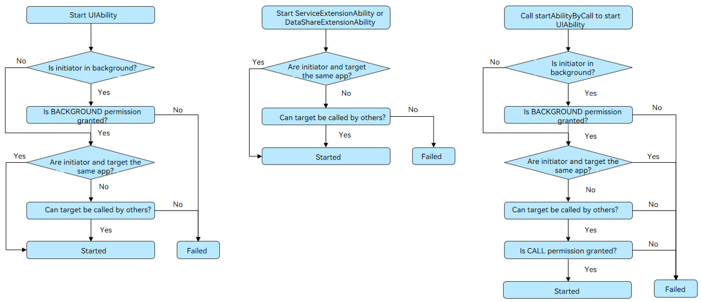
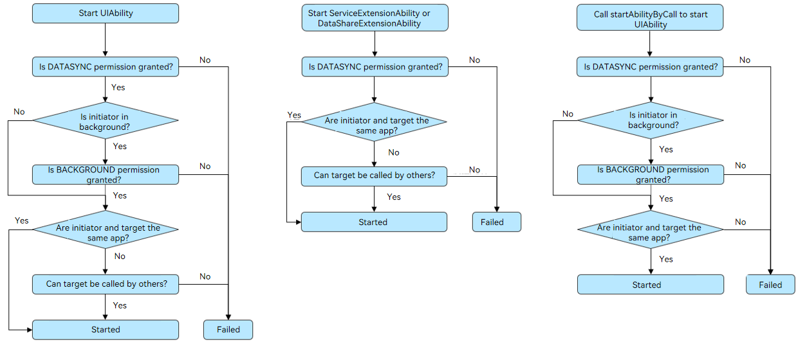

# Component Startup Rules (Stage Model)

Component startup refers to the behavior of starting or connecting to an application component.

- Start the UIAbility, ServiceExtensionAbility, and DataShareExtensionAbility components. For example, you can use **startAbility()**, **startServiceExtensionAbility()**, and **startAbilityByCall()**.

- Connect to the ServiceExtensionAbility and DataShareExtensionAbility components. For example, you can use **connectServiceExtensionAbility()** and **createDataShareHelper()**.

To deliver a better user experience, the system restricts the following behavior:

- A background application randomly displays a dialog box, such as an ads pop-up.

- Background applications wake up each other. This type of behavior occupies system resources and increases power consumption, or even causes system frozen.

- A foreground application randomly redirects to another application, for example, redirecting to the payment page of another application. This type of behavior poses security risks.

In view of this, the system formulates a set of component startup rules, as follows:

- **Before starting a component of another application, verify the visible field of the target component.**
  - If the **exported** field of the target component is **false**, verify the **ohos.permission.START_INVISIBLE_ABILITY** permission.
  - For details, see [Component exported Configuration](../quick-start/module-configuration-file.md#abilities).

- **Before starting a UIAbility component of a background application, verify the BACKGROUND permission.**
  - An application is considered as a foreground application only when the application process gains focus or its UIAbility component is running in the foreground.
  - Verify the **ohos.permission.START_ABILITIES_FROM_BACKGROUND** permission.

- **When the startAbilityByCall() method is used, verify the call permission.** For details, see [Using Call to Implement UIAbility Interaction](uiability-intra-device-interaction.md#using-call-to-implement-uiability-interaction) and [Using Cross-Device Call](hop-multi-device-collaboration.md#using-cross-device-call).
  - Verify the **ohos.permission.ABILITY_BACKGROUND_COMMUNICATION** permission.

> **NOTE**
>
> - Component startup control has been implemented since OpenHarmony v3.2 Release.
> 
> - The new component startup rules are more strict than the original ones. You must be familiar with the new startup rules to prevent service exceptions.

## Intra-Device Component Startup Rules

  The rules for starting components on the same device vary in the following scenarios:

- Starting the UIAbility component

- Starting the ServiceExtensionAbility and DataShareExtensionAbility components

- Using **startAbilityByCall()** to start the UIAbility component

## Inter-Device Component Startup Rules

  The rules for starting components on a different device vary in the following scenarios:

- Starting the UIAbility component

- Starting the ServiceExtensionAbility and DataShareExtensionAbility components

- Using **startAbilityByCall()** to start the UIAbility component

