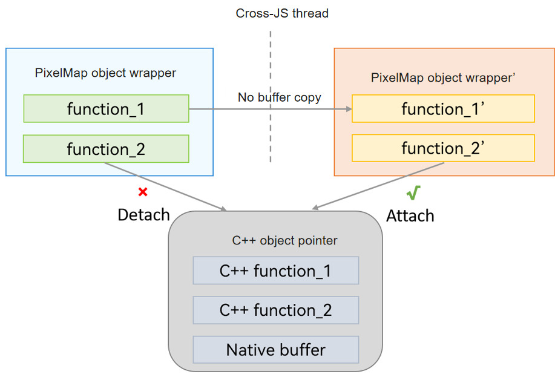

# Transferable Object (NativeBinding Object)


A Transferable object, also known as a NativeBinding object, is a JS object that is bound to a C++ object, with the primary functionality provided by C++. Its JS object wrapper is allocated in the local heap of the virtual machine. During cross-thread communication, the same C++ object is reused. Compared with the pass-by-copy mode of JS objects, this method offers higher transfer efficiency. Therefore, NativeBinding objects that can be shared or transferred are also referred to as Transferable objects.


## Shared Mode

If the C++ implementation can ensure thread safety, the C++ part of the NativeBinding object supports the shared mode. In this case, after the NativeBinding object is passed across threads, you only need to create a JS object wrapper again to bridge to the same C++ object, achieving the sharing of the C++ object. The following figure shows the communication process.


A typical shared-mode NativeBinding object includes context. A context object contains contextual information for application components and provides a way to access system services and resources, enabling the application components to interact with the system. For details about how to obtain context, see [Context (Stage Model)](../application-models/application-context-stage.md).

For details about the development example, see [Using TaskPool for Frequent Database Operations](batch-database-operations-guide.md#using-taskpool-for-frequent-database-operations).


## Transfer Mode

If the C++ implementation contains data and cannot ensure thread safe, the C++ part of the NativeBinding object should be passed by transfer. In this case, after the NativeBinding object is passed across threads, you only need to create a JS object wrapper again to bridge to the C++ object. However, the original object must remove its binding to this object. The following figure shows the communication process.



A typical transfer-mode NativeBinding object includes a PixelMap. The [PixelMap object](../reference/apis-image-kit/js-apis-image.md#imagecreatepixelmap8) can read or write image data and obtain image information, and is usually used for image display.

### Usage Example

Here is an example of passing a PixelMap object across threads to help you better understand the process. First, obtain the image resource from the **rawfile** folder, and then create a PixelMap object in the child thread and pass it to the main thread. The specific implementation is as follows:

```ts
// Index.ets
import { taskpool } from '@kit.ArkTS';
import { loadPixelMap } from './pixelMapTest';
import { BusinessError } from '@kit.BasicServicesKit';

@Entry
@Component
struct Index {
  @State message: string = 'Hello World';
  @State pixelMap: PixelMap | undefined = undefined;

  private loadImageFromThread(): void {
    const resourceMgr = getContext(this).resourceManager;
    // startIcon.png is copied from the media directory to the rawfile folder. You need to replace it. Otherwise, the imageSource fails to be created and subsequent operations cannot be performed.
    resourceMgr.getRawFd('startIcon.png').then(rawFileDescriptor => {
      taskpool.execute(loadPixelMap, rawFileDescriptor).then(pixelMap => {
        if (pixelMap) {
          this.pixelMap = pixelMap as PixelMap;
          console.log('Succeeded in creating pixelMap.');
          // The main thread releases the pixelMap. Because setTransferDetached has been called when the child thread returns the pixelMap, the pixelMap can be released immediately.
          this.pixelMap.release();
        } else {
          console.error('Failed to create pixelMap.');
        }
      }).catch((e: BusinessError) => {
        console.error('taskpool execute loadPixelMap failed. Code: ' + e.code + ', message: ' + e.message);
      });
    });
  }

  build() {
    RelativeContainer() {
      Text(this.message)
        .id('HelloWorld')
        .fontSize(50)
        .fontWeight(FontWeight.Bold)
        .alignRules({
          center: { anchor: 'container', align: VerticalAlign.Center },
          middle: { anchor: 'container', align: HorizontalAlign.Center }
        })
        .onClick(() => {
          this.loadImageFromThread();
        })
    }
    .height('100%')
    .width('100%')
  }
}
```

```ts
// pixelMapTest.ets
import { image } from '@kit.ImageKit';

@Concurrent
export async function loadPixelMap(rawFileDescriptor: number): Promise<PixelMap> {
  // Create an imageSource.
  const imageSource = image.createImageSource(rawFileDescriptor);
  // Create a pixelMap.
  const pixelMap = imageSource.createPixelMapSync();
  // Release the imageSource.
  imageSource.release();
  // Detach the reference of the original thread after the cross-thread transfer of the pixelMap is complete.
  pixelMap.setTransferDetached(true);
  // Return the pixelMap to the main thread.
  return pixelMap;
}
```
