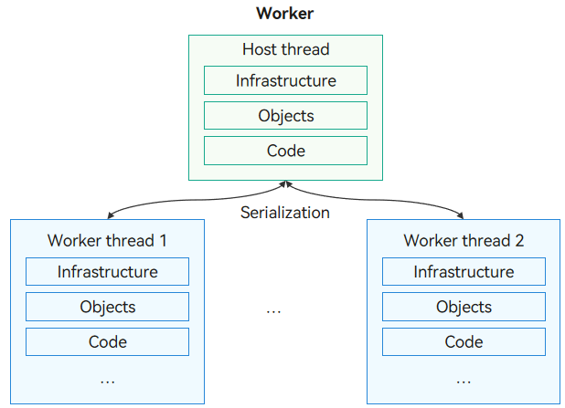

# Worker Introduction

With the **Worker** module, you can provide a multithreading environment for an application, so that the application can perform a time-consuming operation in a background thread. This greatly prevents a computing-intensive or high-latency task from blocking the running of the main thread. For details about the APIs and their usage, see [Worker](../reference/apis/js-apis-worker.md).


## Worker Operating Mechanism

**Figure 1** Worker operating mechanism



The thread that creates the worker thread is referred to as the host thread (not necessarily the main thread, since a worker thread can also create a worker subthread). A worker thread is also named an actor thread. Each worker thread has an independent instance from the host thread, including the infrastructure, object, and code segment. The worker thread communicates with the host thread by means of message exchange. They use the serialization technique to exchange commands and data.


## Precautions for Worker

- The rules for passing in the **Worker.ts** path during the worker thread creation vary in different API versions. For details, see [Precautions for File Paths](#precautions-for-file-paths).

- After a worker thread is created, you must manually manage its lifecycle. A maximum of eight worker threads can run simultaneously. For details, see [Lifecycle Precautions](#lifecycle-precautions).

- Modules of the [ability type](../quick-start/application-package-structure-stage.md) support **Worker**, but modules of the [library type](../quick-start/application-package-structure-stage.md) do not.

- When creating a worker thread, the **Worker.ts** file of another module cannot be used. This means that a worker cannot be called across modules.

- Context objects vary in different threads. Therefore, the worker thread of **Worker** can use only a thread-safe library, rather than a non-thread-safe library, for example, UI-related non-thread-safe library. For details, see [Precautions for Multithread Safe](multi-thread-safety.md).

- A maximum of 16 MB data can be serialized.

- You must register the **onerror** API in the main thread to listen for worker thread errors, which might cause a JavaScript crash.


### Precautions for File Paths

Before calling an API of the **Worker** module, you must create a **Worker** instance. The constructor function varies in different API versions.

```ts
// Import the worker module.
import worker from '@ohos.worker';

// Use the following function in API version 9 and later versions:
const worker1: worker.ThreadWorker = new worker.ThreadWorker('entry/ets/workers/MyWorker.ts');
// Use the following function in API version 8 and earlier versions:
const worker2: worker.Worker = new worker.Worker('entry/ets/workers/MyWorker.ts');
```

The **Worker.ts** file path (specified by **scriptURL**) must be passed in the constructor function. By default, the **workers** directory (upper-level directory of the **Worker.ts** file) is at the same level as the **pages** directory.

**Stage Model**

The following is an example of **scriptURL** in the constructor function:


```ts
// Import the worker module.
import worker from '@ohos.worker';

// In the stage model, the workers directory is at the same level as the pages directory in the entry module.
const worker1: worker.ThreadWorker = new worker.ThreadWorker('entry/ets/workers/MyWorker.ts', {name:"first worker in Stage model"});
// In the stage model, the workers directory is a child directory of the pages directory in the entry module.
const worker2: worker.ThreadWorker = new worker.ThreadWorker('entry/ets/pages/workers/MyWorker.ts');
```

Based on the directory structure of the stage model project, the field meanings are as follows:
- **entry**: value of the **name** attribute under **module** in the **module.json5** file.
- **ets**: directory for storing the ArkTS source code. It is fixed.
- **workers/MyWorker.ts**: path of the worker source file in the **ets** directory.


**FA Model**

The following is an example of **scriptURL** in the constructor function:

```ts
// Import the worker module.
import worker from '@ohos.worker';

// In the FA model, the workers directory is at the same level as the pages directory in the entry module.
const worker1: worker.ThreadWorker = new worker.ThreadWorker('workers/worker.js', {name:'first worker in FA model'});
// In the FA model, the workers directory is at the same level as the parent directory of the pages directory in the entry module.
const worker2: worker.ThreadWorker = new worker.ThreadWorker('../workers/worker.js');
```


### Lifecycle Precautions

- Creating and terminating worker threads consume performance. Therefore, you are advised to manage available workers and reuse them. The worker threads keep running even when they are idle. Therefore, when a worker thread is not required, call [terminate()](../reference/apis/js-apis-worker.md#terminate9) or [parentPort.close()](../reference/apis/js-apis-worker.md#close9) to terminate it. If a worker thread is terminated or being terminated, an error is thrown when it is called.


- A maximum of eight worker threads can co-exist. When the number of worker threads exceeds the limit, the error "Worker initialization failure, the number of workers exceeds the maximum." is thrown.
