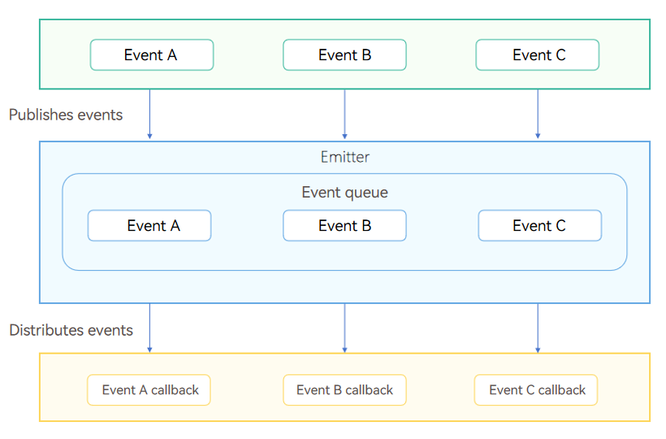

# Using Emitter for Inter-Thread Communication


Emitter is an event processing mechanism used in a process. It provides the capabilities of subscribing to, publishing, and unsubscribing from events for applications.

## When to Use

Emitter is used to process events of the same thread or different threads in the same process in an asynchronous manner. To use this mechanism, you need to subscribe to an event and publish it, after which the Emitter distributes the published event to the subscriber, and the subscriber executes the callback method set during event subscription. Unsubscribe from the event in time to release the Emitter resources when the event does not need to be subscribed to.

## Working Principles
Emitter distributes tasks by maintaining an internal event queue. An application needs to subscribe to an event and set the callback method of the event. After the application publish the event, an event is inserted into the queue. The task queue executes the tasks in serial mode, during which the callback method of the task subscriber is called to process the event.



## Available APIs
For details, see [@ohos.events.emitter (Emitter)](../../reference/apis-basic-services-kit/js-apis-emitter.md).
| API | Capability  | Description    |
| ------- | ------ | -------- |
| on | Event subscription| Continuously subscribes to an event until the event is unsubscribed from.|
| once | Event subscription| Subscribes to an event once.|
| emit | Event publishing| Publishes an event once.|
| off | Event unsubscription.| Unsubscribes from the event and subsequent notifications of this event will not be received.|

## How to Develop

To enable Emitter's capabilities mentioned above, perform the following steps:

1. Import the Emitter module.
   
   ```ts
   import { emitter, Callback } from '@kit.BasicServicesKit';
   ```

2. Subscribe to an event.

   Use **on()** for continuous subscription or **once()** for one-time subscription. Set the events to subscribe to and the callback function after the events are received.
   ```ts
    // Define an event with eventId 1.
    let event: emitter.InnerEvent = {
      eventId: 1
    };
    let callback: Callback<emitter.EventData> = (eventData: emitter.EventData) => {
      console.info(`eventData: ${JSON.stringify(eventData)}`);
    }

    // Execute the callback after receiving the event whose eventId is 1.
    emitter.on(innerEvent, callback);
   ```

   ```ts
   // Execute the callback after receiving the event whose eventId is 1.
   // Note that the event is received only once using once(), while the event is received until the subscription is canceled using on().
    emitter.once(innerEvent, callback);
   ```

3. Emit the event.

   Use **emit()** to send events and set the events to send and the parameters to pass.
   ```ts
   // Define an event with eventId 1 and priority Low.
   let event: emitter.InnerEvent = {
     eventId: 1,
     priority: emitter.EventPriority.LOW
   };

   let callback: Callback<emitter.EventData> = (eventData: emitter.EventData) => {
     console.info(`eventData: ${JSON.stringify(eventData)}`);
   }
   // Subscribes to the event and receive eventData.
   emitter.once(event, callback);

   let eventData: emitter.EventData = {
     data: {
       content: 'emitter',
       id: 1,
       isEmpty: false
     }
   };
   
   // Emit the event with eventId 1 and event content eventData.
   emitter.emit(event, eventData);
   ```

4. Unsubscribe from the event.
    > **NOTE**
    >
    > If an event does not need to be subscribed to, cancel the subscription in a timely manner to prevent memory leakage.

    Use **off()** to unsubscribe from the event and set the corresponding event ID.
   ```ts
   // Unsubscribe from the event with eventId 1.
   emitter.off(1);
   ```
