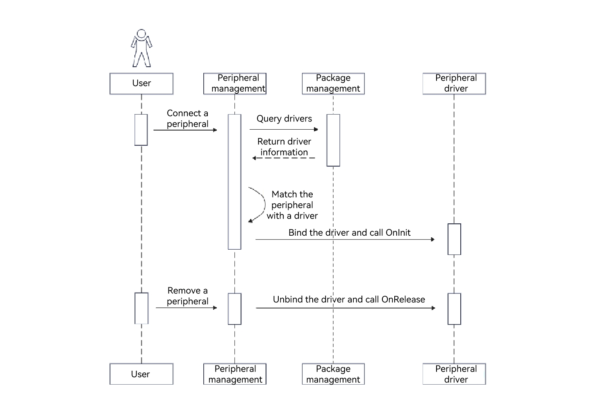
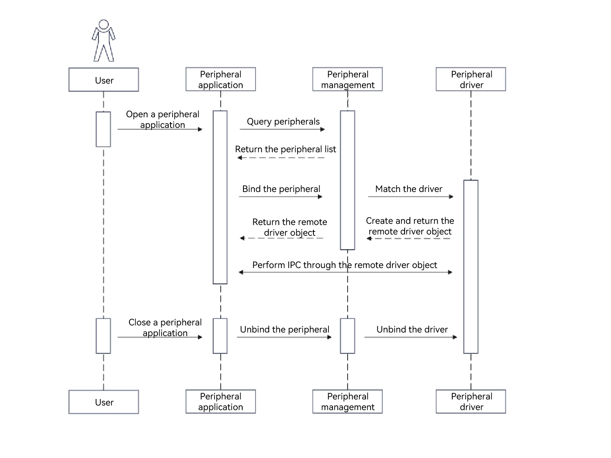

# Introduction to Driver Development Kit

Empowered by the C-API solution, Driver Development Kit provides easy-to-use, secure, and diversified C APIs to elevate your experience in developing peripheral drivers, which bring ultimate plug-and-play experience to users.

1. You can develop advanced peripheral functions to meet user requirements.

2. The extended driver framework supports lifecycle management of peripheral drivers and provides APIs for querying and binding peripheral devices.

## When to Use

You can use Driver Development Kit to:

1. Develop drivers of dedicated peripherals for bank counters, enterprise office, and medical detection, such as high-speed document scanners, ID card scanners, fingerprint scanners, and blood oxygen and blood glucose meters.

2. Develop enhanced functions of non-standard peripherals, such as customizing handwriting pad shortcut keys, setting the pressure sensing/drawing area, setting extended enhancement capabilities, setting the mouse lighting effect, customizing mouse extended buttons, and setting DPI and X and Y axes.

## Working Principles

The HDF extended driver framework provides unified APIs for you to leverage the DDK capabilities for user-mode peripheral driver development.

The driver extension system ability (SA), the core service of user-mode peripheral management, performs lifecycle management of peripherals and peripheral drivers. In addition, standard ArkTS APIs are provided to query, bind, and unbind peripherals.

**Figure 1** Peripheral driver working mechanism 

### **Module Functions**

- Peripheral application: queries and binds the driver, and customizes the device-driver communication mode and data processing mode. For details, see [Peripheral Driver Client Development](externaldevice-guidelines.md).
- Peripheral driver (application): dedicated peripheral driver or enhanced peripheral driver developed using HDF-DDK. For details, see [Peripheral Driver Development](driverextensionability.md).
- Driver extension SA: performs lifecycle management of peripheral devices and driver packages.
- AMS: starts and disables **DriverExtensionAbility**.

### Process Description

Figure 2 shows the process for matching a peripheral driver client with a peripheral driver when a peripheral is connected.

**Figure 2** Process for matching a peripheral with a driver

Figure 2 shows the process of binding the peripheral driver client with a peripheral driver when a peripheral application is run.

**Figure 3** Process of binding the peripheral driver client with a peripheral driver

