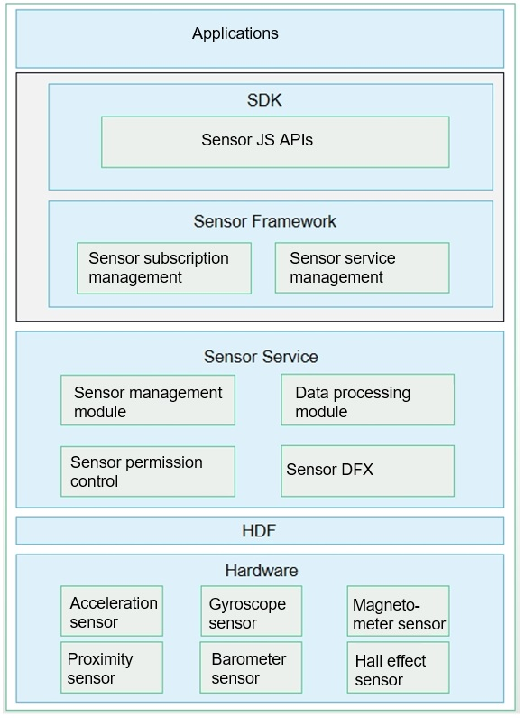

# Sensor Overview

## Sensor Types

Sensors are an abstraction of underlying sensor hardware. Your application can access the underlying sensor hardware via **Sensor** APIs. Using these APIs, you can query sensors on your device and subscribe to sensor data. Based on the sensor data obtained, you can customize algorithms and develop various sensor-based applications, such as compass, motion-controlled games, and fitness and health applications.

| Sensor Types                 | Name              | Description                                                        | Usage                                |
| --------------------------- | ------------------ | ------------------------------------------------------------ | ---------------------------------------- |
| ACCELEROMETER               | Acceleration sensor      | Measures the acceleration (including the gravity acceleration) applied to a device on three physical axes (X, Y, and Z), in the unit of m/s2.| Measures the acceleration of device motion.                           |
| GYROSCOPE                   | Gyroscope sensor      | Measures the rotation angular velocity of a device on three physical axes (X, Y, and Z), in the unit of rad/s.| Measuring the rotation angular velocity                       |
| ORIENTATION                 | Orientation sensor        | Measures the orientation angle of the screen around three physical axes (z, x , and y), in rad.| Measuring the three orientation angles of the screen            |

## Working Principles

The following modules work cooperatively to implement sensors: Sensor API, Sensor Framework, Sensor Service, and HDF layer.

  **Figure 1** How the sensor works

1. Sensor API: provides APIs for performing basic operations on sensors, including querying the sensor list, subscribing to or unsubscribing from sensor data, and executing control commands. This module makes application development simpler.

2. Sensor Framework: manages sensor data subscription, creates and destroys data channels, subscribes to or unsubscribes from sensor data, and implements communication with the Sensor Service module.

3. Sensor Service: interacts with the HD_IDL module to receive, parse, and distribute data, manages foreground and background policies and sensors of a device, and controls sensor permissions.

4. HDF layer: selects proper policies based on the hardware first in first out (FIFO) and frequency, and adapts to different devices.

## Constraints

1. To obtain data of the following sensors, you must request the required permissions.

    | Sensor                                            | Permission                          | Sensitivity    | Permission Description                                                    |
    | -------------------------------------------------- | -------------------------------- | ------------ | ------------------------------------------------------------ |
    | Acceleration sensor, uncalibrated acceleration sensor, and linear acceleration sensor| ohos.permission.ACCELEROMETER    | system_grant | The permission allows an application to read data from acceleration sensors, uncalibrated acceleration sensors, and linear acceleration sensors.|
    | Gyroscope sensor and uncalibrated gyroscope sensor                  | ohos.permission.GYROSCOPE        | system_grant | The permission allows an application to read data from gyroscope sensors and uncalibrated gyroscope sensors.|
    
2. The APIs for subscribing to and unsubscribing from sensor data work in pairs. If you do not need sensor data, call the unsubscription API to stop sensor data reporting.
