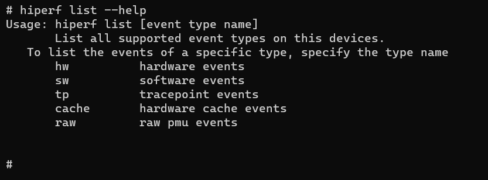

# hiperf

hiperf is a command-line tool provided to capture performance data of a specific program or the entire system, like the kernel's perf tool. It can run on Windows, Linux, and macOS.

## Prerequisites

- The [environment setup](hdc.md#environment-setup) is complete.

- The devices are properly connected.

## Command Format

```
hiperf [options] COMMAND [args for command]
```

- [options]
  - Optional parameter.
  - Debugging commands, such as enabling the logging function.

- COMMAND
  - Mandatory parameter.
  - Command to run, such as **list**, **record**, **stat**, **dump**, or **report**.

- [args for command]
  - Parameters of the command to run.

## help

Run the **--help** command to view help information.

```
hiperf --help
```


Run the following command to view the help information about a command:

```
hiperf [command] --help
```

## list

Run the **list** command to list all the supported events on the device. The event names are used for the **-e** and **-g** parameters of the **stat** and **record** commands.

```
Usage: hiperf list [event type name]
```

Run the **help** command to query the supported event types.

```
hiperf list --help
```



Run the following command to list the hardware events supported and not supported by the device. 

```
hiperf list hw
```


## record

Run the **record** command to specify the target program for sampling and saves the sampled data to a file (**/data/local/tmp/perf.data** by default).

```
Usage: hiperf record [options] [command [command-args]] 
```

Sample all processes in the system for 3 seconds and display detailed log information.

```
hiperf record -d 3 -a --verbose
```

Sample the process 267 for 10 seconds and use **dwarf** to collect and unwind stack memory of the process.

```
hiperf record -p 267 -d 10 -s dwarf
```


For details, run the **help** command.

```
hiperf record --help
```

## stat

Run the **stat** command to monitor the specified application and periodically prints the values of performance counters.

```
Usage: hiperf stat [options] [command [command-args]]
```

Monitor the performance counter of process 2349 on CPU0 for 3 seconds.

```
hiperf stat -p 2349 -d 3 -c 0
```

For details, run the **help** command.

```
hiperf stat --help
```

## dump

The **dump** command is used to read the data in **perf.data** without processing the file. You can check whether the original sampling data is correct.

```
Usage: hiperf dump [option] \<filename\>
```

Run the **dump** command to read the **/data/local/tmp/perf.data** file and export it to the **/data/local/tmp/perf.dump** file.

```
hiperf dump -i /data/local/tmp/perf.data -o /data/local/tmp/perf.dump
```


For details, run the **help** command.

```
hiperf dump --help
```

## report

This command is used to display the sampled data (read from perf.data) in required format (such as JSON or ProtoBuf).

```
Usage: hiperf dump [option] \<filename\>
```

Display a common report, with the sampling limit of 1%.

```
hiperf report --limit-percent 1
```

For details, run the **help** command.

```
hiperf report --help
```

## script

You can use a script to sample data and generate flame graphs. You can obtain the script from [developtools_hiperf](https://gitee.com/openharmony/developtools_hiperf/tree/master/script).

1. Sample data.

   Run **command_script.py** to sample data. This script packages the **report** command.

   ```
   usage: command_script.py [-h]                         
                            (-app PACKAGE_NAME | -lp LOCAL_PROGRAM | -cmd CMD | -p [PID [PID ...]] | -t [TID [TID ...]] | -sw)
                            [-a ABILITY] [-r RECORD_OPTIONS] [-lib LOCAL_LIB_DIR]
                            [-o OUTPUT_PERF_DATA] [--not_hdc_root]
   ```

   Sample the **com.ohos.launch** package.

   ```
   python command_script.py -app com.ohos.launch
   ```

   Sample the **hdcd** process.

   ```
   python command_script.py -lp hdcd
   ```

2. Collect symbol tables.

   Run **recv_binary_cache.py** to collect symbol tables. This script searches for the ELF in the specified paths based on the files and libraries recorded in **perf.data** and their **buildids**.

   ```
   usage: recv_binary_cache.py [-h] [-i PERF_DATA] [-l LOCAL_LIB_DIR [LOCAL_LIB_DIR ...]]
   ```

   The following example specifies two symbol table paths.

   ```
   python recv_binary_cache.py -l Z:\OHOS_MASTER\out\ohos-arm-release\lib.unstripped  Z:\OHOS_MASTER\out\ohos-arm-release\exe.unstripped
   ```

   The ELF files of the specified symbol table paths are copied to the **binary_cache** folder. If the paths do not exist, the file in the device will be copied.

3. Generate a flame graph.

   Run **make_report.py** to display the sampled data in an HTML page.

   ```
   usage: make_report.py [-h] [-i PERF_DATA] [-r REPORT_HTML]
   ```

   Generate an HTML file. The default file name is **hiperf_report.html**.

   ```
   python make_report.py -i perf.data
   ```
