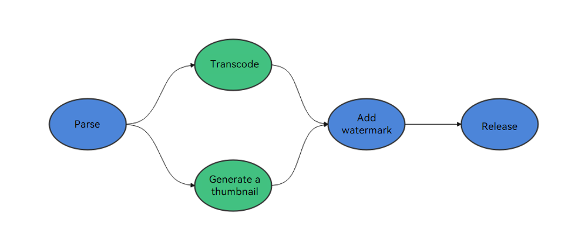
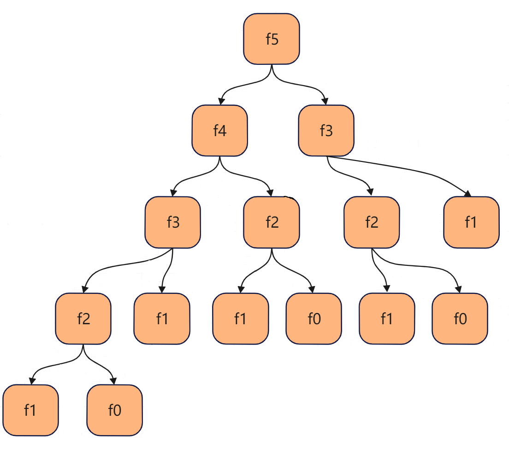

# Function Flow Runtime Task Graph (C++)

## Overview

The FFRT task graph supports task dependency and data dependency. Each node in the task graph indicates a task, and each edge indicates the dependency between tasks. Task dependency is classified into input dependency (`in_deps`) and output dependency (`out_deps`).

You can use either of the following ways to build a task graph:

- Use the task dependency to build a task graph. The task `handle` is used to indicate a task object.
- Use the data dependency to build a task graph. The data object is abstracted as a data signature, and each data signature uniquely indicates a data object.

### Task dependency

> **NOTE**
>
> When a task handle appears in `in_deps`, the corresponding task is the previous task. When a task handle appears in `out_deps`, the corresponding task is the subsequent task.

Task dependency applies to scenarios where tasks have specific sequence or logical process requirements. For example:

- Tasks with sequence. For example, a data preprocessing task is executed before a model training task.
- Logic process control. For example, in a typical commodity transaction process, orders are placed, followed by production and then logistics transportation.
- Multi-level chain: For example, during video processing, you can perform tasks such as transcoding, generating thumbnails, adding watermarks, and releasing the final video.

### Data Dependency

> **NOTE**
>
> When the signature of a data object appears in `in_deps` of a task, the task is referred to as a consumer task that executes without modifying the original input data object.
> When the signature of a data object appears in `out_deps` of a task, the task is referred to as a producer task that updates the output data object's content to create a new version.

Data dependency applies to scenarios where tasks are triggered by data production and consumption relationships.

A data object may have multiple versions. Each version corresponds to one producer task and zero, one, or more consumer tasks. A sequence of the data object versions and the version-specific producer task and consumer tasks are defined according to the delivery sequence of the producer task and consumer tasks.

When all producer tasks and consumer tasks of the data object of all the available versions are executed, the data dependency is removed. In this case, the task enters the ready state and can be scheduled for execution.

FFRT can dynamically build producer/consumer-based data dependencies between tasks at runtime and perform scheduling based on the task data dependency status, including:

- Producer-Consumer dependency

  A dependency formed between the producer task of a data object of a specific version and a consumer task of the data object of the same version. It is also referred to as a read-after-write dependency.

- Consumer-Producer dependency

  A dependency formed between a consumer task of a data object of a specific version and the producer task of the data object of the next version. It is also referred to as a write-after-read dependency.

- Producer-Producer dependency

  A dependency formed between the producer task of a data object of a specific version and a producer task of the data object of the next version. It is also referred to as a write-after-write dependency.

For example, the relationship between a group of tasks and data A is expressed as follows:

```cpp
task1(OUT A);
task2(IN A);
task3(IN A);
task4(OUT A);
task5(OUT A);
```


For ease of description, circles are used to represent tasks and squares are used to represent data.

The following conclusions can be drawn:

- task1 and task2/task3 form a producer-consumer dependency. This means that task2/task3 can read data A only after task1 writes data A.
- task2/task3 and task4 form a consumer-producer dependency. This means that task4 can write data A only after task2/task3 reads data A.
- task 4 and task 5 form a producer-producer dependency. This means that task 5 can write data A only after task 4 writes data A.

## Example: Streaming Video Processing

A user uploads a video to the platform. The processing steps include: parsing, transcoding, generating a thumbnail, adding watermark, and releasing the video. Transcoding and thumbnail generation can occur simultaneously. The following figure shows the task process.



The FFRT provides task graph that can describe the task dependency and parallelize the preceding video processing process. The code is as follows:

```cpp
#include <iostream>
#include "ffrt/ffrt.h"

int main()
{
    // Submit a task.
    auto handle_A = ffrt::submit_h([] () { std::cout << "Parse" << std::endl; });
    auto handle_B = ffrt::submit_h([] () { std::cout << "Transcode" << std::endl; }, {handle_A});
    auto handle_C = ffrt::submit_h([] () { std::cout << "Generate a thumbnail" << std::endl; }, {handle_A});
    auto handle_D = ffrt::submit_h([] () { std::cout << "Add watermark" << std::endl; }, {handle_B, handle_C});
    ffrt::submit([] () { std::cout << "Release" << std::endl; }, {handle_D});

    // Wait until all tasks are complete.
    ffrt::wait();
    return 0;
}
```

The expected output may be as follows:

```plain
Video parsing
Video transcoding
Thumbnails generation
Watermark adding
Video release
```

## Example: Fibonacci Sequence

Each number in the Fibonacci sequence is the sum of the first two numbers. The process of calculating the Fibonacci number can well express the task dependency through the data object. The code for calculating the Fibonacci number using the FFRT framework is as follows:

```cpp
#include <iostream>
#include "ffrt/cpp/task.h"

void Fib(int x, int& y)
{
    if (x <= 1) {
        y = x;
    } else {
        int y1, y2;

        // Submit the task and build data dependencies.
        ffrt::submit([&]() { Fib(x - 1, y1); }, {&x}, {&y1});
        ffrt::submit([&]() { Fib(x - 2, y2); }, {&x}, {&y2});

        // Wait until the task is complete.
        ffrt::wait({&y1, &y2});
        y = y1 + y2;
    }
}

int main()
{
    int y;
    Fib(5, y);
    std::cout << "Fibonacci(5) is " << y << std::endl;
}
```

Expected output:

```plain
Fibonacci(5) is 5
```

In the example, `fibonacci(x-1)` and `fibonacci(x-2)` are submitted to FFRT as two tasks. After the two tasks are complete, the results are accumulated. Although a single task is split into two subtasks, the subtasks can be further split. Therefore, the concurrency of the entire computational graph is very high.

Each task forms a call tree in the FFRT.



## Available APIs

The main FFRT APIs involved in the preceding example are as follows:

| Name                                                                                                               | Description                            |
| ------------------------------------------------------------------------------------------------------------------- | -------------------------------- |
| [submit](https://gitee.com/openharmony/resourceschedule_ffrt/blob/master/docs/ffrt-api-guideline-cpp.md#submit)     | Submits a task.              |
| submit_h | Submits a task, and obtains the task handle.|
| [wait](https://gitee.com/openharmony/resourceschedule_ffrt/blob/master/docs/ffrt-api-guideline-cpp.md#wait)         | Waits until all tasks in the context are complete.        |

> **NOTE**
>
> For details about how to use FFRT C++ APIs, see [Using FFRT C++ APIs](ffrt-development-guideline.md#using-ffrt-c-api-1).

## Constraints

- For `submit`, the total number of input dependencies and output dependencies of each task cannot exceed 8.
- For `submit_h`, the total number of input dependencies and output dependencies of each task cannot exceed 7.
- When a parameter is used as both an input dependency and an output dependency, it is counted as one dependency. For example, if the input dependency is `{&x}` and the output dependency is also `{&x}`, then the number of dependencies is 1.
