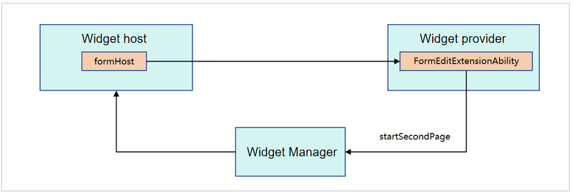

# Overview of ArkTS Widget Editing

ArkTS widgets provide the page editing capability to allow users to customize widget content, for example, editing a contact widget, modifying contacts displayed in a widget, and editing a weather widget.

## How to Implement
The home screen provides a unified widget editing page. The widget provider uses the [startSecondPage](../reference/apis-form-kit/js-apis-inner-application-formEditExtensionContext.md#formeditextensioncontextstartsecondpage) method provided by the FormEditExtensionContext of [FormEditExtensionAbility](../reference/apis-form-kit/js-apis-app-form-formEditExtensionAbility.md) to transfer the level-2 editing page information to the home screen. After the the level-2 editing page is started, the page content can be edited.

The following figure shows the widget editing process.

**Figure 1** Widget editing process

1. When a user taps a widget to edit it, the widget provider inherits [FormEditExtensionAbility](../reference/apis-form-kit/js-apis-app-form-formEditExtensionAbility.md) to implement the widget editing function.

2. After the user identifies that the widget provider inherits [FormEditExtensionAbility](../reference/apis-form-kit/js-apis-app-form-formEditExtensionAbility.md), the level-1 editing page of the widget provider is displayed.

3. The widget provider invokes the [startSecondPage](../reference/apis-form-kit/js-apis-inner-application-formEditExtensionContext.md#formeditextensioncontextstartsecondpage) method of [FormEditExtensionContext](../reference/apis-form-kit/js-apis-inner-application-formEditExtensionContext.md) in the callback method [onSessionCreate](../reference/apis-ability-kit/js-apis-app-ability-uiExtensionAbility.md#uiextensionabilityonsessioncreate) of [FormEditExtensionAbility](../reference/apis-form-kit/js-apis-app-form-formEditExtensionAbility.md) to transfer the level-2 page information of the widget provider to be started to the widget management service.

4. The widget management service transfers the received level-2 page information of the widget provider to the user.

5. Then the user opens the level-2 page to edit the page content.
