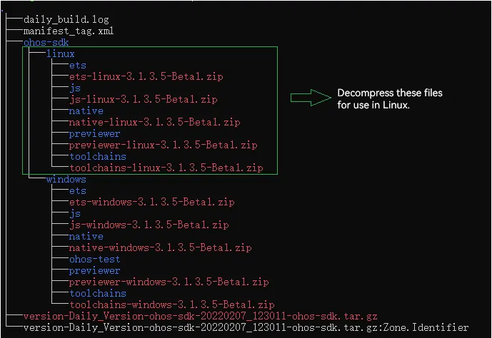

# Building an NDK Project with the Command Line CMake


In many complex application projects, C++ projects are compiled and built in command line mode through build systems such as CMake. The following describes how to switch an existing CMake project to the OpenHarmony toolchain so that CMake can be used to build the project.


## Downloading the NDK

1. (Recommended) Acquire source code from mirrors for an officially released version. For details, see [release notes](../../release-notes/OpenHarmony-v4.0-release.md).

2. Download the NDK from the SDK Manager in DevEco Studio.


## Decompressing the NDK

Place the downloaded NDK in a folder you prefer and decompress it. Below shows the directory structure after decompression.



Configure the Linux environment as follows: (Skip them if the NDK is downloaded from DevEco Studio.)

1. Add the CMake tool that comes with the NDK to the environment variables.
   ```
   #Open the .bashrc file.
   vim ~/.bashrc
   #Append the custom CMake path to the file.
   export PATH=~/ohos-sdk/ohos-sdk/linux/native/build-tools/cmake/bin:$PATH
   #Run the source ~/.bashrc command to make the environment variables take effect.
   source ~/.bashrc
   ```

2. Check the default CMake path.
   ```
   #Run the which cmake command.
   which cmake
   #The result should be the same as the custom path previously appended to the .bashrc file.
   ~/ohos-sdk/ohos-sdk/linux/native/build-tools/cmake/bin/cmake
   ```


## Using the NDK to Compile a Native Program

You can use the NDK to quickly develop a native program, including native dynamic libraries, static libraries, and executable files. The following exemplifies how to use the NDK to compile a C/C++ dynamic library in a C/C++ demo project.


### Demo Project

The following is a CMake demo project. This project contains two directories. The **include** directory contains the header files of the library, and the **src** directory contains all source code. Specifically, the **src** directory contains two files: **sum.cpp** (algorithm file) and **main.cpp** (main entry file for invoking algorithms). The two files are compiled into an executable program and an algorithm dynamic library.

**Demo Project Directory**

```
demo
  ├── CMakeLists.txt
  ├── include
       └── sum.h
  └── src
       ├── CMakeLists.txt
       ├── sum.cpp
       └── main.cpp
```

**CMakeLists.txt in the demo Directory**

```
# Specify the minimum CMake version.
CMAKE_MINIMUM_REQUIRED(VERSION 3.16)

# Set the project name, which is HELLO in this example.
PROJECT(HELLO)

#Add a subdirectory and build the subdirectory.
ADD_SUBDIRECTORY(src)
```

**CMakeLists.txt in the src Directory**

```
SET(LIBHELLO_SRC hello.cpp)

# Set compilation flags.
SET(CMAKE_CXX_FLAGS "${CMAKE_CXX_FLAGS} -O0")   
 
# Set the link parameter. The value below is only for exemplary purposes.
SET(CMAKE_EXE_LINKER_FLAGS "${CMAKE_EXE_LINKER_FLAGS} -Wl,--emit-relocs --verbose")    

# Add a libsum dynamic library target. If the compilation is successful, a libsum.so file is generated.
ADD_LIBRARY(sum SHARED sum.cpp)

# Add the executable target called Hello. If the compilation is successful, a Hello executable is generated.
ADD_EXECUTABLE(Hello ${LIBHELLO_SRC})

# Specify the path to the include directory of the Hello target.
TARGET_INCLUDE_DIRECTORIES(Hello PUBLIC ../include)

# Specify the name of the library to be linked to the Hello target.
TARGET_LINK_LIBRARIES(Hello PUBLIC sum)
```

**Source Code**

**hello.cpp** source code:

```
#include <iostream>
#include "sum.h"

int main(int argc,const char **argv)
{
    std::cout<< "hello world!" <<std::endl;
    int total = sum(1, 100);
    std::cout<< "Sum 1 + 100=" << total << std::endl;
    return 0;
}
```

**sum.h** source code:

```
int sum(int a, int b);
```

**sum.cpp** source code:

```
#include <iostream>
    
int sum(int a, int b)
{
    return a + b;
}
```


### Compiling and Building the Demo Project

In the project directory, create the **build** directory to store the intermediate files generated during CMake building.

> **NOTE**
>
> In the following commands, **ohos-sdk** is the root directory of the downloaded SDK. Replace it with the actual directory.

1. Use **OHOS_STL=c++_shared** to dynamically link the C++ library to build a project. If **OHOS_STL** is not specified, **c++_shared** is used by default.

   ```
    >mkdir build && cd build
    >cmake -DOHOS_STL=c++_shared -DOHOS_ARCH=armeabi-v7a -DOHOS_PLATFORM=OHOS -DCMAKE_TOOLCHAIN_FILE={ohos-sdk}/linux/native/build/cmake/ohos.toolchain.cmake ..
    >cmake --build .
   ```

2. Use **OHOS_STL=c++_static** to link a static C++ library to build the project.

   ```
    >mkdir build && cd build
    >cmake -DOHOS_STL=c++_static -DOHOS_ARCH=armeabi-v7a -DOHOS_PLATFORM=OHOS -DCMAKE_TOOLCHAIN_FILE={ohos-sdk}/linux/native/build/cmake/ohos.toolchain.cmake ..
    >cmake --build .
   ```

   In the command, the **OHOS_ARCH** and **OHOS_PLATFORM** variables generate the **--target** command parameters of Clang++. In this example, the two parameters are **--target=arm-linux-ohos** and **--march=armv7a**. **CMAKE_TOOLCHAIN_FILE** specifies the toolchain file. In this file, **--sysroot={ndk_sysroot directory}** is set for Clang++ by default, instructing the compiler to search for the root directory of system header files.
