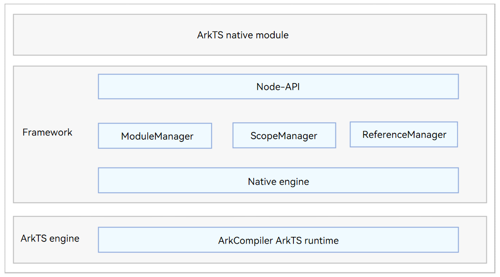
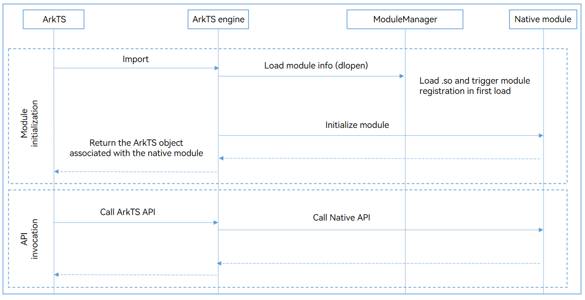

# OpenHarmony Node-API

## When to Use

Developed based on the Node-API specifications of **Node.js**, OpenHarmony Node-API allows interaction between ArkTS/JS and C/C++ modules. It provides a set of stable and cross-platform APIs that can be used on different operating systems.

Unless otherwise specified, Node-API in this document refers to OpenHarmony Node-API.

Generally, ArkTS/JS is used for OpenHarmony application development. However, in computationally intensive scenarios, such as games and physical simulations, the existing C/C++ library is required to achieve higher performance and efficiency. Node-API encapsulates I/O, CPU-intensive, and OS underlying capabilities and has ArkTS/JS APIs exposed. It stands out due to the following benefits:

- The system can open rich module functions of the framework layer to upper-layer applications through the ArkTS/JS APIs.

- You can encapsulate core functions in C/C++ and use them with ArkTS/JS APIs to improve the execution efficiency of your application.

## Node-API Architecture

**Figure 1** Node-API architecture

- Native Module: a module developed using Node-API and imported to ArkTS.

- Node-API: implements the logic for interaction between ArkTS and C/C++.

- ModuleManager: manages Native modules, including loading and locating Native modules.

- ScopeManager: manages the lifecycle of **napi_value**.

- ReferenceManager: manages the lifecycle of **napi_ref**.

- NativeEngine: ArkTS engine abstraction layer, which unifies the API behavior of the ArkTS engine at the Node-API layer.

- ArkComiler ArkTS Runtime: ArkTS runtime.

## Key Interaction Process

**Figure 2** Key interaction process of Node-API

The interaction between ArkTS and C++ consists of the following two steps:

1. Initialization: When a Native module is imported to ArkTS, the ArkTS engine calls the ModuleManager to load the .so and dependencies of the module. During the initial load of the module, the module is registered with the system, and the method properties defined by the module are embedded to the **exports** object. When the initialization is complete, the **exports** object is returned.

2. Invocation: When an ArkTS method is called using the **exports** object returned, the ArkTS engine locates and calls the embedded C/C++ method.
