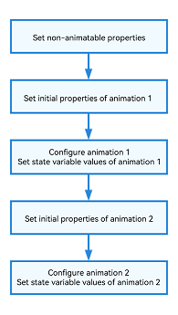
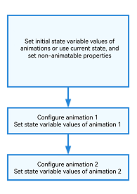

# OpenHarmony Application Animation Practice

## Introduction
Animations add a lively, delightful touch to your application. Yet, they must be handled carefully to avoid performance issues. This topic describes how to make smart use of animations in applications, and examines how less frequent layout and property changes and avoidance of redundant re-renders can reduce performance overhead.
Specifically, the following modes are recommended in implementing animations:

- Using **transition** for component transitions
- Using transform properties for component layout changes
- Using the same **animateTo** for properties with same animation settings.
- Updating state variables for multiple **animateTo** calls at once

## Smart Use of Animations

### Using transition for Component Transitions
To apply an animation to a component when it appears or disappears, two common methods are available:

- Use the **animateTo** API and add logic processing to the animation end callback.
- Use the **transition** API.

**transition** is preferred over **animateTo**, primarily for two reasons:

- **transition** leads to higher performance, in that it involves only one property change with a conditional statement, while **animateTo** involves two property changes, one before the animation and one after.
- **transition** is easier to implement, with the need for complex logic processing in the animation end callback.  

Avoid: Change a component's opacity property from 1 to 0 to hide the component, and control the disappearance of the component in the animation end callback.

```typescript
@Entry
@Component
struct MyComponent {
  @State mOpacity: number = 1;
  @State show: boolean = true;
  count: number = 0;
  
  build() {
    Column() {
      Row() {
        if (this.show) {
          Text('value')
            .opacity(this.mOpacity)
        }
      }
      .width('100%')
      .height(100)
      .justifyContent(FlexAlign.Center)
      Text('toggle state')
        .onClick(() => {
          this.count++;
          const thisCount: number = this.count;
          this.show = true;
          // Hide or hide the <Text> component by changing its opacity property.
          animateTo({ duration: 1000, onFinish: () => {
            // In the last animation, hide the <Text> component, and then change the conditional statement to make the component disappear.
            if (thisCount === this.count && this.mOpacity === 0) {
              this.show = false;
            }
          } }, () => {
            this.mOpacity = this.mOpacity === 1 ? 0 : 1;
          })
        })
    }
  }
}
```

Preferrable: Directly use the **transition** API to animate the opacity when the **\<Text>** component appears or disappears.

```typescript
@Entry
@Component
struct MyComponent {
  @State show: boolean = true;
  
  build() {
    Column() {
      Row() {
        if (this.show) {
          Text('value')
            // Set the ID so that the transition can be interrupted.
            .id('myText')
            .transition(TransitionEffect.OPACITY.animation({ duration: 1000 }))
        }
      }.width('100%')
      .height(100)
      .justifyContent(FlexAlign.Center)
      Text('toggle state')
        .onClick(() => {
          // Use transition to animate the opacity when the component appears or disappears.
          this.show = !this.show;
        })
    }
  }
}
```

### Using Transform Properties for Component Layout Changes
You can change the layout of a component in either of the following methods:

- Modify [layout properties](../ui/arkts-attribute-animation-overview.md), which will cause a UI re-render. Common layout properties include **width**, **height**, and **layoutWeight**.
- Modify [transform properties](../reference/arkui-ts/ts-universal-attributes-transformation.md), which will cause the component to translate, rotate, or scale.

As modifying transform properties does not involve the time-consuming UI re-render, it is more time efficient than modifying layout properties, and is therefore recommended. The following examples use the preceding methods to scale up a component by 10 times.

Avoid: Scale up a component by 10 times by modifying its **width** and **height** properties.

```typescript
    @State textWidth: number = 10;
    @State textHeight: number = 10;
    
    Text()
      .backgroundColor(Color.Blue)
      .fontColor(Color.White)
      .fontSize(20)
      .width(this.textWidth)
      .height(this.textHeight)

    Button ('Layout Properties')
      .backgroundColor(Color.Blue)
      .fontColor(Color.White)
      .fontSize(20)
      .margin({ top: 30 })
      .borderRadius(30)
      .padding(10)
      .onClick(() => {
        animateTo({duration:1000}, () => {
          this.textWidth = 100;
          this.textHeight = 100;
        })
      })
```

Because animating the location and size properties of a component involves new UI measurement and layout, performance overhead is high. If a component's location or size changes continuously, as in a pinch gesture, using the **scale** property is a better choice for the animation, as in the example below.

Preferrable: Scale up a component by 10 times by modifying the **scale** property.

```typescript
    @State textScaleX: number = 1;
    @State textScaleY: number = 1;
    
    Text()
      .backgroundColor(Color.Blue)
      .fontColor(Color.White)
      .fontSize(20)
      .width(10)
      .height(10)
      .scale({ x: this.textScaleX, y: this.textScaleY })
      .margin({ top: 100 })

    Button ('Transform Properties')
      .backgroundColor(Color.Blue)
      .fontColor(Color.White)
      .fontSize(20)
      .margin({ top: 60 })
      .borderRadius(30)
      .padding(10)
      .onClick(() => {
        animateTo({ duration: 1000 }, () => {
        this.textScaleX = 10;
        this.textScaleY = 10;
      })
    })
```

### Using Same animateTo for Properties with Same Animation Settings
Each time **animateTo** is called, a before-after comparison is required. Less **animateTo** calls can contribute to fewer component re-renders and thereby higher performance.

In light of this, if properties share the same animation settings, consider placing them in the same animation closure.

Avoid: Place state variables with the same animation settings in different animation closures.

```typescript
@Entry
@Component
struct MyComponent {
  @State width: number = 200;
  @State color: Color = Color.Red;
  
  func1() {
    animateTo({ curve: Curve.Sharp, duration: 1000 }, () => {
      this.width = (this.width === 100 ? 200 : 100);
    });
  }
  
  func2() {
    animateTo({ curve: Curve.Sharp, duration: 1000 }, () => {
      this.color = (this.color === Color.Yellow ? Color.Red : Color.Yellow);
    });
  }
  
  build() {
    Column() {
      Row()
        .width(this.width)
        .height(10)
        .backgroundColor(this.color)
      Text('click')
        .onClick(() => {
          this.func1();
          this.func2();
        })
    }
    .width('100%')
    .height('100%')
  }
}
```

Preferrable: Combine animations with the same animation settings into one animation closure.

```typescript
@Entry
@Component
struct MyComponent {
  @State width: number = 200;
  @State color: Color = Color.Red;
  
  func() {
    animateTo({ curve: Curve.Sharp, duration: 1000 }, () => {
      this.width = (this.width === 100 ? 200 : 100);
      this.color = (this.color === Color.Yellow ? Color.Red : Color.Yellow);
    });
  }
  
  build() {
    Column() {
      Row()
        .width(this.width)
        .height(10)
        .backgroundColor(this.color)
      Text('click')
        .onClick(() => {
          this.func();
        })
    }
    .width('100%')
    .height('100%')
  }
}
```

### Updating State Variables for Multiple animateTo Calls At Once
**animateTo** compares the states before and after the animation closure is executed and animates the differences. For comparison, all changed state variables and dirty nodes are re-rendered before the animation closure of **animateTo** is executed.
If state variables are re-rendered between **animateTo** calls, there may exist dirty nodes that need to be re-rendered before the next **animateTo** call, which may cause redundant re-renders.

Avoid: Re-render state variables between **animateTo** calls.



The following code updates other states of a component between two **animateTo** calls.

```typescript
@Entry
@Component
struct MyComponent {
  @State width: number = 200;
  @State height: number = 50;
  @State color: Color = Color.Red;
  
  build() {
    Column() {
      Row()
        .width(this.width)
        .height(10)
        .backgroundColor(this.color)
      Text('click')
        .height(this.height)
        .onClick(() => {
          this.width = 100;
          // h is a non-animatable property.
          this.height = 100;
          animateTo({ curve: Curve.Sharp, duration: 1000 }, () => {
            this.width = 200;
          });
          this.color = Color.Yellow;
          animateTo({ curve: Curve.Linear, duration: 2000 }, () => {
            this.color = Color.Red;
          });
        })
    }
    .width('100%')
    .height('100%')
  }
}
```

Before the first **animateTo** call, the **width** property is modified. Therefore, the **\<Row>** component needs to be re-rendered. In the animation closure of the first **animateTo** call, the **width** property is modified. Therefore, the **\<Row>** component needs to be re-rendered again and compared to generate a width and height animation. Before the second **animateTo** call, the **color** property is modified. Therefore, the **\<Row>** component needs to be re-rendered again. In the animation closure of the second **animateTo** call, the **color** property is modified. Therefore, the **\<Row>** component needs to be re-rendered again to generate a background color animation. In sum, the **\<Row>** component is re-rendered four times for its property changes.
In this example, the state variable **h** irrelevant to the animation is also modified. If the state change is not needed, it should be avoided to reduce redundant re-renders.

Preferrable: Update state variables in a unified manner.

 or 

Preferrable 1: Use the original state before **animateTo** to drive the animation from the original state to the target state. In this way, abrupt, unnatural changes can be avoided at the beginning of the animation.

```typescript
@Entry
@Component
struct MyComponent {
  @State width: number = 100;
  @State height: number = 50;
  @State color: Color = Color.Yellow;
  
  build() {
    Column() {
      Row()
        .width(this.width)
        .height(10)
        .backgroundColor(this.color)
      Text('click')
        .height(this.height)
        .onClick(() => {
          animateTo({ curve: Curve.Sharp, duration: 1000 }, () => {
            this.width = (this.width === 100 ? 200 : 100);
          });
          animateTo({ curve: Curve.Linear, duration: 2000 }, () => {
            this.color = (this.color === Color.Yellow ? Color.Red : Color.Yellow);
          });
        })
    }
    .width('100%')
    .height('100%')
  }
}
```

Before the first **animateTo** call, no dirty state variable or dirty node needs to be updated, and no re-render is required. In the animation closure of the first **animateTo** call, the **width** property is modified. Therefore, the **\<Row>** component needs to be re-rendered and compared to generate a width and height animation. Before the second **animateTo** call, because no additional statement is executed, there is no dirty state variable or dirty node that needs to be updated, and no re-render is required. In the animation closure of the second **animateTo** call, the **color** property is modified. Therefore, the **\<Row>** component needs to be re-rendered again to generate a background color animation. In sum, the **\<Row>** component is re-rendered twice for its property changes.

Preferrable 2: Explicitly specify the initial values of all properties that require animation before **animateTo**, update the values to the node, and then animate the properties.

```typescript
@Entry
@Component
struct MyComponent {
  @State width: number = 200;
  @State height: number = 50;
  @State color: Color = Color.Red;
  
  build() {
    Column() {
      Row()
        .width(this.width)
        .height(10)
        .backgroundColor(this.color)
      Text('click')
        .height(this.height)
        .onClick(() => {
          this.width = 100;
          this.color = Color.Yellow;
          animateTo({ curve: Curve.Sharp, duration: 1000 }, () => {
            this.width = 200;
          });
          animateTo({ curve: Curve.Linear, duration: 2000 }, () => {
            this.color = Color.Red;
          });
          this.height = 100;
        })
    }
    .width('100%')
    .height('100%')
  }
}
```

Before the first animateTo call, the **width** and **color** properties are modified. Therefore, the **\<Row>** component needs to be re-rendered. In the animation closure of the first **animateTo** call, the **width** property is modified. Therefore, the **\<Row>** component needs to be re-rendered and compared to generate a width and height animation. Before the second **animateTo** call, because no additional statement is executed, there is no dirty state variable or dirty node that needs to be updated, and no re-render is required. In the animation closure of the second **animateTo** call, the **color** property is modified. Therefore, the **\<Row>** component needs to be re-rendered again to generate a background color animation. In sum, the **\<Row>** component is re-rendered three times for its property changes.
