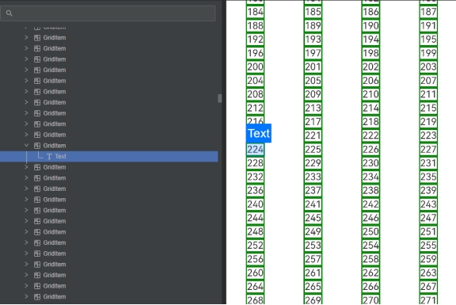

# Page Layout Checker ArkUI Inspector Usage Guide

DevEco Studio has a built-in ArkUI Inspector tool. Developers can use ArkUI Inspector to view the UI display effect of applications on real devices on DevEco Studio. By using the ArkUI Inspector tool, developers can quickly locate layout problems or other UI-related problems. In addition, developers can observe and understand the layout relationships and attributes between different components and learn how to control the display mode of components through layout attributes.

## Constraints

The device to be debugged has been connected using a USB cable and started on the device.

ArkUI Inspector can be used only for debug apps.

Only stage projects of OpenHarmony API 9 or later are supported.

## Scenario Examples

The sample code uses the Grid component to implement the grid layout. Three layers of Stack containers are nested at the outer layer of the Text component.

```ts
@Entry
@Component
struct ArkUIInspectorExample {
 @State children: Number[] = Array.from(Array(900), (_, k) => k);

 build() {
  Scroll() {
   Grid() {
    ForEach(this.children, (item: Number) => {
     GridItem() {
      Stack() {
       Stack() {
        Stack() {
         Text(item.toString()).border({ width: 2, color: Color.Green })
        }
       }
      }
     }
    }, (item: Number) => item.toString())
   }
   .columnsTemplate('1fr 1fr 1fr 1fr')
   .columnsGap(0)
   .rowsGap(0)
   .size({ width: "100%", height: "100%" })
  }
 }
}
```

## How to Use the Page Layout Checker

Take DevEco Studio 4.0.0.400 as an example. Choose ***\*View\**** > ***\*Tool Windows\**** > ***\*ArkUI Inspector\**** on the menu bar of DevEco Studio, or click! on the toolbar at the bottom of DevEco Studio. [img](./figures/profiler_inspector_button.jpg)

Open the ArkUI Inspector, as shown in the following figure.


1. Select an application process that has been started on the device. Click  Refresh on the right to refresh the snapshot of the current page. Note that the device must be in the screen-on state and the application must be running in the foreground.

2. Component tree area, which is used to view the component nesting status. Currently, the Text component is displayed.

3. In the page snapshot area, after you click the Text component, the selected Text component is displayed in the component list. Click the  Pan Screen button in the lower right corner to drag the screen. Click! [img](./figures/profiler_plus.jpg), ! [img] (./figures/profiler_minus.jpg) button to zoom the page; click! [img](./figures/profiler_zoom.jpg) The Zoom to Fit Screen button centers the page and fits it to the screen size.

4. Component details area, which displays the attributes of the selected Text component, including the coordinates, layout information (Spacing), size information (Size), border information (Border), background information (Background), mask information (Effect), and all other attributes (All Attributes). To accurately search for a single attribute, use the search bar on the top of the page.

## Problem Analysis

According to the page layout checker, there are three layers of redundant stack containers outside the Text component, which is a scenario where there are too many nested containers.


## Code optimization

For the redundant stack container problem found in the page layout checker, delete the redundant stack container from the application code.

```ts
@Entry
@Component
struct ArkUIInspectorExample {
 @State children: Number[] = Array.from(Array(900), (_, k) => k);

 build() {
  Scroll() {
   Grid() {
    ForEach(this.children, (item: Number) => {
     GridItem() {
      Text(item.toString()).border({ width: 2, color: Color.Green })
     }
    }, (item: Number) => item.toString())
   }
   .columnsTemplate('1fr 1fr 1fr 1fr')
   .columnsGap(0)
   .rowsGap(0)
   .size({ width: "100%", height: "100%" })
  }
 }
}
```

## Optimization result

After the layout is optimized, you can use the page layout checker to see that the redundant items on the page have been removed. According to the test result, the average time for refreshing a frame during page sliding is 1 ms shorter than that before the optimization.


