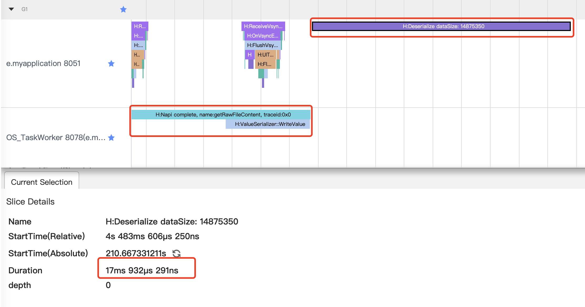
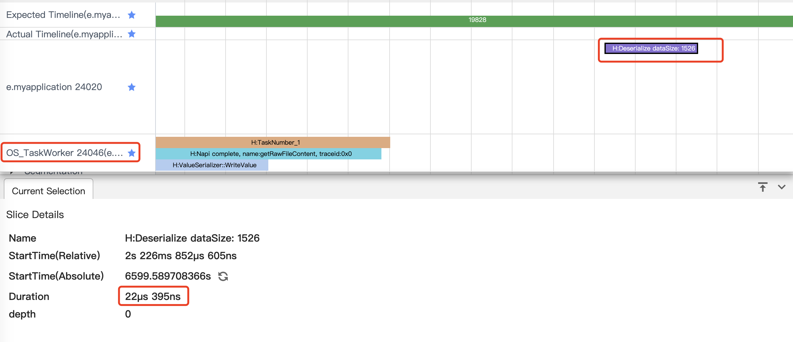

# Avoid Time-consuming Operations in the Main Thread
## Overview
During application development, time-consuming APIs are often called, such as server data APIs and local file reading APIs. If no proper processing is performed, performance problems such as frame freezing may occur.
## Scenario
In the scenario where the list slides infinitely, a data request needs to be sent when the bottom is about to be reached. If the requested data is directly processed in the main thread, the sliding animation may be interrupted. If the processing of the callback function takes a long time, the main thread is directly blocked, and frame freezing is obvious. Asynchronous invoking is performed in asynchronous execution mode. The callback function is still executed in the main thread, which also blocks UI drawing and rendering. The following figure shows the scenario preview. During the list sliding, the image display is delayed.


## Optimization Examples
### Code Example Before Optimization
The following code implements a waterfall stream. Each element is an image. When the sliding is about to reach the bottom, the asynchronous function mockRequestData is called to obtain new data and write the data to the data source. The asynchronous function mockRequestData is used to simulate time-consuming network requests, read data from rawfile, process the data, and return the data.
```ts
  build() {
    Column({ space: 2 }) {
      WaterFlow() {
        LazyForEach(this.dataSource, (item: ModelDetailVO) => {
          FlowItem() {
            Column() {
              Image(item.url)
            }
          }
          .onAppear(() => {
            // Add data in advance when scrolling is about to end.
            if (item.id + 10 === this.dataSource.totalCount()) {
              // Obtain data through a subthread and transfer the current data length to assign the data ID.
              this.mockRequestData().then((data: ModelDetailVO[]) => {
                for (let i = 0; i < data.length; i++) {
                  this.dataSource.addLastItem(data[i]);
                }
              })
            }
          })
        }, (item: string) => item)
      }
    }
  }

  async mockRequestData(): Promise<ModelDetailVO[]> {
    let result: modelDetailDTO[] = [];
    // The data.json file contains local JSON data whose size is about 20 MB. It is used to simulate data obtaining from the network.
    await getContext().resourceManager.getRawFileContent("data.json").then((data: Uint8Array) => {
      // Time consumption callback function
      let jsonData = buffer.from(data).toString();
      let res: responseData = JSON.parse(jsonData);
      result = res.data;
    })
    return this.transArrayDTO2VO(result);
  }
  // ...
```
After compilation and running, use the [SmartPerf Host](./performance-optimization-using-smartperf-host.md) tool to capture traces. As shown in the following figure, the part in the red box is the callback duration of getRawFileContent.


As shown in the preceding figure, a large amount of time is consumed in the main thread. As a result, users can experience obvious frame freezing when sliding. The asynchronous callback function is also executed by the main thread. Therefore, do not perform time-consuming operations in the callback function.

### Optimize

#### Optimization idea: Use the multi-thread capability.
Use the built-in [TaskPool](../arkts-utils//taskpool-introduction.md) multi-thread capability of the system.
```ts
  build() {
    Column({ space: 2 }) {
      WaterFlow() {
        LazyForEach(this.dataSource, (item: ModelDetailVO) => {
          FlowItem() {
            Column() {
              Image(item.url)
            }
          }
          .onAppear(() => {
            // Add data in advance when scrolling is about to end.
            if (item.id + 10 === this.dataSource.totalCount()) {
              // Obtain data through a subthread and transfer the current data length to assign the data ID.
              taskpoolExecute(this.dataSource.totalCount()).then((data: ModelDetailVO[]) => {
                for (let i = 0; i < data.length; i++) {
                  this.dataSource.addLastItem(data[i]);
                }
              })
            }
          })
        }, (item: string) => item)
      }
    }
  }

  // Note: The following methods and class declarations are declared outside the component.
  async function taskpoolExecute(index: number): Promise<ModelDetailVO[]> {
    // The context needs to be manually transferred to the subthread.
    let task: taskpool.Task = new taskpool.Task(mockRequestData, index, getContext());
    return await taskpool.execute(task) as ModelDetailVO[];
  }

  // Mark the function to be executed concurrently.
  @Concurrent
  async function mockRequestData(index: number, context: Context): Promise<ModelDetailVO[]> {
    let result: modelDetailDTO[] = [];
    // The data.json file contains local JSON data whose size is about 20 MB. It is used to simulate data obtaining from the network.
    await context.resourceManager.getRawFileContent("data.json").then((data: Uint8Array) => {
      let jsonData = buffer.from(data).toString();
      let res: responseData = JSON.parse(jsonData);
      result = res.data;
    })
    return transArrayDTO2VO(result, index);
  }
```

In the preceding code, the optimization idea is to use subthreads to process time-consuming operations to prevent time-consuming operations from affecting UI rendering in the main thread. After compilation and running, use the [SmartPerf Host](./performance-optimization-using-smartperf-host.md) tool to capture traces. As shown in the following figure, the getRawFileContent tag in the main thread is transferred to the TaskWorker thread.

 

As shown in the preceding figure, the blocking duration of the main thread is significantly reduced, and a new trace __H:Deserialize__ is displayed in the upper right corner. This trace indicates the data returned by the deserialization taskpool thread. It still takes a certain period of time (17 ms) and frame loss may occur. The system provides the [@Sendable](../arkts-utils/arkts-sendable.md) decorator to implement memory sharing. You can use the @Sendable decorator on the returned class object ModelDetailVO to continue optimizing performance.

#### Optimization idea: Use the @Sendable decorator to improve data transmission and synchronization efficiency.
Inter-thread communication is time-consuming. If a large amount of data is involved, use [@Sendable](../arkts-utils/arkts-sendable.md).

```c++
  build() {
    Column({ space: 2 }) {
      WaterFlow({}) {
        LazyForEach(this.dataSource, (item: ModelDetailVO) => {
          FlowItem() {
            Column() {
              Image(item.url)
            }
          }
          .onAppear(() => {
            // Add data in advance when scrolling is about to end.
            if (item.id + 10 === this.dataSource.totalCount()) {
              // Obtain data through a subthread and transfer the current data length to assign the data ID.
              taskpoolExecute(this.dataSource.totalCount()).then((data: ModelDetailVO[]) => {
                for (let i = 0; i < data.length; i++) {
                  this.dataSource.addLastItem(data[i]);
                }
              })
            }
          })
        }, (item: string) => item)
      }
    }
  }

  // Note: The following methods and class declarations are declared outside the component.
  async function taskpoolExecute(index: number): Promise<ModelDetailVO[]> {
    // The context needs to be manually transferred to the subthread.
    let task: taskpool.Task = new taskpool.Task(mockRequestData, index, getContext());
    return await taskpool.execute(task) as ModelDetailVO[];
  }

  // Mark the function to be executed concurrently.
  @Concurrent
  async function mockRequestData(index: number, context: Context): Promise<ModelDetailVO[]> {
    let result: modelDetailDTO[] = [];
    // The data.json file contains local JSON data whose size is about 20 MB. It is used to simulate data obtaining from the network.
    await context.resourceManager.getRawFileContent("data.json").then((data: Uint8Array) => {
      let jsonData = buffer.from(data).toString();
      let res: responseData = JSON.parse(jsonData);
      result = res.data;
    })
    return transArrayDTO2VO(result, index);
  }

  class ModelDetailVO {
    id: number = 0;
    name: string = "";
    url: string = "";
  }
  
  // ...
```
The preceding code uses @Sendable on the class object returned by the subthread. The system uses the shared memory to process the class that uses @Sendable, reducing the deserialization overhead.

 

As shown in the figure, the size and time required for deserialization are significantly reduced.

## Summary
According to the preceding sample code and optimization process, processing time-consuming operations in the callback function of the main thread directly blocks the main thread, and users can perceive obvious frame freezing. Using subthreads and @Sendable can effectively optimize the performance in this scenario.
