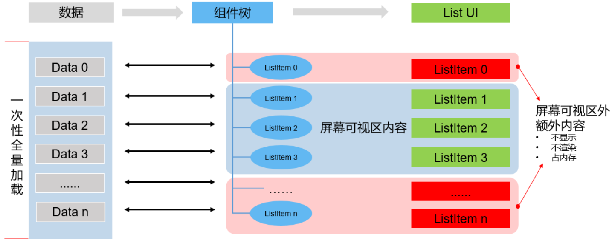
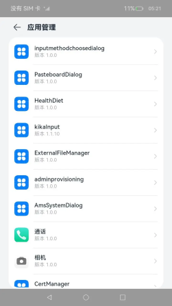
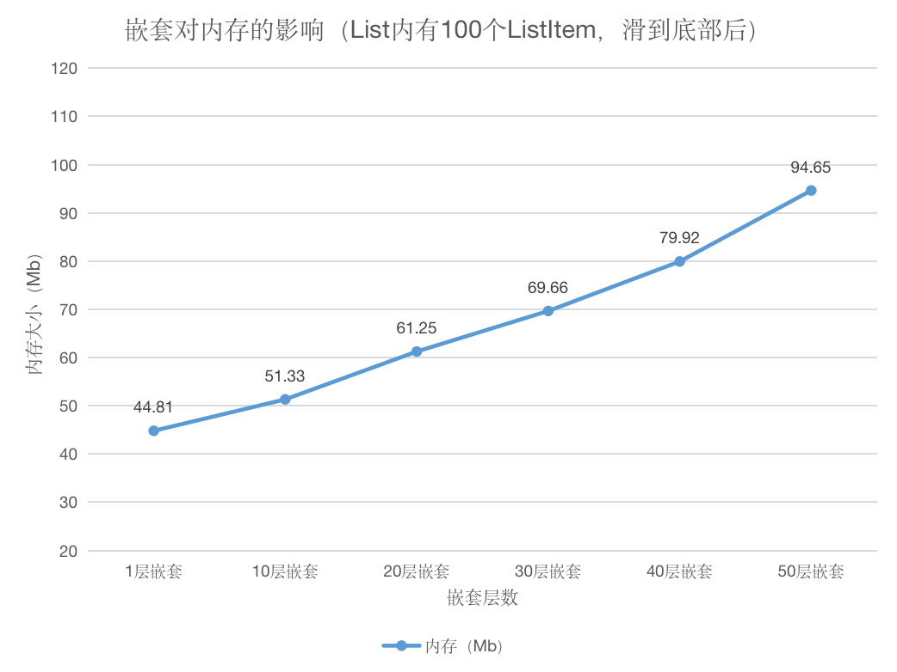
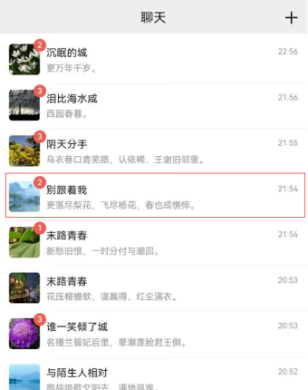
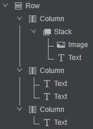
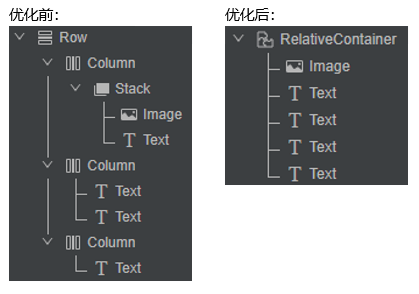

# Best Practices for List Performance Optimization

In application UI development, lists are among the most commonly used presentation techniques, and the way they are used can significantly affect an application's performance. In this topic you'll explore how to optimize performance of your application in scenarios when lists are used.

## Overview

This topic primarily focuses on four list optimization approaches, which you can combine, where appropriate, to achieve a balance between startup time, memory, and system resources.

**Lazy loading**: Lazy loading is also known as on-demand loading. It can effectively improve page load speeds, by shortening the length of data loaded at once and minimizing resource usage.

**Caching**: Caching an appropriate number of list items before they appear onscreen, combined with lazy loading, can greatly help create a smooth scrolling experience.

**Component reuse**: Reusing components can reduce the overhead of frequent component creation and destruction and improve component render efficiency.

**Layout optimization**: A flattened layout with less nesting and components can avoid overdrawing.

## Lazy Loading

### Mechanism

The ArkUI application framework provides two methods for loading and rendering data of container components: **ForEach** and **LazyForEach**.

**ForEach** is used to load all items in an array at once and render them one at a time.

```ts
ForEach(  
  arr: any[], // List array that requires data iteration. 
  itemGenerator: (item: any, index?: number) => void, // Child component generation function. 
  keyGenerator?: (item: any, index?: number) => string // (Optional) Key generation function. 
)
```

Method 2 – LazyForEach: Use it to implement lazy data loading and on-demand rendering.

```ts
LazyForEach(  
  dataSource: IDataSource, // Data source to iterate over.  
  itemGenerator: (item: any) => void, // Child component generation function. 
  keyGenerator?: (item: any) => string // (Optional) ID generation function. 
)
```

**ForEach** renders a list in the following process:

1. Loads all data from the list data source at once.

2. Creates a component for each item of the list and mounts the components to the component tree. That is, the number of component nodes created by **ForEach** and mounted to the component tree is the same as the number of list items traversed by **ForEach**.

3. Renders only list items in the viewport. When a previously invisible list item is scrolled into the viewport, it can be directly rendered because it has been loaded and mounted to the component tree.



A major drawback of **ForEach** is the performance hit that comes when the list contains a considerable number of items in a complex structure. Understandably, when a list is large, it takes a long time to complete the aforementioned load-create-mount process, resulting in slow page loading. In addition, although components outside of the viewport are not displayed on the screen, they still occupy space in the memory. The performance issue is aggravated when the system is heavily loaded. In extreme cases, the application may exit unexpectedly.  

This is where **LazyForEach**, a lazy loading technique, comes in.

**LazyForEach** works as follows:

1. Loads data on demand based on the number of components that the viewport can accommodate.

2. Creates components based on the loaded data and mounts them to the component tree, which is resultantly small. The number of list items loaded and mounted to the component tree is subject to how many list items can be displayed in the viewport.

3. Shows only those list items that are in the viewport. When a previously invisible list item is scrolled into the viewport, it must go through the load-create-mount process, before being rendered to the screen.


4. The keyGenerator function in LazyForEach lazy loading is used to generate a unique and fixed key value for each data item in the data source. The ID generation function must generate a unique value for each piece of data. Rendering issues will arise with components assigned duplicate IDs.

**LazyForEach**, with its on-demand loading, can be especially useful in reducing page loading time and memory usage when the list data is in large amounts and the list structure is complex.  

### Use Scenarios and Constraints

- If a list is substantially long and loading all of its data at once may bog down page loads, consider using **LazyForEach**.

- For short lists whose full loading is not a performance bottleneck, you can go for **ForEach**.

- If LazyForEach is used for lazy loading, you are advised not to use stringify in the key generator function that uses LazyForEach for component reuse.

Both **ForEach** and **LazyForEach** must be used in container components, such as **\<List>**, **Grid**, and **Swiper**, for rendering their children components that share the same layout. For more information about lazy loading, see [LazyForEach: Lazy Data Loading](../quick-start/arkts-rendering-control-lazyforeach.md).

As a bonus, the **LazyForEach** API provides the **cachedCount** attribute, which specifies the number of list items to be preloaded outside of the screen. For details, see [Caching](#caching).

### Example

Before introducing the sample code for using LazyForEach lazy loading in container components such as List and Grid, the following counterexample is provided based on the third application scenario to help developers better understand and use LazyForEach.

**Negative example: Use stringify in the key generator function that uses LazyForEach for component reuse.**

```ts
class BasicDataSource implements IDataSource {
  private listeners: DataChangeListener[] = [];
  private originDataArray: string[] = [];

  public totalCount(): number {
    return 0;
  }

  public getData(index: number): string {
    return this.originDataArray[index];
  }

  registerDataChangeListener(listener: DataChangeListener): void {
    if (this.listeners.indexOf(listener) < 0) {
      console.info('add listener');
      this.listeners.push(listener);
    }
  }

  unregisterDataChangeListener(listener: DataChangeListener): void {
    const pos = this.listeners.indexOf(listener);
    if (pos >= 0) {
      console.info('remove listener');
      this.listeners.splice(pos, 1);
    }
  }

  notifyDataReload(): void {
    this.listeners.forEach(listener => {
      listener.onDataReloaded();
    })
  }

  notifyDataAdd(index: number): void {
    this.listeners.forEach(listener => {
      listener.onDataAdd(index);
    })
  }

  notifyDataChange(index: number): void {
    this.listeners.forEach(listener => {
      listener.onDataChange(index);
    })
  }

  notifyDataDelete(index: number): void {
    this.listeners.forEach(listener => {
      listener.onDataDelete(index);
    })
  }
}

class MyDataSource extends BasicDataSource {
  private dataArray: string[] = [];

  public totalCount(): number {
    return this.dataArray.length;
  }

  public getData(index: number): string {
    return this.dataArray[index];
  }

  public addData(index: number, data: string): void {
    this.dataArray.splice(index, 0, data);
    this.notifyDataAdd(index);
  }

  public pushData(data: string): void {
    this.dataArray.push(data);
    this.notifyDataAdd(this.dataArray.length - 1);
  }
}

//This is a reused customized component.
@Reusable
@Component
struct ChildComponent {
  @State desc: string = '';
  @State sum: number = 0;
  @State avg: number = 0;

  aboutToReuse(params: Record<string, Object>): void {
    this.desc = params.desc as string;
    this.sum = params.sum as number;
    this.avg = params.avg as number;
  }

  build() {
    Column() {
      //This parameter is used only for ux display. The actual business will be more complex.
      Text(this.desc).fontSize(16).textAlign(TextAlign.Center)
    }.width('100%')
  }
}

@Entry
@Component
struct ReusableKeyGeneratorUseStringify {
  private data: MyDataSource = new MyDataSource();

  aboutToAppear(): void {
    for (let index = 0; index < 200; index++) {
      this.data.pushData(index.toString())
    }
  }

  build() {
    Column() {
      List() {
        LazyForEach(this.data, (item: string) => {
          ListItem() {
            ChildComponent({ desc: item, sum: 0, avg: 0 })
          }
          .width('100%')
          .height(100)
        }, (item: string) => JSON.stringify(item))
      }
      .height('100%')
      .width('100%')
    }
  }
}
```

In the negative example, stringify is used in the key generator function that uses LazyForEach for component reuse. In actual complex service scenarios, the lazy loading item data is large and the number of items is large. When the stringify is used, the entire item object is serialized and the item is converted into a string, which consumes a large amount of time and computing resources. As a result, the page performance deteriorates. Therefore, to reduce the page rendering time and improve page performance, do not use stringify in the key generator function reused by the LazyForEach component. You are advised to use a simple short string, for example, item.id. Assume that each item has a unique id attribute.


The preceding counterexamples help developers better understand and correctly use LazyForEach lazy loading. The following provides the basic writing method of a positive example. The sample code for using LazyForEach lazy loading in container components such as List and Grid is as follows:

```ts
// Data source to be traversed by LazyForEach, which is an instance that implements the **IDataSource**.  
private dataList = ...
build() {
  Column() {
    List() {
      LazyForEach(this.dataList, // Data source         
        (item: ListItemData) => {// Generate the corresponding component based on the list item data. 
          ListItem() {
            this.initItem(item)
          }
        },(item: ListItemData) => item.itemId) // Generate the list item key.
      }
   }
}
```

Overall, the implementation process of **LazyForEach** consists of three steps:

1. Prepare a data source class.

2. Traverse the data source to create a list item.

3. Specify a unique key for the list item.


The following are details of each step:<br> 1. Implement the **IDataSource** class as the data source of **LazyForEach**. This class provides the APIs for obtaining the total amount of data, returning the data with the specified index, and registering and deregistering a data listener. Write a data source class, **BasicDataSource**, that implements **IDataSource**. This class contains **listeners**, an instance variable of the DataChangeListener type, used to maintain the registered data listeners and invoke the corresponding callback when data changes. Each **listener** instance corresponds to a **LazyForEach** instance in ArkUI. When the data source changes, the **listener** instance notifies **LazyForEach** that the page needs to be updated. For details about the code, see [BasicDataSource.ets](https://gitee.com/openharmony/applications_app_samples/blob/master/code/Solutions/IM/Chat/features/chatlist/src/main/ets/viewmodel/BasicDataSource.ets).

**BasicDataSource** is an abstract class. It must be implemented for data sources of different list pages based on service scenarios. In this example, a **ChatListData** class is implemented for a chat list. In the class the array variable **chatList: Array** provides data for the list child components. The **ChatModel** class represents the list items in the chat list, including the contact information, last message, timestamp, and number of unread messages. **totalCount()** and **getData(index: number)** are methods defined in the **IDataSource** class and called by the application framework to provide data for **LazyForEach**. The **addData()** and **pushData()** methods are called to add data to the data source. Note that the **notifyDataAdd** method must be called in these two methods to trigger **LazyForEach** updates through the API in **DataChangeListener**.

```ts
class ChatListData extends BasicDataSource {  
    /**  
    * Array of chat list items 
    */  
    private chatList: Array<ChatModel> = []  
    /**  
    * Obtain the total data amount of the data source. 
    */  
    public totalCount(): number {  
        return this.chatList.length  
    }  

    /**  
    * Obtain the data with the specified index. 
    */  
    public getData(index: number): ChatModel {  
        return this.chatList[index]  
    }  
    /**  
    * Add a data record to the specified location in the chat list. 
    */  
    public addData(index: number, data: ChatModel): void {  
        this.chatList.splice(index, 0, data)  
        this.notifyDataAdd(index)  
    }  
    /**  
    * Add a data record to the chat list. 
    */  
    public pushData(data: ChatModel): void {  
        this.chatList.push(data)  
        this.notifyDataAdd(this.chatList.length - 1)  
    }  
}
```

2. Create sample data. In the custom component **ChatListDisplayView**, create a local variable **chatList_Lazy** of the ChatListData type, and then create sample data in the **aboutToAppear()** method.

```ts
@Component  
export struct ChatListDisplayView {  
    private chatList_Lazy: ChatListData = new ChatListData()  
    ......  
    async aboutToAppear(): Promise<void> {  
    await makeDataLocal(this.chatList_Lazy)  
    ......  
   }
}
```

3. In the **\<List>** component, use **LazyForEach** to traverse the data source **this.chatList_Lazy** to generate list items. The **chatViewBuilder()** method is used to lay out list items on the page. The code **(msg: ChatModel) => msg.user.userId** uses the user code as a unique key of a list item. Now, the implementation of **LazyForEach** is complete.

```ts
build() {  
    Column() {  
        List() {  
        ......  
        LazyForEach(this.chatList_Lazy, (msg: ChatModel) => {  
        ListItem() {  
        ......  
        this.chatViewBuilder(msg)  
        ......  
        }
       }, (msg: ChatModel) => msg.user.userId)  
       ......  
    }  
  }
}
```

### Effect

To find out how much of the performance difference between **LazyForEach** and **ForEach**, this example stimulates a chat list that contains 10,000 records. The test items include the page load time and the frame rate during list scrolling.

When **ForEach** is used, it takes 3530 ms to load the page. When **LazyForEach** is enabled, the time is slashed to 752 ms, down by 21.3%.

In terms of the frame loss rate, the number is 26.64% is when **ForEach** is used and 2.33% when **LazyForEach** is used.


## Caching

### Mechanism

Although it is necessary to avoid loading all list items at once, properly caching list items before they are actually displayed onscreen can significantly improve the swiping experience by, for example, minimizing white blocks during swiping.

In **LazyForEach**, you can set the **cachedCount** attribute to specify the number of list items to be preloaded outside of the screen.

The detailed process is described as follows:

1. Compared with non-preloaded list items, preloaded ones can be created and rendered much more quickly when they appear in the viewport.

2. When the list keeps scrolling and the number of preloaded list items outside the viewport is less than the value of **cachedCount**, a list item loading event is triggered to continue to preload list items. For example, if **cachedCount** is set to **10**, when the tenth item is displayed on the screen, a list item loading event is trigger to preload the 11th to 20th items.

3. If the list is scrolled up and down alternately, the list items in both directions are preloaded.

4. If **cachedCount** is not explicitly set, the default value **1** is used.


### Use Scenarios and Constraints

Caching is applicable to the scenario where loading list items is time-consuming. For example, when list items are online videos or images, you can preload and cache them to shorten the time required for rendering.

Caching works only with **LazyForEach**, since **ForEach** loads all data at once.

### Example

This example shows how to use the **cachedCount** attribute of a **\<List>** or **Grid** component with **LazyForEach**. The application can adjust the number of off-screen preload items by adding the cachedCount parameter.   

```ts
build() {
  Column() {
    List() {
      ...
      ...
      LazyForEach(this.chatListData, (msg: ChatModel) => {
        ListItem() {
          ChatView({ chatItem: msg })
        }
      }, (msg: ChatModel) => msg.user.userId)
    }
    .backgroundColor(Color.White)
    .listDirection(Axis.Vertical)

    ...
    ...
    .cachedCount(this.list_cachedCount ? Constants.CACHED_COUNT : 0) // Number of list or items to be preloaded outside of the screen 
  }
}
```

### Effect

To measure the performance boost from caching, this example displays 9 list items per page on the screen. As shown below, different values of **cachedCount** have different impact on the frame loss rate. If it is not set, the frame loss rate is 7.79%. As the value increases, the frame loss rate decreases. When the value reaches 5, that is, half of the number of items displayed on the screen, the frame loss rate is at its lowest. Past this threshold, the frame loss rate does not drop significantly as the value increases, and even increases when the value is inappropriately large.  


It should be noted that the optimal value of **cachedCount** must be calculated on a case-by-case basis. A proper value can achieve a tradeoff between user experience and memory consumption. For example, to display network data in a list when data loading is slow, set **cachedCount** to a large value to improve the browsing efficiency and experience of the list. To load memory-intensive images or videos to the list, set **cachedCount** to a small value to reduce the memory usage.

## Reusing Components

### Mechanism

The application framework provides the component reuse capability. When a reusable component is removed from the component tree, it enters a recycling buffer. When a new component node is created, the node in the cache is reused to save the component re-creation time. Especially in scenarios such as lists, user-defined subcomponents have the same component layout structure. When the list is updated, only data such as status variables is different. Component reuse can improve the loading speed and response speed of the list page.

The component reuse mechanism is as follows:

1. When a component marked with @Reusable is removed from the component tree, the component and its corresponding JSView object are placed in the reuse cache.

2. When a new ListItem is to be displayed and a node needs to be created in the List component tree, the system searches the reuse cache for reusable component nodes.

3. Find the reusable node, update it, and add it to the component tree. In this way, the time for creating component nodes and JSView objects is saved.


The @Reusable component reuse and LazyForEach lazy loading can further solve the bottleneck problem in the list sliding scenario and provide a high-performance component creation method in the sliding scenario to improve the sliding frame rate.

### Use Scenarios and Constraints

If the following scenarios exist in service implementation and become the frame rate bottleneck of the UI thread, component reuse is recommended:

1. Multiple user-defined components that have been destroyed are repeatedly created in a frame.

2. The control branch of condition rendering is repeatedly switched, and the component subtree structure in the control branch is heavy.

For component reuse to take effect, the following conditions must be met:

- A user-defined component is modified by the @Reusable decorator, indicating that the component can be reused.

- A user-defined subcomponent that is created under a user-defined parent component and has the component reuse capability is added to the reusable node cache of the parent user-defined component after the reusable user-defined component is removed from the component tree.

- When a reusable subcomponent is created under a user-defined parent component, if the reusable subcomponent of the corresponding type exists in the cache of the reusable subcomponent, the reusable subcomponent is quickly created by updating the reusable subcomponent.

- ForEach cyclic rendering loads full data at a time. Therefore, component reuse is not supported.

The usage rules are as follows:

- @Reusable indicates that a user-defined component can be reused and can be added to any user-defined component. However, developers need to carefully process the creation and update processes of the user-defined component to ensure that the user-defined component can display the correct behavior after being reused.

- The cache and reuse of reusable user-defined components can occur only under the same parent component. Instances of the same user-defined node cannot be reused under different parent components. For example, component A is a reusable component and a subcomponent of component B. Component A enters the reusable node cache of component B. However, when component A is created in component C, component A cached in component B cannot be used.

- The reuse of custom components improves performance mainly by reducing the time for creating JS objects of custom components and reusing the component tree structure of custom components. If you use rendering control syntax before and after the reuse of custom components, and the component tree structure of custom components is significantly changed, you will not be able to reap the benefits of performance improvement from component reuse.

- Component reuse occurs only when a reusable component is removed from the component tree and then added to the component tree again. e.g. Use the ForEach rendering control syntax to create reusable custom components. Component reuse cannot be triggered due to the full expansion attribute of the ForEach rendering control syntax.

The suggestions are as follows:

To maximize the component reuse performance, avoid any operations that may change the component tree structure of the custom component or re-lay out the reusable component.

- For achieve best possible performance, combine component reuse with the **LazyForEach** rendering control syntax in list scrolling scenarios.

- Pay attention to the behavior differences between the creation and update of custom components. Component reuse is, in effect, a special form of component update. The process and lifecycle callbacks used in component creation will not occur during component reuse, and the constructor parameters of the custom component are passed to it through the **aboutToReuse** lifecycle callback. e.g. aboutToAppear lifecycle and initialization input parameters of customized components will not occur during component reuse.

- Avoid time-consuming operations during the **aboutToReuse** lifecycle callback. The best practice is to, in **aboutToReuse**, only update the state variable values required for updating custom components.

### Example

During application development, a custom component is modified by the @Reusable decorator, indicating that the custom component can be reused. After a reusable component created under a customized parent component is removed from the component tree, the component is added to the reusable node cache of the parent component. When a reusable component is created for the parent component again, the reusable component is quickly created from the cache by updating the reusable component. After using the decorator @Reusable to mark a component as a reusable component, you need to implement the lifecycle callback function aboutToReuse() of the customized component. The parameter of aboutToReuse() is the status variable of the reusable component. When a reusable custom component is called, the parent component transfers construction data to the child component.

<br>Example:

```ts
/**
  * Reusable Chat Page Component with Optimized Layout
  */
@Reusable
@Component
struct ReusableOptLayoutChatView {
  @State chatItem: ChatModel = new ChatModel(new ChatContact('', ''), '', '', 0);

  aboutToReuse(params: Record<string, Object>): void {
    this.chatItem = params.chatItem as ChatModel;
    Logger.info(TAG, 'aboutToReuse=' + this.chatItem.toString());
  }

  build() {
    OptLayoutChatView({ chatItem: this.chatItem });
  }
}
```

### Effect Comparison

In the sample program, reuse the components in the list items. According to the test result, the layout of reused components in this example is simple, and component reuse does not significantly improve the performance in this test scenario. In actual scenarios, how to reuse this feature with components? When the layout complexity of list items is higher, the component reuse effect is better. The component layout with higher complexity consumes more system resources during initialization. Therefore, you are advised to use the component reuse feature when using the list layout with higher complexity.

## Layout optimization

### **Common Layout Types**

Currently, the ArkUI application framework provides the following two common layout modes:

Linear layout: For example, Stack, Column, Row, and Flex. Components in the layout are arranged in a linear direction, such as horizontal, vertical, and Z axis directions. This layout is easy to use and understand. However, in complex scenarios, more components and deep nesting layers are used, which is difficult to maintain and increases system overhead.

Advanced layout: Fewer nodes and layout levels can be used to achieve more complex layout effects and flatten the layout. List, Grid, and RelativeContainer. Flattened layout modes are provided in scenarios such as list, grid, and mixed layout. For example, RelativeContainer can perform low-nested complex layout based on anchor points, and List and Grid support methods such as lazy loading to improve performance, at the same time, the maintenance cost is reduced; therefore, the advanced layout is a more recommended layout method.

### **Application Scenarios and Problems**

During page development, we are accustomed to using linear layout to implement page construction. This layout method may cause too many component trees and nested layers, resulting in high performance overhead in the creation and layout phases. The following is an example:

|  |  |
| -------------------------------- | ------------------------------------- |

Redundant layouts exist in the layout, for example, the column layout at the first layer under the build() function. For example, the nested structure under GridContainer uses multiple linear layout columns with deep levels. In the following scenario example, the linear layout is frequently used, causing too deep nesting.

|  |  |
| ---------------------------------- | --------------------------------------- |

Nested components of layers 10, 20, 30, 40, and 50 are constructed as list items. 100 nested components are inserted into the list to test the impact of these nested components on the memory in the sliding scenario. The data is as follows:



The following figure shows the structure of nested components.


According to the memory data, the deeper the nesting level, the higher the system memory overhead. Therefore, during development, minimize layout nesting to make the layout more flat. How to optimize the layout?

### **Layout Optimization Approach**

For these common problems, the page layout of a chat list item will be optimized to show the layout optimization method and idea. You can use tools such as ArkUI Inspector integrated in DevEco Studio to view the view layout. The following figure shows the scenario preview image and the layout structure before optimization.

| **Scenario Preview**                           | **Layout of List Items Before Optimization**                              |
| ---------------------------------- | -------------------------------------------- |
|  |  |

As shown in the scenario preview image, the list contains five parts: image, number of messages, nickname, chat information, and time. The linear layout mode is used. That is, a horizontal layout row is nested with three vertical layout columns. Because the red message font needs to overlap with the image, the stack layout is used for stacking. The final layout mode is shown in the preceding figure. A total of 10 components are used, and four layers are nested, the source code is as follows:

```ts
build() {
  Row() {
    Column() {
      Stack({ alignContent: Alignment.TopEnd }) {
        Image(this.chatItem.user.userImage) //User avatar 
        ...
        if (this.chatItem.unreadMsgCount > 0) {//Render the red dot when the number of red dot messages is greater than 0. 
          Text(`${this.chatItem.unreadMsgCount}`) //Number of messages 
          ...
        }
      }
    }
    .layoutWeight(1)
    .padding({ right: 12 })

    Column() {
      Text (this.chatItem.user.userName) //nickname 
        .fontColor(Color.Black)
        .fontSize(16)
        .margin({ bottom: 3 })
      Text(this.chatItem.lastMsg) //Chat message 
        .fontColor("#999999")
        .maxLines(1)
        .fontSize(14)
        .margin({ top: 5 })
    }
    .alignItems(HorizontalAlign.Start)
    .layoutWeight(3)

    Column() {
      Text (this.chatItem.lastTime) //time 
        .width(50)
        .fontColor("#999999")
        .textAlign(TextAlign.End)
        .maxLines(1)
        .fontSize(12)
        .margin({ right: 6, bottom: 27 })
    }
    .padding({ left: 15 })
    .alignItems(HorizontalAlign.End)
    .layoutWeight(1)
  }

  ...
}
```

The four parts have a clear relative relationship. For example, the number of images and messages is on the left of the list, the time is on the right of the list, and the nickname and chat information is on the right of the image and distributed up and down. Therefore, the RelativeContainer layout can be used for optimization, after the optimization, the number of components can be reduced to 5 and two layers can be nested, greatly reducing the system overhead. The source code is as follows:

```ts
build() {
  RelativeContainer() {// Relative layout 
    Image(this.chatItem.user.userImage) //User avatar 
    ...
    .alignRules({
      top: { anchor: '__container__', align: VerticalAlign.Top },
      left: { anchor: '__container__', align: HorizontalAlign.Start }
    })
      .syncLoad(this.img_syncLoad ? true : false)
      .id("figure")

    if (this.chatItem.unreadMsgCount > 0) {//Render the red dot when the number of red dot messages is greater than 0. 
      Text(`${this.chatItem.unreadMsgCount}`) //Number of messages 
      ...
      .alignRules({
        top: { anchor: '__container__', align: VerticalAlign.Top },
        left: { anchor: '__container__', align: HorizontalAlign.Start }
      })
        .opacity(this.chatItem.unreadMsgCount > 0 ? 1 : 0)
        .id("badge")
    }

    Text (this.chatItem.user.userName) //nickname 
    ...
    .alignRules({
      top: { anchor: '__container__', align: VerticalAlign.Top },
      left: { anchor: '__container__', align: HorizontalAlign.Start }
    })
      .id("user")

    Text (this.chatItem.lastTime) //time 
    ...
    .alignRules({
      top: { anchor: '__container__', align: VerticalAlign.Top },
      right: { anchor: '__container__', align: HorizontalAlign.End }
    })
      .id("time")
    Text(this.chatItem.lastMsg) //Chat information 
    ...
    .alignRules({
      top: { anchor: '__container__', align: VerticalAlign.Top },
      left: { anchor: '__container__', align: HorizontalAlign.Start }
    })
      .id("msg")
  }
  ...
}
```



| **Optimization Status**    | **Total number of components** | **Number of view nesting layers** |
| ----------- | -------- | ---------- |
| Before the optimization, the linear layout is used. | 10       | 4          |
| After the optimization, the flat layout is used. | 5        | 2          |

As shown in the preceding case, selecting correct layout components not only removes the nested component levels, reduces the number of components, facilitates code maintenance, but also prevents the system from drawing more layout components, optimizing performance and reducing memory usage, this is the idea of flat layout reconstruction.


The system also provides more flat layout solutions, such as absolute positioning, customized layout, Grid, and GridRow, which are applicable to more different scenarios. For details, see [Official Document](../ui/Readme-EN.md).

## Summary

Based on the chat list scenario in [Sample Chat Sample Application] (https://gitee.com/openharmony/applications_app_samples/tree/OpenHarmony-5.0-Beta1/code/Solutions/IM/Chat), this document analyzes the methods for optimizing the list sliding performance, including lazy loading, list item caching, component reuse, and page layout optimization. This document describes the principles and application scenarios of each optimization method, and provides the optimization effect and comparison data based on the sample program. You can refer to these optimization methods when developing similar list scenarios.

## Samples

For details, see the following example:

- [Sample Chat Instance Application (ArkTS) (API10)](https://gitee.com/openharmony/applications_app_samples/tree/OpenHarmony-5.0-Beta1/code/Solutions/IM/Chat)
