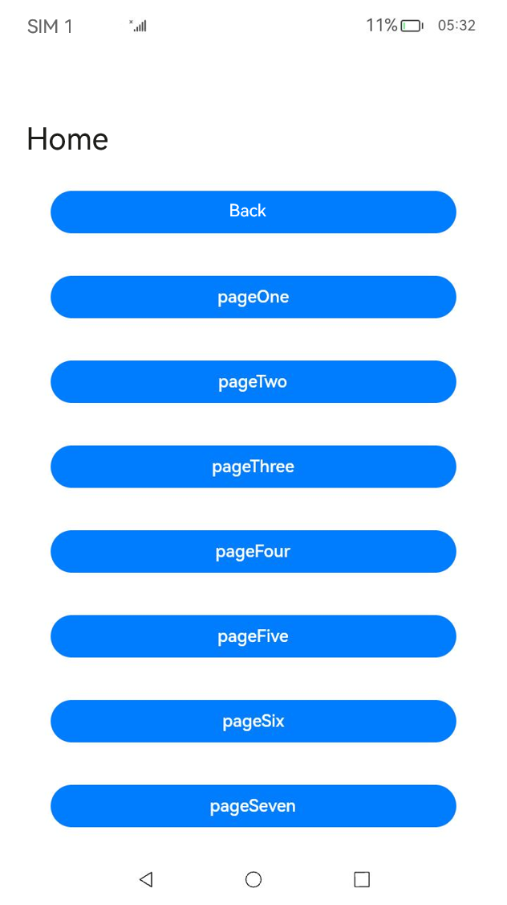

# Dynamic Import

## Overview

When an application loads a page, importing statically all modules significantly slows the loading, and it is often the case that these modules are not all needed. For example, when the home page uses the **Navigation** component, loading the home page loads all subpages by default. As a result, the loading takes a long time, especially when there are a large number of subpages. In effect, the subpages are irrelevant to home page rendering. If they are loaded at a later time, the home page load time can be greatly reduced.
This is where dynamic import comes into play. In this document, we will improve the performance of an application by dynamically importing modules.

## Example

| Home page                                      | Subpage                                       |
|------------------------------------------|--------------------------------------------|
|  |  |

The following example compares static import and dynamic import of the **Navigation** component to describe how to trigger on-demand loading during redirection.

### Static Import

When using the **Navigation** component, you may import subpage components to the home page and add methods to buttons to implement redirection. The following code shows a static import example.

1. Subpage modules are imported. The **Navigation** component uses these modules to redirect the user to subpages. As the subpages are not immediately needed when the user accesses the home page, loading these subpages is redundant and slows down home page loading.
    ```ts
    import { pageOne, pageOneData } from './pageOne';
    import { pageTwo, pagesTwoData } from './pageTwo';
    ...
    import router from '@ohos.router';
    ```
2. The home page uses the **Navigation** component to redirect the user to different subpages when they click a specific button.
    ```ts
    @Provide('pathInfos') pageInfos: NavPathStack = new NavPathStack();
    
    @Builder
    PageMap(name: string) {
      if (name === 'pageOne') {
        pageOne(new pagesOneData(name, this.pageInfos));
      } else if (name === 'pageTwo') {
        pageTwo(new pagesTwoData(name, this.pageInfos));
      }
      ...
    }
    
    build() {
      Navigation(this.pageInfos) {
        Button('Back', { stateEffect: true, type: ButtonType.Capsule })
          .onClick(() => {
             router.back();
          })
        Column() {
          Button('pageOne', { stateEffect: true, type: ButtonType.Capsule })
            .onClick(() => {
               this.pageInfos.pushPath({ name: 'pageOne' }); // Push the navigation destination page specified by name to the navigation stack.
            })
          Button('pageTwo', { stateEffect: true, type: ButtonType.Capsule })
            .onClick(() => {
               this.pageInfos.pushPath({ name: 'pageTwo' });
            })
          ...
        }
      }.title('Home').navDestination(this.PageMap)
    }
    ```

### Dynamic Import

If the **Navigation** component loads all modules statically at a time, the loading of the home page can be slow, especially when there are a large number of complex child components. To reduce page load time, you can use dynamic import, so that child components are dynamically imported as needed during page redirection. To implement dynamic import, perform the following steps:

1. Encapsulate the **pageOne** component to be dynamically imported through the **PageOneLoader** function. This way, when the **PageOneLoader** function is called, the **pageOne** page is rendered.
    ```ts
    import { pageOne } from './pageOne';
    
    @Builder
    export function PageOneLoader() {
      pageOne();
    }
    ```
2. Because the **NavDestination** component in **PageMap** of the **Navigation** component cannot directly load components (**import** is a function and cannot be referenced in components), you need to declare the **@BuilderParam PageOneLoader** function and initialize it when the corresponding button is clicked. This way, **this.PageOneLoader()** can be called in the **NavDestination** component to load the **pageOne** component.
To dynamically load **pageOne** on the home page **DynamicHome**, perform the following steps: 
   a. Define the **@BuilderParam PageOneLoader: () => void** function in the home page **DynamicHome** to receive the result of asynchronously importing **pageOneLoader** by **await import**.
    ```ts
    @BuilderParam PageOneLoader: () => void;
    ```
   b. Defines an asynchronous function so that when the button is clicked, **PageOneLoader** is initialized.
    ```ts
    async loadPageOne(key: string){
      if (key === "pageOne") {
        let PageObj: ESObject = await import("../pages/PageOneLoader");
        this.PageOneLoader = PageObj.PageOneLoader;
      }
    }
    ```
   c. Click the button to trigger the click function and call **loadPageOne**. In this case, **@BuilderParam PageOneLoader** is initialized and **Navigation** is used to load the component.
    ```ts
    private onEntryClick(): void {
      try {
        this.loadPageOne('pageOne');
        this.pageInfos.clear();
        this.pageInfos.pushPathByName('pageOne', '');
        logger.info('DynamicImport Success');
      } catch (error) {
        logger.info('DynamicImport Fail');
      }
    }
    ```
   d. Trigger the initialized **PageOneLoader** function in **PageMap** to dynamically load the **PageOne** component.
    ```ts
    @Builder
    PageMap(name: string) {
      if (name === 'pageOne') {
        this.PageOneLoader();
      }
    }
    ```
The complete code of the **DynamicHome** home page is as follows:
```ts
import router from '@ohos.router';
import { logger } from '../../ets/utils/Logger';

@Entry
@Component
struct DynamicHome {
  @Provide('pathInfos') pageInfos: NavPathStack = new NavPathStack();
  @State active: boolean = false;
  @BuilderParam PageOneLoader: () => void;

  @Builder
  PageMap(name: string) {
    if (name === 'pageOne') {
      this.PageOneLoader();
    }
  }

  build() {
    Navigation(this.pageInfos) {
      Column() {
        Button('Back', { stateEffect: true, type: ButtonType.Capsule })
          .width('80%')
          .height(40)
          .margin(20)
          .onClick(() => {
            router.back();
          })
        Button('PageOne-Dynamic', { stateEffect: true, type: ButtonType.Capsule })
          .width('80%')
          .height(40)
          .margin(20)
          .onClick(() => {
            this.onEntryClick();
          })
      }
    }.title('HOME').navDestination(this.PageMap)
  }

  async loadPageOne(key: String) {
    if (key === "pageOne") {
      let PageObj: ESObject = await import("../pages/PageOneLoader");
      this.PageOneLoader = PageObj.PageOneLoader;
    }
  }

  // Trigger dynamic loading.
  private onEntryClick(): void {
    try {
      this.loadPageOne('pageOne');
      this.pageInfos.clear();
      this.pageInfos.pushPathByName('pageOne', '');
      logger.info('DynamicImport Success');
    } catch (error) {
      logger.info('DynamicImport Fail');
    }
  }
}
```
In sum, when there are a large number of subpages in the **Navigation** component, using static import to load all subpages at once can significantly slow the loading of the home page. To reduce the page load time and overall resource consumption and prevent the main thread from being blocked, use dynamic import so subpages are loaded on demand.
