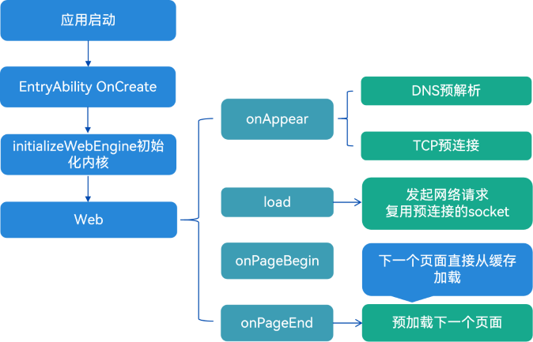
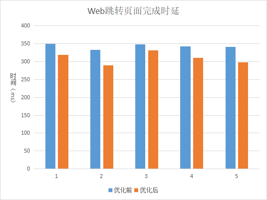

# Web Component Development Performance Improvement

## Overview

To display a web page in an application, developers need to use @ohos.web.webview for web control and use the web component to display web pages. In actual applications, white screen, frame freezing, or other issues occur when a web page is redirected for the first time or the web component is redirected due to various reasons. This document describes how to improve the speed of web home page loading and web page redirection, and provides the [sample source code](https://gitee.com/openharmony/applications_app_samples/tree/OpenHarmony-5.0-Beta1/code/Performance/PerformanceLibrary/feature/webPerformance).

## Optimization Approaches

When using the web component to display web pages, users usually go through four phases: no feedback, white screen, web page rendering, and complete display. The system performs operations such as WebView initialization, network connection establishment, data receiving, and page rendering in each phase. Figure 1 shows the WebView startup phase.

Figure 1 Phase in which the web component displays pages


The home page loading performance of the web component can be optimized in the three phases marked in the legend:

1. In the WebView initialization phase, the first step for an application to open WebView is to start the browser kernel. During this period, all subsequent steps are completely blocked because WebView does not exist yet. Therefore, it may be considered that WebView initialization is completed in advance in the application, and methods such as preloading a component kernel and completing a network request are used during initialization, so that WebView initialization does not completely block subsequent steps, thereby reducing time consumption.
2. In the connection establishment phase, if the developer knows the address of the web page to be accessed in advance, we can establish a connection in advance for DNS resolution.
3. In the resource data receiving phase, when the developer knows in advance what page a user will click on the next page, we can properly use the cache and preloading to download the resources of the page to the cache in advance.

To sum up, developers can use methods 1 and 2 to improve the loading speed of the web home page, and initialize the kernel in advance in the onCreate phase when an application creates an ability. Then, in the onAppear phase, resolve the DNS and pre-connect the home page to be loaded. 
In the web page redirection scenario, developers can also use method 3 to preload the next page to be accessed in the onPageEnd phase to improve the web page redirection and display speed, as shown in Figure 2.

Figure 2 Lifecycle callback function of the web component



## Optimization Method

### Initializing the Kernel in Advance

When an application is opened for the first time, the browser kernel is not initialized by default. The browser kernel is initialized only when a WebView instance is created. 
To initialize the WebView instance in advance, @ohos.web.webview provides the **initializeWebEngine** method, which loads the dynamic link library (DLL) file of the web engine through the API before the web component is initialized. In this way, the DLL of the web component is loaded and the main process of the web kernel is initialized in advance, thus improving the startup performance and reducing the white screen time. 
Use the method as follows:
```javascript
// ../src/main/ets/pages/WebInitialized.ets

import webview from '@ohos.web.webview';

...
  aboutToAppear() {
    // The WebviewController can be used to control various behaviors of web components. A WebviewController object can control only one web component, and the APIs (except static APIs) in the WebviewController can be invoked only after it has been bound to the target web component.
    webview.WebviewController.initializeWebEngine();
}
```

### DNS Resolution and Pre-connection
WebView pre-connects the socket in the onAppear phase. When the web kernel initiates a request, the pre-connected socket is directly reused. If the current resolution is not complete, the DNS resolution task that is being executed is reused when the network request is initiated for DNS resolution. Similarly, even if the pre-connected socket is not successfully connected, the web kernel reuses the socket that is being connected to optimize the resource loading process. 
@ohos.web.webview provides the **prepareForPageLoad** method to implement the pre-connection URL. This API is called before the URL is loaded, only to resolve the DNS and establish a socket link on the URL, but not to obtain the sub-resources of the main resource. 
Parameters:

| Name           | Type     | Description                                                                                       |
|----------------|---------|-------------------------------------------------------------------------------------------|
| url            | string  | URL to be preconnected.                                                                                 |
| preconnectable | boolean | Whether to perform preconnection, which involves DNS resolution and socket connection establishment. The value **true** means to perform pre-connection, and **false** means the opposite.|
| numSockets     | number  | Number of sockets to be preconnected. The value must be greater than 0. A maximum of six socket connections are allowed.                                                   |

The usage is as follows: 
```javascript
// Use the preceding method to preload the WebView kernel to enable pre-connection.
webview.WebviewController.initializeWebEngine();
// Start pre-connection. The connection address is the website to be opened.
webview.WebviewController.prepareForPageLoad("https://www.example.com", true, 2);
```

### Preloading the Next Page
Developers can perform preloading in the onPageEnd phase. When the next page is loaded, if the preloading is successful, the page resources are directly loaded from the cache, which is faster. Generally, when the next page to be accessed by the user can be accurately predicted, the page to be accessed can be preloaded, for example, the next page of a novel, or the page to be accessed by the user is identified by the browser in a process of entering information in the address bar. 
@ohos.web.webview provides the **prefetchPage** method which is used to download the resources required in advance, including the main resource and the sub-resources, when a page is likely to be accessed in the near future, without executing the page JavaScript code or presenting the page. This can significantly reduce the load time for the prefetched page. 
Parameters:

| Name              | Type              | Description            |
|-------------------|------------------|----------------|
| url               | string           | URL to be preloaded.      |
| additionalHeaders | Array<WebHeader> | Additional HTTP headers of the URL.|

Use the method as follows:
```javascript
// ../src/main/ets/pages/WebBrowser.ets

import webview from '@ohos.web.webview';
...

  controller: webview.WebviewController = new webview.WebviewController();
    ...
    Web({ src: 'https://www.example.com', controller: this.controller })
      .onPageEnd((event) => {
         ...
         // Enable preloading when the page to be redirected is determined.
         this.controller.prefetchPage('https://www.example.com/nextpage');
      })
    Button ('Next')
      .onClick(() => {
         ...
         // Go to the next page.
         this.controller.loadUrl('https://www.example.com/nextpage');
      })
```

## Performance Analysis

### Scenario Examples

Redirect to a web page by clicking a button and redirect within a web page. Use Hilog dotting to record timestamps at the redirection event triggered by clicking a button and the OnPageEnd event triggered by the web component.

#### Negative Examples

The entry page is redirected through the router.
```javascript
// ../src/main/ets/pages/WebUninitialized.ets

...
Button ('Go to web page')
  .onClick(() => {
    hilog.info(0x0001, "WebPerformance", "UnInitializedWeb");
    router.pushUrl({ url: 'pages/WebBrowser' });
  })
```
The web page uses the web component to load specified web pages.
```javascript
// ../src/main/ets/pages/WebBrowser.ets

...
Web({ src: 'https://www.example.com', controller: this.controller })
  .domStorageAccess(true)
  .onPageEnd((event) => {
     if (event) {
       hilog.info(0x0001, "WebPerformance", "WebPageOpenEnd");
     }
  })
```

#### Positive Examples

The web component is initialized and pre-connected on the entry page in advance.

```javascript
// ../src/main/ets/pages/WebInitialized.ets

import webview from '@ohos.web.webview';

...
Button ('Go to web page')
  .onClick(() => {
     hilog.info(0x0001, "WebPerformance", "InitializedWeb");
     router.pushUrl({ url: 'pages/WebBrowser' });
  })
...
aboutToAppear() {
  webview.WebviewController.initializeWebEngine();
  webview.WebviewController.prepareForPageLoad("https://www.example.com", true, 2);
}
```
The entry page uses **prefetchPage** to preload the next page while loading the web page.
```javascript
// ../src/main/ets/pages/WebBrowser.ets

import webview from '@ohos.web.webview';

...
  controller: webview.WebviewController = new webview.WebviewController();
    ...
    Web({ src: 'https://www.example.com', controller: this.controller })
      .domStorageAccess(true)
      .onPageEnd((event) => {
         if (event) {
           hilog.info(0x0001, "WebPerformance", "WebPageOpenEnd");
           this.controller.prefetchPage('https://www.example.com/nextpage');
         }
      })
```

### Data comparison

After capturing the trace data of the positive and negative examples and using the SmartPerf Host tool to analyze the data, the following conclusions can be drawn:


From accessing the web home page by clicking a button to the OnPageEnd event triggered by the web component, the home page loading is complete. According to the comparison of the delay before and after the optimization, the average loading time can be reduced by about 100 ms by initializing the kernel in advance, resolution, and pre-connection.


From clicking the button for redirecting to the next page on the web home page to the OnPageEnd event triggered by the web component, the page redirection is complete. According to the comparison of the delay before and after the optimization, the average redirection time can be reduced by 40 ms to 50 ms by preloading the next page.


