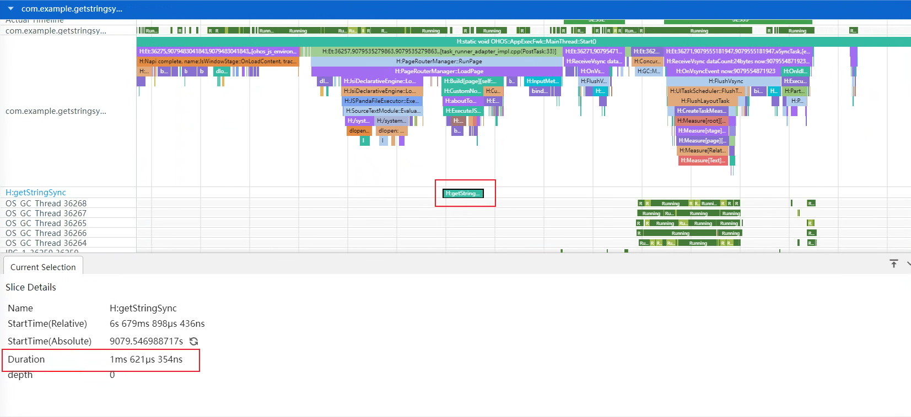
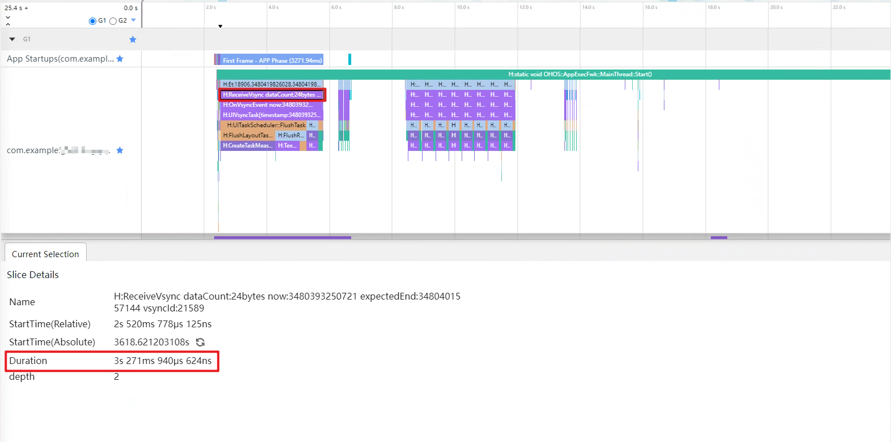

# Reasonable Use of APIs Provided by the System

## Overview

During application development, APIs provided by the system are often called, for example, reading local files and processing server data. Improper use of APIs may cause performance problems such as delay, frame freezing, and frame loss. This document uses the APIs provided by the following system as an example to summarize the precautions.

- getXXXSync API of [ResourceManager](../reference/apis-localization-kit/js-apis-resource-manager.md)
- [wordBreak](../reference/apis-arkui/arkui-ts/ts-basic-components-text.md#wordbreak11) attribute

## getXXXSync API of ResourceManager

ResourceManager can obtain resources through the getXXXSync API in either of the following ways: resource object `resourceManager.getStringSync($r('app.string.test'))` and id `resourceManager.getStringSync($r('app.string.test').id)`.
The following uses [getStringSync](../reference/apis-localization-kit/js-apis-resource-manager.md) as an example to test whether the time required for using the two parameters in the method is different.

### Obtained from the resource object

```ts
@Entry
@Component
struct Index {
  @State message: string = 'getStringSync';

  aboutToAppear(): void {
    hiTraceMeter.startTrace('getStringSync', 1);
    // The input parameter of the getStringSync API directly uses the resource without using the resource ID.
    getContext().resourceManager.getStringSync($r('app.string.test'));
    hiTraceMeter.finishTrace('getStringSync', 1);
  }

  build() {
    RelativeContainer() {
      Text(this.message)
        .fontSize(50)
        .fontWeight(FontWeight.Bold)
    }
    .height('100%')
    .width('100%')
  }
}
```

Use the [SmartPerf Host](performance-optimization-using-smartperf-host.md) tool to capture trace messages. Duration: 1.621 ms.



### Obtained by ID

```ts
@Entry
@Component
struct Index {
  @State message: string = 'getStringSyncAfter';

  aboutToAppear(): void {
    hiTraceMeter.startTrace('getStringSyncAfter', 2);
    // The input parameter of the getStringSync API uses the resource ID.
    getContext().resourceManager.getStringSync($r('app.string.test').id);
    hiTraceMeter.finishTrace('getStringSyncAfter', 2);
  }

  build() {
    RelativeContainer() {
      Text(this.message)
        .fontSize(50)
        .fontWeight(FontWeight.Bold)
    }
    .height('100%')
    .width('100%')
  }
}
```

Use the [SmartPerf Host](performance-optimization-using-smartperf-host.md) tool to capture trace messages. The duration is 0.124 ms.


### Summary

When the parameter is resource information (1.621 ms), it takes more time than when the parameter is resource ID (0.124 ms). Therefore, when you need to use a similar method, you are advised to use the resource ID as a parameter.

## wordBreak attribute

Zero Width Space (ZWSP) is a special Unicode character. It is an invisible character whose width is zero and does not occupy any visible space. In a text processing system, although it is visually invisible, it does exist in the text and can be used as a potential breakpoint, that is, allowing a line to be disconnected at this position. This means that if a line of text is too long and needs to be wrapped, the text can be folded at the position of zero-width spaces without affecting the integrity of the word.

While zero-width spaces are useful in many cases, it can also cause problems, especially in text processing and data cleaning. If you do not pay attention to these invisible characters, unexpected data errors, search failures, and data inconsistency may occur. Therefore, it is important to understand and consider these invisible characters when processing text data from different sources.

Do not use zero-width spaces (\u200b) in the text component to set line break rules. [wordBreak](../reference/apis-arkui/arkui-ts/ts-basic-components-text.md#wordbreak11) is recommended because WordBreak has better performance than zero-width spaces. For example, the recommended usage is Text(this.diskName).wordBreak(WordBreak.BREAK_ALL).

### Negative Examples

```ts
@CustomDialog
export struct DiskFormatDialog {
  private diskName: string = '';
  build() {
    Column() {
      Text(this.diskName.split("").join("\u200B"))
      .textAlign(TextAlign.Start)
    }
  }
}
```

Use the [SmartPerf Host](performance-optimization-using-smartperf-host.md) tool to capture trace messages. During the startup, the ReceiveVsync phase takes 3s271 ms.



### Positive Examples

```ts
@CustomDialog
export struct DiskFormatDialog {
  private diskName: string = '';
  build() {
    Column() {
      Text(this.diskName)
      .textAlign(TextAlign.Start)
      .wordBreak(WordBreak.BREAK_ALL)
    }
  }
}
```

Use the [SmartPerf Host](performance-optimization-using-smartperf-host.md) tool to capture trace messages. During startup, the ReceiveVsync phase takes 301 ms.


### Summary

When zero-width spaces are used (3s271 ms), more time is consumed than when wordBreak is used (301 ms). Therefore, when you need to use a similar method, wordBreak has better performance.
