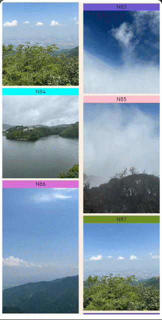

# High-Performance WaterFlow Development

## Background

The waterfall layout is a popular layout for presenting images and frequently seen in shopping and information applications. It is implemented using the [WaterFlow](../reference/apis-arkui/arkui-ts/ts-container-waterflow.md) component in ArkUI. This document discusses how to improve the **WaterFlow** performance, with practical examples.

## Using Lazy Loading

Below shows the basic usage of the **WaterFlow** component.

```ts
  build() {
    Column({ space: 2 }) {
      WaterFlow() {
        LazyForEach(this.datasource, (item: number) => {
          FlowItem() {
            Column() {
              Text("N" + item).fontSize(12).height('16')
              Image('res/waterFlowTest (' + item % 5 + ').jpg')
                .objectFit(ImageFit.Fill)
                .width('100%')
                .layoutWeight(1)
            }
          }
          .width('100%')
          // Set the <FlowItem> height to avoid the need to adapt to image heights. 
          .height(this.itemHeightArray[item])
          .backgroundColor(this.colors[item % 5])
        }, (item: string) => item)
      }
      .columnsTemplate("1fr 1fr")
      .columnsGap(10)
      .rowsGap(5)
      .backgroundColor(0xFAEEE0)
      .width('100%')
      .height('80%')
    }
  }
```

In the sample code, [LazyForEach](../quick-start/arkts-rendering-control-lazyforeach.md) is used for lazy loading. During the layout of the **WaterFlow** component, the **\<FlowItem>** components are created as needed based on the visible area; those that extend beyond the visible area are destroyed to reduce memory usage.

Considering that **\<Image>** components are loaded asynchronously by default, you are advised to set the height for **\<FlowItem>** components based on the image size, to avoid layout re-render caused by **\<FlowItem>** components' changing heights to accommodate images.

## Implementing Infinite Scrolling

In the example, the fixed number of **\<FlowItem>** components results in failure to achieve infinite scrolling.

To implement infinite scrolling with the capabilities provided by the **WaterFlow** component, you can new data to the **LazyForEach** data source during **onReachEnd**, and set the footer to the loading-new-data style (by using the [\<LoadingProgress>](../reference/apis-arkui/arkui-ts/ts-basic-components-loadingprogress.md) component).

```ts
  build() {
    Column({ space: 2 }) {
      WaterFlow({ footer: this.itemFoot.bind(this) }) {
        LazyForEach(this.datasource, (item: number) => {
          FlowItem() {
            Column() {
              Text("N" + item).fontSize(12).height('16')
              Image('res/waterFlowTest (' + item % 5 + ').jpg')
                .objectFit(ImageFit.Fill)
                .width('100%')
                .layoutWeight(1)
            }
          }
          .width('100%')
          .height(this.itemHeightArray[item % 100])
          .backgroundColor(this.colors[item % 5])
        }, (item: string) => item)
      }
      // Load data once the scrolling reaches the end of the page. 
      .onReachEnd(() => {
        console.info("onReachEnd")
        setTimeout(() => {
          for (let i = 0; i < 100; i++) {
            this.datasource.AddLastItem()
          }
        }, 1000)
      })
      .columnsTemplate("1fr 1fr")
      .columnsGap(10)
      .rowsGap(5)
      .backgroundColor(0xFAEEE0)
      .width('100%')
      .height('80%')
    }
  }

  // Add an item to the end of the data. 
  public AddLastItem(): void {
    this.dataArray.splice(this.dataArray.length, 0, this.dataArray.length)
    this.notifyDataAdd(this.dataArray.length - 1)
  }
```

To add new data, you must add an item to the end of the data. Do not directly modify the data array and use **onDataReloaded()** of **LazyForEach** to instruct the **WaterFlow** component to reload data.

Because the heights of the child components in **WaterFlow** vary, and the position of a lower child component depends on its upper one, reloading all data in **WaterFlow** will trigger waterfall layout recalculation, causing frame freezing. In comparison, if you add new data by adding an item to the end of the data and then call **notifyDataAdd(this.dataArray.length - 1)**, the **WaterFlow** component loads new data, without processing existing data repeatedly.



## Adding Data in Advance

Although infinite scrolling can be achieved through triggering of **onReachEnd()** upon new data, there may be an obvious pause in the process of loading new data when the user scrolls to the bottom.

To create a smooth scrolling experience, you need to adjust the time for adding new data. For example, you can add some new data in advance when the **LazyForEach** data source still has several pieces of data left before iteration ends.

```ts
  build() {
    Column({ space: 2 }) {
      WaterFlow() {
        LazyForEach(this.datasource, (item: number) => {
          FlowItem() {
            Column() {
              Text("N" + item).fontSize(12).height('16')
              Image('res/waterFlowTest (' + item % 5 + ').jpg')
                .objectFit(ImageFit.Fill)
                .width('100%')
                .layoutWeight(1)
            }
          }
          .onAppear(() => {
            // Add data in advance when scrolling is about to end. 
            if (item + 20 == this.datasource.totalCount()) {
              for (let i = 0; i < 100; i++) {
                this.datasource.AddLastItem()
              }
            }
          })
          .width('100%')
          .height(this.itemHeightArray[item % 100])
          .backgroundColor(this.colors[item % 5])
        }, (item: string) => item)
      }
      .columnsTemplate("1fr 1fr")
      .columnsGap(10)
      .rowsGap(5)
      .backgroundColor(0xFAEEE0)
      .width('100%')
      .height('80%')
    }
  }
```

In this example, the quantity of data items left till the end is determined in **onAppear** of **\<FlowItem>**, and new data is added in advance to implement stutter-free infinite scrolling.


## Reusing Components

Now that we have a waterfall that scrolls infinitely without explicitly waiting for more data, we can further optimize its performance by making the components reusable.

During scrolling, **\<FlowItem>** and its child component are frequently created and destroyed. By encapsulating the component in **\<FlowItem>** into a custom component and decorating it with the **@Reusable** decorator, you make the component reusable, reducing the overhead of repeatedly creating and destroying nodes in the ArkUI framework. For details about component reuse, see [Best Practices for Component Reuse](component-recycle.md).

```ts
  build() {
    Column({ space: 2 }) {
      WaterFlow() {
        LazyForEach(this.datasource, (item: number) => {
          FlowItem() {
            // Use reusable custom components. 
            ResuableFlowItem({ item: item })
          }
          .onAppear(() => {
            // Add data in advance when scrolling is about to end. 
            if (item + 20 == this.datasource.totalCount()) {
              for (let i = 0; i < 100; i++) {
                this.datasource.AddLastItem()
              }
            }
          })
          .width('100%')
          .height(this.itemHeightArray[item % 100])
          .backgroundColor(this.colors[item % 5])
        }, (item: string) => item)
      }
      .columnsTemplate("1fr 1fr")
      .columnsGap(10)
      .rowsGap(5)
      .backgroundColor(0xFAEEE0)
      .width('100%')
      .height('80%')
    }
  }
@Reusable
@Component
struct ResuableFlowItem {
  @State item: number = 0

  // Invoked when a reusable custom component is re-added to the component tree from the reuse cache. The component state variable can be updated here to display the correct content.
  aboutToReuse(params) {
    this.item = params.item;
  }

  build() {
    Column() {
      Text("N" + this.item).fontSize(12).height('16')
      Image('res/waterFlowTest (' + this.item % 5 + ').jpg')
        .objectFit(ImageFit.Fill)
        .width('100%')
        .layoutWeight(1)
    }
  }
}

```

## Takeaway

To achieve the optimal performance in infinite scrolling, you can use **WaterFlow** with the **LazyForEach** rendering control syntax, ahead-of-time data addition, and component reuse.
