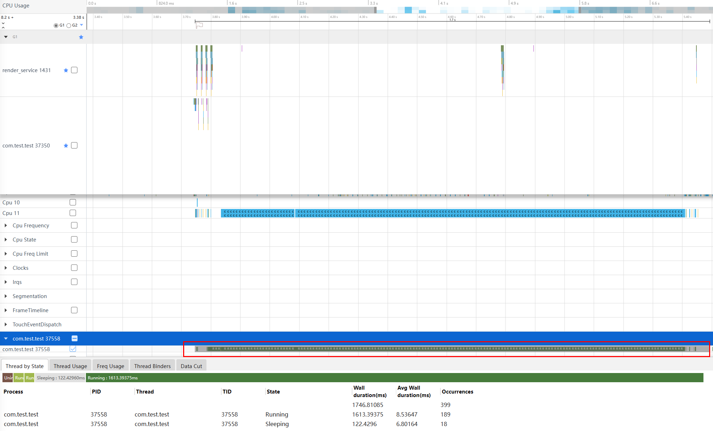
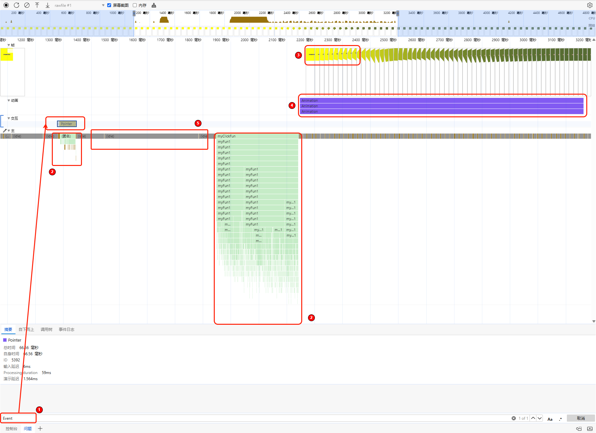
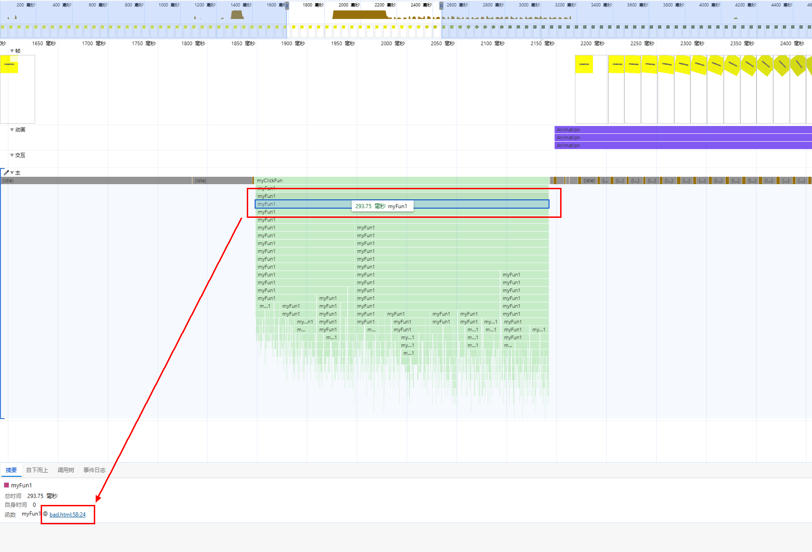
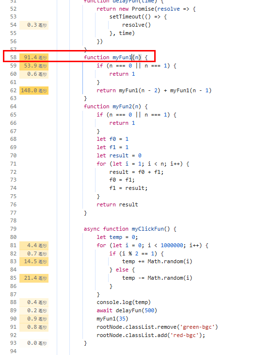

# Web Performance Problem Analysis Cases

As shown in the following figure, after you click the text block in the lower part, the animation starts after a certain period of time. Actually, the delay is long. 
Figure 1 Scenario animation 
  

## Fault Locating Process

### Using Screen Recording to Assist Fault Locating

When handling a fault, you can view the operation screen recording and operation scenario to check whether you can find some information that helps locate the fault. For example:

1. Check whether there is a transition dynamic effect and whether the initial dynamic effect is obvious.
2. Indicates whether the page component is complex.

In this problem, it can be found that the click delay is before the dynamic effect, and the component complexity is low.

### Using the Trace Tool to Capture Trace Messages

For response delay problems, determine the start and end points of the response, where the area is located, and what the area is doing.

1. Start point: If the event is triggered by clicking, find ispatchTouchEvent Type = 1 on the application side, as shown in the red line in Figure 2. 
    Figure 2 Trace start point
    
2. End point: Generally, the first frame on the render_service side is used as the end point, as shown by the blue line in Figure 3. 
    Figure 3 Trace end point
    
    It can be found that the subsequent animation has reached the maximum frame rate, indicating that the no response is from the red line to the blue line.
3. According to the analysis of the H:ReceiveVsync signal, several frames occur in the no-response phase, but the time consumed by each frame is not too long. The same applies to the application side, indicating that the load is not high during UI drawing. 
    Figure 4 Trace frame rate analysis
    
4. In addition, it can be found that the application occupies the CPU for a long time during this process. Therefore, a large number of calculations may be generated. 
    Figure 5 Possible causes of time consumption
    

Based on the preceding analysis, the application side finds that a large number of calculations may be generated on the H5 side. In this case, the Devtools tool needs to be used for further analysis.

### Use Devtools for analysis.

For details about how to use DevTools for debugging, see [Using DevTools to Debug Frontend Pages] (https://developer.huawei.com/consumer/cn/doc/harmonyos-guides-V5/web-debugging-with-devtools-V5?catalogVersion=V5).

Figure 6 shows the swimlane diagram of DevTools. This document analyzes the possible abnormal areas.

Figure 6: DevTools swimlane area division 

- Area 1: This area is the start point. Enter Event to search for click events. 
- Area 2: component loading area, which is mainly used for JS execution. 
- Area 3: response end point. The first frame of the frame lane is sent for display. 
- Area 4: This area is an animation area and is responsible for executing animations. 
- Area 5: This area is a blank area, which is generally caused by delay functions such as setTimeout. 

This page does not involve network interaction. Therefore, some areas, such as network areas, are not marked. Examples will be provided later.

## Root Cause

In the HTML5 page switching scenario, the web component has been initialized, and the click event is an internal web event. The scenario process mainly occurs in area 1234 in Figure 6. 
When you click, the following process is executed:
1. Web navigation waits for the main page to render the first non-blank frame.
2. On the main page, click Main Resource Download, then click Main Resource Parsing and Rendering, and then click Subresource Download and Subresource Parsing and Rendering.
3. The main resource is rendered and is a non-blank frame. The navigation animation is evoked and the page responds.
4. After the main resource is rendered, the frame is a blank frame and is discarded by the web system. The first non-blank frame rendered by the subsequent sub-resources wakes up the navigation animation and the page responds.

Summary: Most slow responses have the following exceptions:
1. The structure of the main resource rendering component is complex and time-consuming.
2. The main resource is blank, the sub-resources are dynamically loaded, and the first frame is displayed slowly.

Therefore, focus on the component loading and network area exception phases. The root cause analysis of each area is as follows:

### Component Loading Area Exception Analysis

Area 2 in Figure 6: You can record the loading duration.
The exceptions are as follows:
1. The proportion of time-consuming areas is high. For example, area 2 takes about 290 ms, which is an optimization point.
2. Rendering components are being loaded in several areas. In this case, components may be dynamically loaded, and the latency is high.

We can see that a large number of myFun1s are called. In this case, you can click the following link to go to the source code:  
Figure 7: Method jumping to the source code 
  
Figure 8: Time consumed by the source code 
  
As shown in Figure 8, the source code displays the time consumed by the specific method. In this case, it can be found that the myFun1 method uses recursion, which greatly increases the CPU calculation time and causes the response delay. 
Solution: Optimize the recursive method myFun1 to the loop method myFun2 to reduce the time consumption.

### Network Area Exception Analysis

Corresponding to area 2 in FIG. 6: 
Exception definition: The network time consumption ratio is too high. 
The exception point is as follows: In the response phase, the time consumption ratio is high, and the thread is blocked. 
Trace feature: After a network request is complete in each phase of the network area, the JS or task is executed accordingly. 

### Animation Area Exception Analysis

Corresponding to area 4 in FIG. 6: 
If the trace start time and end time of the test response time differ greatly, the animation area is abnormal. 
Common scenario: The background color of the page in the animation is transparent, and the animation curve is slow and then fast. As a result, when the animation starts, the transparent color does not change and looks slow.

### Blank Area Exception Analysis

Corresponds to area 5 in Figure 6. 
The exceptions are as follows: 
- There are network requests. After the blank area, a JS function is executed. The upper network lane usually has network requests. (If the network request is too long, the blank area may be caused when the CPU is idle.)
The common scenario is as follows: After a button is clicked, a network request is sent. After the backend returns data successfully, the page is redirected or the page status is changed.
- The timer waits. After the blank area, the timer-related functions can be found and executed.

It is found that the code contains the timer delay function `await delayFun(500)`. The optimization method is to remove the redundant delay function.

After the preceding analysis, DevTools is called again for analysis. 
Figure 9: Optimized swimlane diagram
  
As shown in Figure 9, the time consumption is significantly reduced and returns to the normal level.

## Common Trace Process Points

**The overall web page loading process is as follows:**

Figure 10: Overall web page loading process  

| Breakdown of the Web Page Loading Process| Key Trace|  
| --- | --- |  
| Click Event| From the time when the last DispatchTouchEvent is sent to the time when the component is initialized| 
| Initializing the Web Component| NWebImpl\|CreateNWeb to the front of the navigation process| 
| Navigation Process| NavigationControllorImpl::LoadURLWithParams to NavigationBodyLoader::OnStartLoadingResponseBody End|
| DOM&CSS parsing| CSSParserImpl::parseStyleShee and ParseHTML parsing, deducting HTMLDocumentParser::RunScriptsForPausedTreeBuilder|
| JS compilation and execution| EvaluateScript and v8.callFunction|
| Waiting for network resource download| Idle before ThrottlingURLLoader::OnReceiveResponse of the render main thread (roughly calculate the blank space of a large segment)|
| Click the response end point.| NotifyFrameSwapped, UnloadOldFrame/First SkiaOutputSurfaceImplOnGpu::SwapBuffers|
| Draw| ThreadProxy::BeginMaiFrame deducts v8 execution|
| rasterization & synthesis| From ProxyImpl::NotifyReadyToCommitOnImpl to SwapBuffers|
| Completion Delay End| Last SkiaOutputSurfaceImplOnGpu::SwapBuffers|

## Summary

After performing the preceding steps, you can use the screen recording, Trace tool, and Devtools to effectively locate and solve click handover delay problems.
