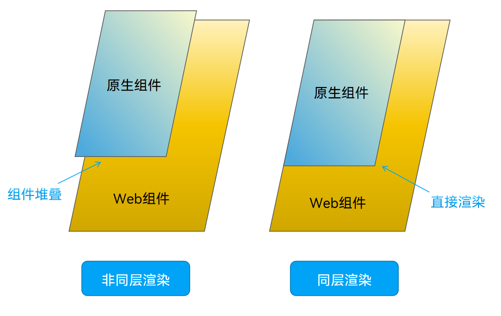
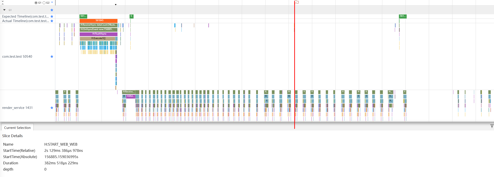
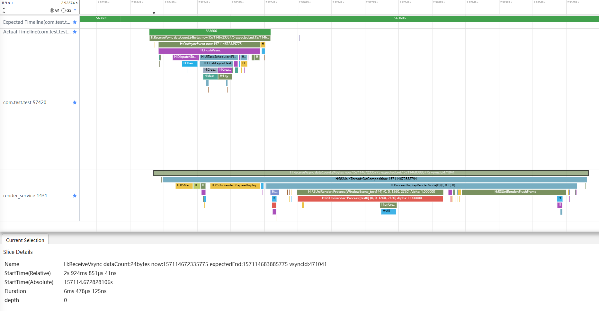

# Rendering Native Components on the Web Using Same-Layer Rendering

When the web component is used to load HTML5 pages, scenarios such as long lists and videos often occur. Currently, the maximum frame rate of the web is 60 fps. To ensure smoother experience, native components must be deployed on the web.

In what scenarios should native components be used on the web?
- High performance and smooth experience are required. such as long lists and videos.
- Native component functions are required.
- Native components have been implemented and reused to reduce development costs.

Currently, there are two solutions to use native components on the web: 
Solution 1: Directly stack components on HTML5 pages. 
Solution 2: Use rendering at the same layer and use the web and native component interaction mode to replace some components in the web, improving interaction experience and performance.

## What Is Same-Layer Rendering?

Same-layer rendering is an optimization technology used to improve the rendering performance of web pages. In same-layer rendering, elements at the same layer are rendered together to reduce the number of redrawing and rearrangement times and improve the page rendering efficiency.

The differences between same-layer rendering and non-same-layer rendering are as follows:

- Rendering at different layers: Stacked on web pages based on the Z-order hierarchy. This method is easy to implement and applies to scenarios where the size and position of native components are fixed.
- Same-layer rendering: The HTML5 page is directly rendered to the Embed tag area in the same-layer rendering mode. This method is complex and applies to the scenario where the size and position of native components need to change with the web page.

**Figure 1: Differences between rendering at the same layer and rendering at different layers**  


For details about the development process of rendering at the same layer, see [Rendering and Drawing at the Same Layer](../web/web-same-layer.md).

## Scenario Examples

The following three rendering modes are used: pure HTML5, non-same-layer rendering, and same-layer rendering. The same mall component is loaded to the same HTML5 page, and traces are captured to compare the differences between the three modes. Figure 2 shows the mall page.

**Figure 2: E-mall page scenario**  
</img>

The core part of the scenario instance source code is as follows:

In the preceding figure, the blank background provides the following HTML5 pages:

```html
<!-- nativeembed_view.html -->
...
  <body>
    <div>
      <div id="bodyId">
        <!--On the HTML5 page, use embedded tags to identify elements at the same layer. On the application side, render native components to the location of embedded tags on the HTML5 page.-->
        <embed id="nativeSearch" type="native/component" width="100%" height="100%" src="view" />
      </div>
    </div>
  </body>
...
```

In the preceding figure, the native mall components of the search box and list below are as follows:

```typescript
// SearchComponent.ets
...
@Component
export struct SearchComponent {
  @Prop params: Params;
  @State myData: MyData = new MyData();

  build() {
    Column({ space: 8 }) {
      Text ('mall').fontSize (16)
      Row() {
        Image($r("app.media.nativeembed_search_icon"))
          .width(14)
          .margin({ left: 14 })
        Text ("Search Related Baby")
          .fontSize(14)
          .opacity(0.6)
          .fontColor('#000000')
          .margin({ left: 14 })
      }
      .width("100%")
      .margin(4)
      .height(36)
      .backgroundColor('#FFFFFF')
      .borderRadius(18)
      .onClick(() => {
        //Tips displayed when a user clicks the search box
        promptAction.showToast({
          message: "Demo Only"
        });
      })

      Grid() {
        LazyForEach(this.myData, (item: ProductDataModel, index: number) => {
          GridItem() {
            Column({ space: 8 }) {
              Image(item.uri).width(100)
              Row({ space: 8 }) {
                Text(item.title).fontSize(12)
                Text(item.price).fontSize(12)
              }
            }
            .backgroundColor('#FFFFFF')
            .alignItems(HorizontalAlign.Center)
            .justifyContent(FlexAlign.Center)
            .width("100%")
            .height(140)
            .borderRadius(12)
          }
        }, (item: ProductDataModel) => `${item.id}`)
      }
      .cachedCount(2)
      .columnsTemplate('1fr 1fr')
      .rowsGap(8)
      .columnsGap(8)
      .width("100%")
      .height("90%")
      .backgroundColor('#F1F3F5')
    }
    .padding(10)
    .width(this.params.width)
    .height(this.params.height)
  }
}

...
```

## Comparison Between the Three Solutions for Loading Native Components on the Web Page

### Use H5 for loading. 
The first idea is to implement the search box and list components using native H5 and load the page directly using the web. The data interaction part needs to interact with the native interaction part through WebMessagePort. The key code steps are as follows:

1. The application uses a single web component to mount to the HTML5 page. However, the javaScriptProxy input parameter needs to be set and the WebMessagePort channel needs to be established in the PageEnd callback to transmit data.

    ```typescript
    Web({ src: $rawfile("web.html"), controller: this.browserTabController })
      .zoomAccess(false)
      .javaScriptProxy({
        object: this.mockData,
        name: 'mockData',
        methodList: ["getMockData"],
        controller: this.browserTabController
      })
      .onPageEnd(() => {
        // 1. Create a message port.
        this.ports = this.browserTabController.createWebMessagePorts(true);
        // 2. Send port 1 to HTML5.
        this.browserTabController.postMessage("init_web_messageport", [this.ports[1]], "*");
        // 3. Save port 0 to the local host.
        this.nativePort = this.ports[0];
        // 4. Set the callback.
        this.nativePort.onMessageEventExt((result) => {
          try {
            const type = result.getType();
            switch (type) {
              case webview.WebMessageType.STRING: {
                if (result.getString() === 'shop_search_click') {
                  //Tips displayed when a user clicks the search box
                  promptAction.showToast({
                    message: $r("app.string.nativeembed_prompt_text")
                  });
                }
                break;
              }
            }
          } catch (error) {
            console.error(`ErrorCode: ${error.code},  Message: ${error.message}`);
          }
        });
        hiTraceMeter.finishTrace('START_WEB_WEB', 2002);
      })
    ```
2. In this case, the style and component need to be controlled separately through the JS and CSS files. Only the main JS code is displayed here.

    ```javascript
    let h5Port; // Obtain the port number of the application.
    window.addEventListener('message', function (event) {
        if (event.data == 'init_web_messageport') {
            if (event.ports[0] != null) {
                h5Port = event.ports[0]; // 1. Save the port number sent from the eTS side.
            }
        }
    })

    function postStringToApp(str) {
        if (h5Port) {
            h5Port.postMessage(str);
        } else {
            console.error("In html h5port is null, please init first");
        }
    }


    //Obtain the data object on the application side.
    let imageNodeData = mockData.getMockData();

    // Search box
    let searchNode = document.createElement('div');
    searchNode.classList.add('shop-input');
    searchNode.addEventListener('click', () => {
        postStringToApp('shop_search_click')
    })

    ...
    //Other related nodes
    ...

    let imageNodeList = []; // Vmall node list.
    imageNodeData.forEach(item => {
        //Offering div
        let node = document.createElement("div");
        node.classList.add('shop-container');
        //Image img
        let imageNode = document.createElement('img');
        imageNode.classList.add('shop-img');
        imageNode.src = item.uri;
        //Text
        let textNode = document.createElement("p");
        textNode.innerText = `${item.title}\u00A0\u00A0\u00A0\u00A0${item.price}`;
        //Combined offering image
        node.append(imageNode, textNode);
        imageNodeList.push(node);
    })

    shopNode.append(...imageNodeList);

    document.querySelector("#my-app").append(titleNode, searchNode, shopNode);
    ```

In the preceding solution, JS, CSS, and even some front-end frameworks are required for page development using HTML5. In addition, the dynamic effect and experience of native components are not as good as those of native components. Since the web is also a component, you can directly stack native components on the web page. The solution is as follows:  

### Rendering at Different Layers  
The bottom layer uses a blank HTML5 page, uses any label as a placeholder, and cascades a native component above the HTML5 page. The native component needs to be displayed in the corresponding position after the web loading is complete and the label size position is obtained.

1. Use Stack to cascade Web and searchBuilder components.

    ```typescript
    build() {
      Stack() {
        Web({ src: $rawfile("nativeembed_view.html"), controller: this.browserTabController })
          .backgroundColor('#F1F3F5')
          .zoomAccess(false)// Scaling is not allowed.
          .onPageEnd(() => { 
            ...
            //The content of the next step is placed in the file.
            ...
          })
        if (this.isWebInit) {
          Column() {
            //The display needs to be performed based on the actual size loaded on the web page. Therefore, the width and height need to be obtained after the web page is initialized and then stacked on the web page.
            searchBuilder({ width: this.searchWidth, height: this.searchHeight })
          }
          .zIndex(10)
        }
      }
      .alignContent(Alignment.Top)
    }
    ```
2. Use the web to load the nativeembed_view.html file. In the onPageEnd callback after the loading is complete, obtain the size of the Embed element reserved on the web side and convert the size to the component size using the px2vp method. 
You need to add the getEmbedSize method on the HTML5 side to obtain the element size as follows:

    ```javascript
    //H5 side
    function getEmbedSize() {
        let doc = document.getElementById('nativeSearch');
        return {
          width: doc.offsetWidth,
          height: doc.offsetHeight,
        }
    }
    ```
    On the application side, in the onPageEnd callback in step 1:

    ```typescript
    //Obtain the component size from the web side.
    this.browserTabController.runJavaScript(
      'getEmbedSize()',
      (error, result) => {
        if (result) {
          interface EmbedSize {
            width: number,
            height: number
          }
          let embedSize = JSON.parse(result) as EmbedSize;
          this.searchWidth = px2vp(embedSize.width);
          this.searchHeight = px2vp(embedSize.height);
          this.isWebInit = true;
        }
      });
    ```
3. After obtaining the size in step 2, transfer the size to the searchBuilder and display the SearchComponent component through display or hide control.

In the foregoing solution, an implementation method is very simple. However, this is limited to the situation where the underlying H5 web page is simple and does not scroll. If an HTML5 page can be swiped up or down or zoomed in or out, a problem occurs in this solution. As a result, it is difficult to locate the native component and scroll with the HTML5 page. In terms of performance, the web is rendered as a whole, and even the part covered by native components consumes performance. Therefore, we can solve this problem through same-layer rendering. The solution is as follows: 

### Implementation of Same-Layer Rendering 
Simply speaking, rendering at the same layer is as follows: The bottom layer uses blank HTML5 pages, Embed tags as placeholders, and native **NodeContainer** are used. Finally, the surface ID on the web side is bound to the native component and rendered on the **NodeContainer**. For details, see the link in [What Is Same-Layer Rendering](#what-is-same-layer-rendering). Here are some general steps.

1. Use the Stack component to cascade NodeContainer and Web components, and enable the enableNativeEmbedMode mode.
    ```typescript
      build() {
        Stack() {
          NodeContainer(this.searchNodeController)
          //The web component loads the local nativeembed_view.html page.
          Web({ src: $rawfile("nativeembed_view.html"), controller: this.browserTabController })
            .backgroundColor('#F1F3F5')
            .zoomAccess(false)// Scaling is not allowed.
            .enableNativeEmbedMode(true) //Enable the rendering mode at the same layer.
        }
      }
    ```
2. Because NodeContainer is to be used, a class SearchNodeController inherited from NodeController is encapsulated.
    ```typescript
    type Node = BuilderNode<[Params]> | undefined | null;

    /**
     * Controls and feeds back the behavior of nodes on the corresponding NodeContainer. This parameter must be used together with NodeContainer.
     */
    class SearchNodeController extends NodeController {
      private surfaceId: string = ""; //current surfaceId
      private embedId: string = ""; //current embedId
      private type: string = ""; //Current node type
      private renderType: NodeRenderType = NodeRenderType.RENDER_TYPE_DISPLAY; // rendering mode
      private componentWidth: number = 0; //Native component width
      private componentHeight: number = 0; // native componentHeight
      private nodeMap: Map<string, Node> = new Map<string, Node>(); // stores the BuilderNode associated with the surface ID.

      /**
       * Sets rendering options such as surfaceId.
       */
      setRenderOption(params: NodeControllerParams): void {
        this.surfaceId = params.surfaceId;
        this.embedId = params.embedId;
        this.type = params.type;
        this.renderType = params.renderType;
        this.componentWidth = params.width;
        this.componentHeight = params.height;
      }

      /**
       * Invoked when the corresponding NodeContainer is created or called by the rebuild method.
       */
      makeNode(uiContext: UIContext): FrameNode | null {
        if (!this.surfaceId) {//If there is no surfaceId, null is returned.
          return null;
        }
        let getNode: Node = this.nodeMap.get(this.surfaceId);
        if (getNode) {//Obtain BuilderNode based on surfaceId.
          return getNode.getFrameNode();
        } else {//If the value is not obtained, create a BuilderNode, associate it with the nodeMap, and return the value.
          let newNode: Node = new BuilderNode(uiContext, { surfaceId: this.surfaceId, type: this.renderType })
          newNode.build(wrapBuilder(searchBuilder), { width: this.componentWidth, height: this.componentHeight });
          this.nodeMap.set(this.surfaceId, newNode);
          return newNode.getFrameNode();
        }
      }

      /**
       * Dispatch the touch event to the FrameNode created by the rootNode.
       */
      postEvent(event: TouchEvent | undefined): boolean {
        if (!this.surfaceId) {
          return false;
        } else {
          let getNode: Node = this.nodeMap.get(this.surfaceId);
          return getNode?.postTouchEvent(event) as boolean;
        }
      }
    }
    ```
3. Use the web system to load the nativeembed_view.html file. After parsing the Embed tag, the web system uses the onNativeEmbedLifecycleChange interface to report the Embed tag creation message to the application side.
    ```typescript
    Web({ src: $rawfile("nativeembed_view.html"), controller: this.browserTabController })
      .backgroundColor('#F1F3F5')
      .zoomAccess(false)// Scaling is not allowed.
      .enableNativeEmbedMode(true) //Enable the rendering mode at the same layer.
      .onNativeEmbedLifecycleChange((embed) => {
        ...
        //Go to the next step.
        ...
      })
      .onNativeEmbedGestureEvent((touch) => { 
        //Obtain the touch event information of the rendering component at the same layer.
        this.searchNodeController.postEvent(touch.touchEvent);
      })
    ```
4. In the callback in step 3, transfer the configuration to searchNodeController based on embed.status and execute the rebuild method to trigger the makeNode method again.
    ```typescript
    if (embed.status === NativeEmbedStatus.CREATE) {
      //Obtain information such as surfaceId of the embedded tag and transfer the information to searchNodeController.
      this.searchNodeController.setRenderOption({
        surfaceId: embed.surfaceId as string,
        type: embed.info?.type as string,
        renderType: NodeRenderType.RENDER_TYPE_TEXTURE,
        embedId: embed.embedId as string,
        width: px2vp(embed.info?.width),
        height: px2vp(embed.info?.height)
      });
    }
    this.searchNodeController.rebuild();
    ```
5. After the makeNode method is triggered, the NodeContainer component obtains the BuilderNode object, and the native component is displayed on the page.
6. The Embed tag size change is the Embed tag update message reported by the onNativeEmbedLifecycleChange interface.

## Performance Benefit Comparison in Page Startup Scenarios

This topic uses the scenario where the Navigation page is redirected to the web page as an example to capture trace diagrams for analysis. In the following trace diagram, the web page is loaded in the red line, and the native component is loaded in the blue line. 

### Use H5 for loading. 

**Figure 3: Trace diagram of H5**
  
H5 analysis:
- On the application side, the HTML5 page is rendered on the web side. Therefore, the app side has only the JS processing phase before the web page is loaded. After the page ends, the application side does not perform any processing.
- On the render_service side, the time consumed by ReceiveVsync of each frame does not change significantly. 

### Rendering and Loading at Different Layers 

**Figure 4: Trace graph rendered at different layers**  
  
Analysis of Rendering at Different Layers:
- On the application side, the measurement and calculation layout is between the red and blue lines, and the image loading is delayed beyond the blue line. 
- On the render_service side, the time consumed by ReceiveVsync of each frame after the blue line increases greatly. 
**Figure 5: Enlarged image of a single frame in the case of rendering at different layers**  
  
As shown in Figure 5, the time consumed by RSUniRender::Process is much longer than that consumed by other frames. This indicates that the cascading of components on the application side causes heavy drawing tasks on the render_service side.

### Use rendering and loading at the same layer. 

**Figure 6: Trace diagram rendered at the same layer**  
  
Analysis of Same-Layer Rendering:
- On the application side, the measurement and drawing of the component layout between the red and blue lines are divided into two parts due to the NodeContainer. In addition, the image loading is moved forward between the red and blue lines.
- On the render_service side, the time consumed by ReceiveVsync of each frame does not change significantly. 

### Summary of Page Startup Scenarios

The following table compares the time consumed by render_service before and after native component loading (blue line) using various methods. -1 indicates the previous frame, 1 indicates the next frame, and so on.

|          | Rendering at Different Layers        | Same-layer rendering       |
| ----     | ----              |  ----          |
| -2       | 3ms 682μs 292ns   | 3ms 561μs 979ns|
| -1       | 3ms 796μs 355ns   | 3ms 866μs 145ns|
| 1        | 6ms 741μs 146ns   | 4ms 192μs 187ns|
| 2        | 7ms 974μs 479ns   | 3ms 439μs 584ns|
| 3        | 10ms 543μs 750ns  | 3ms 350μs 1ns  |
| 4        | 4ms 706μs 250ns   | 3ms 573μs 958ns|
| **Average** | 6ms 240μs 712ns   | 3ms 663μs 975ns|


As shown in the preceding table, rendering at different layers greatly increases the time required for each frame on the render_service side. Compared with rendering at different layers, rendering at the same layer does not affect the time required for each frame on the render_service side.

## Performance Benefit Comparison in the List Sliding Scenario

This section uses the list sliding scenario as an example to capture trace diagrams for analysis. In this scenario, the frame rate calculation of the web client implemented by pure H5 is different. Therefore, pure H5 is not considered in the second scenario. The following figure shows the structure of each frame in the same-layer rendering and different-layer rendering. 

### Rendering at Different Layers

  **Figure 7: Single-frame image during sliding in non-same-layer rendering**  
  

### Use Same-Layer Rendering

  **Figure 8: Single-frame image during sliding during rendering at the same layer**  
  
  According to the comparison between the preceding two figures, the time consumed by each frame of render_service increases greatly, and the time consumed by RSUniRender::Process also increases greatly. The conclusion is the same as that described above. The same result is verified again.

## Summary

Based on the preceding analysis, the following conclusions can be drawn.

|      | H5  | Rendering at Different Layers | Same-layer rendering |
| ----     | ----   |  ----  | ----  |
| Experience | Lower than native| Native experience| Native experience  |
| Performance | Low  | Medium| High  |
| Description | Lower than native | Complete Native Functions| Complete Native Functions |

Compared with rendering at different layers, rendering at the same layer reduces drawing tasks and improves performance when native components are rendered on the web. In addition, rendering at the same layer can be used to implement more functions, for example, adjusting the component size based on the size, thereby avoiding complex operations.
