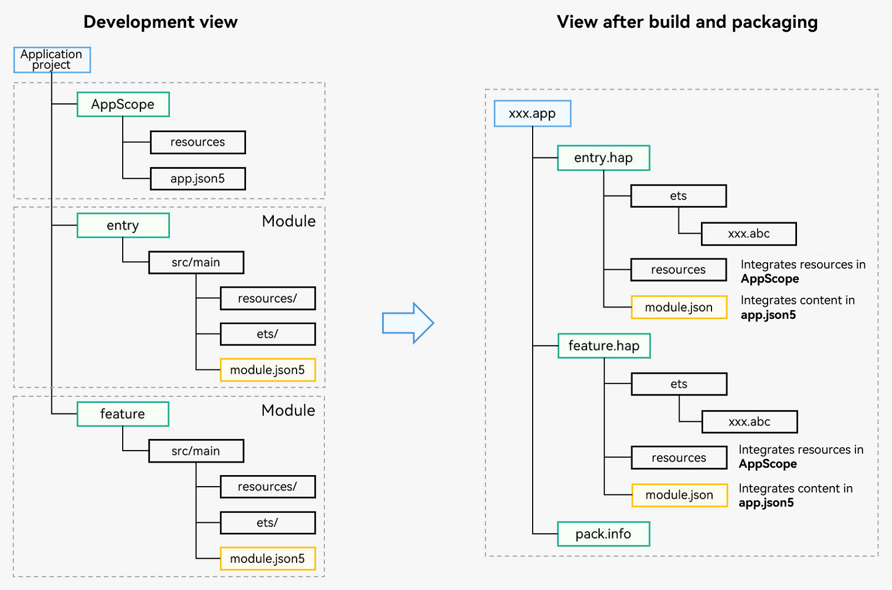

# Multi-HAP Build View

DevEco Studio allows you to develop and build multiple HAP files in one application project, as shown below.

**Figure 1** Multi-HAP build view

## Development View in DevEco Studio

- **AppScope** folder
   - **[app.json5](app-configuration-file.md)**: stores application-wide configuration, such as the bundle name, version number, application icon, application name, and dependent SDK version number.
   - **resources** folder: stores application icon resources and application name string resources.

      **NOTE**
      - The **resources** folder is automatically generated by DevEco Studio and its name cannot be changed.
      - The file names in the **AppScope** folder cannot be the same as those in the entry- or feature-type module folder. Otherwise, an error will be reported.
- **entry** or **feature** folder (whose name is customizable)
   - A module folder created by following the creation wizard of DevEco Studio. It stores the service logic of the application. Multiple module folders can be created. In the preceding figure, **entry** and **feature** are two created module folders.
   - **resources** folder: stores the resources used by the module.
   - **ets** folder: stores the service logic.
   - **[module.json5](module-configuration-file.md)**: stores the module configuration, such as the module name, entry code path of the module, and component information.

## View After Build and Packaging

- After a module is built, a HAP file for deployment is generated. Each module corresponds to a HAP file.
- The **module.json** file in the HAP file is composed of the **app.json5** and **module.json5** files in the development view.
- All HAP files are finally built into an App Pack in .app format for release to the application market.