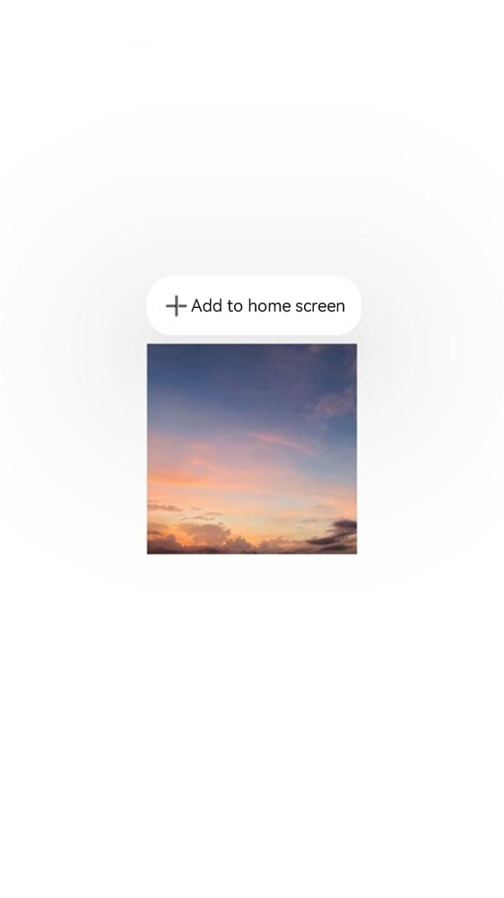
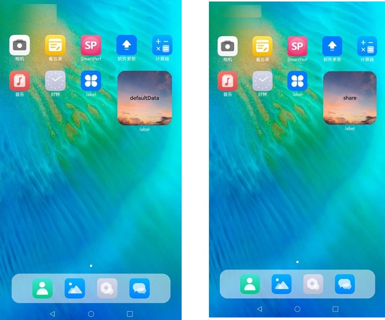

# @ohos.arkui.advanced.FormMenu (Add to Home Menu)

This component encapsulates an Add to Home screen menu, which is used to generate the Add to Home screen menu by touching and holding the widget in an app. Tap the menu to trigger the operation of adding a card to the home screen. You can access the shortcut card of the application on the home screen to directly access the functions of the component. During application use, this component functions as the retention and review entry to attract users to quickly add functions to the home screen.

This component allows you to touch and hold a menu in an app to quickly add a card to the home screen.

(1) You send the card data and the ID of the functional component in the app to the card framework.

(2) The click event obtains the snapshot and location of the functional component in the application based on the component ID. The snapshot and location are used for the transition effect when the component is added to the home screen.

(3) The card framework notifies the home screen of the table adding data to trigger the operation of adding a card to the home screen.


> **NOTE**
>
> This component is supported since API version 12. Updates will be marked with a superscript to indicate their earliest API version.


## Import modules.

```
import { AddFormMenuItem } from '@kit.ArkUI';
```


## Child Components

Not supported

## Name
The [universal attributes](ts-universal-attributes-size.md) are not supported.

## AddFormMenuItem 


AddFormMenuItem(
  want: Want,
  componentId: string,
  options?: AddFormOptions
): void;


**Decorator**: @Component


**System capability**: SystemCapability.ArkUI.ArkUI.Full

**Parameters**

| Name          | Type                       | Mandatory | Decorator Type | Note:                                                            |
| -------------- | ------------------------------- | ---- | ---------- | ---------------------------------------------------------------- |
| want           | [Want](../../apis-ability-kit/js-apis-app-ability-want.md#want)                            | Yes  | \@Prop     | Want information about the functional component to be released.                                        |
| componentId    | string                          | Yes  | -          | ID of a functional component in an application. The interface corresponding to the component ID is similar to that of the service card to be added. |
| AddFormOptions| [AddFormOptions](#addformoptions) | No  | -          | Add card options.                                                        |

## AddFormOptions


**System capability**: SystemCapability.ArkUI.ArkUI.Full

**Parameters**
| Name            | Type               | Mandatory | Note:                                                     |
| --------------- | ---- | ---- | ---------------------------------------------------------------- |
| formBindingData | [formBindingData.FormBindingData](../../apis-form-kit/js-apis-app-form-formBindingData.md#formbindingdata) | No | Widget data |
| callback        | AsyncCallback\<string>                                                                                                | No | Callback of the returned result. |
| style           | [FormMenuItemStyle](#formmenuitemstyle)                                                                              | No | Customized menu style information.|


## FormMenuItemStyle


**System capability**: SystemCapability.ArkUI.ArkUI.Full

**Parameters**
| Name           | Type          | Mandatory | Note: |
| --------------- | ----------------- | ---- | ---- |
| options | [MenuItemOptions](ts-basic-components-menuitem.md#menuitemoptions)&nbsp;\ | No  | Contains the information for setting MenuItem.|

> **NOTE**
>
> The default icon and menu text are used only when style is left empty or not set.

## Event
Menu click events are supported.

## Example

```ts
// index.ets
import { AddFormMenuItem } from '@kit.ArkUI';
import { formBindingData } from '@kit.FormKit';
import { hilog } from '@kit.PerformanceAnalysisKit';

const tag = 'AddFormMenuItem';

@Entry
@Component
struct Index {
  @State message: string = 'Long press show menu';
  private compId: string = 'addforms@d46313145';

  @Builder
  MyMenu() {
    Menu() {
      AddFormMenuItem(
        {
          bundleName: 'com.example.myapplication', //Package name
          abilityName: 'EntryFormAbility', //Module ability name
          parameters: {
            'ohos.extra.param.key.form_dimension': 2,
            'ohos.extra.param.key.form_name': 'widget',
            'ohos.extra.param.key.module_name': 'entry'
          },
        },
        this.compId,
        {
          formBindingData: formBindingData.createFormBindingData({}),
          // formBindingData: formBindingData.createFormBindingData({ data: 'share' }),
          callback:
          (error, formId) => {
            hilog.info(0x3900, tag, 'callback info: error: ' + error + ' formId:' + formId);
          },
          style: {
            // options: {
            // startIcon: $r("app.media.icon"), //Menu icon, which can be provided by yourself. The default value is sys.media.ic_public_add.
            // content: "Add to Desktop", //Menu content, which can be customized. The default value is "sys.string.ohos_add_form_to_desktop".
            // endIcon: $r("app.media.icon") //Menu icon, which can be provided by yourself.
            // }
          }
        }
      )
    }
  }

  build() {
    Row() {
      Column() {
        Image($r("app.media.startIcon")) //Custom image
          .id(this.compId)
          .width(200)
          .height(200)
          .bindContextMenu(this.MyMenu, ResponseType.LongPress, {
            placement: Placement.TopLeft
          })
      }
      .width('100%')
    }
    .height('100%')
  }
}
```

```ts
// WidgetCard.ets
const local = new LocalStorage()

@Entry(local)
@Component
struct WidgetCard {
  @LocalStorageProp('data') data: string = 'defaultdata'; //Define the card data to be refreshed.
  /*
   * The action type.
   */
  readonly ACTION_TYPE: string = 'router';
  /*
   * The ability name.
   */
  readonly ABILITY_NAME: string = 'EntryAbility';
  /*
   * The message.
   */
  readonly MESSAGE: string = 'add detail';
  /*
   * The width percentage setting.
   */
  readonly FULL_WIDTH_PERCENT: string = '100%';
  /*
   * The height percentage setting.
   */
  readonly FULL_HEIGHT_PERCENT: string = '100%';

  build() {
    Row() {
      Column() {
        Text(this.data)
          .fontSize($r('app.float.font_size'))
          .fontWeight(FontWeight.Medium)
          .fontColor($r('app.color.item_title_font'))
      }
      .width(this.FULL_WIDTH_PERCENT)
    }
    .height(this.FULL_HEIGHT_PERCENT)
    .backgroundImage($r('app.media.startIcon'))
    .backgroundImageSize({ width: '100%', height: '100%' })
    .onClick(() => {
      postCardAction(this, {
        action: this.ACTION_TYPE,
        abilityName: this.ABILITY_NAME,
        params: {
          message: this.MESSAGE
        }
      });
    })
  }
}
```

**Advanced Custom Component UI**



**Result of Calling formbindingdata**

The left part shows the result when **formbdingdata** is empty, and the right part shows the result when **formbindingdata** is **{data:'share'}**.


