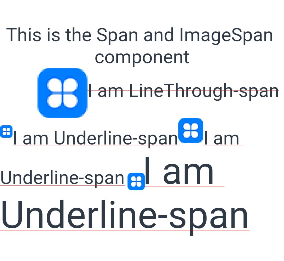
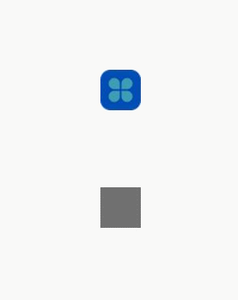

# ImageSpan

As a child of the [\<Text>](ts-basic-components-text.md) and [\<ContainerSpan>](ts-basic-components-containerspan.md) components, the **\<ImageSpan>** component is used to display inline images.

>  **NOTE**
>
>  This component is supported since API version 10. Updates will be marked with a superscript to indicate their earliest API version.


## Child Components

Not supported


## APIs

ImageSpan(value: ResourceStr | PixelMap)

**Atomic service API**: This API can be used in atomic services since API version 11.

**System capability**: SystemCapability.ArkUI.ArkUI.Full

**Parameters**

| Name | Type | Mandatory | Description |
| -------- | -------- | -------- | -------- |
| value | [ResourceStr](ts-types.md#resourcestr) \| [PixelMap](../../apis-image-kit/js-apis-image.md#pixelmap7)  | Yes | Image source. Both local and online images are supported.<br>When using an image referenced using a relative path, for example, **ImageSpan("common/test.jpg")**, the **\<ImageSpan>** component cannot be called across bundles or modules. Therefore, you are advised to use **\$r** to reference image resources that need to be used globally.<br>\- The supported formats include PNG, JPG, BMP, SVG, GIF, and HEIF.<br>\- Base64 strings are supported. The value format is data:image/[png\|jpeg\|bmp\|webp\|heif];base64,[base64 data], where *[base64 data]* is a Base64 string.<br>\- Strings with the **file:///data/storage** prefix are supported, which are used to read image resources in the **files** folder in the installation directory of the application. Ensure that the application has the read permission to the files in the specified path. |


## Attributes

The attributes inherit from [BaseSpan](ts-basic-components-span.md#basespan). Among the universal attributes, [size](ts-universal-attributes-size.md#size), [background](ts-universal-attributes-background.md#background), and [border](ts-universal-attributes-border.md#border) are supported.

### alt<sup>12+</sup>

alt(value: PixelMap)

Sets the placeholder image displayed during loading.

**System capability**: SystemCapability.ArkUI.ArkUI.Full

**Parameters** 

| Name | Type                                                    | Mandatory | Description                                                        |
| ------ | -------------------------------------------------------- | ---- | ------------------------------------------------------------ |
| value  | [PixelMap](../../apis-image-kit/js-apis-image.md#pixelmap7) | Yes  | Placeholder image displayed during loading. The [PixelMap](../../apis-image-kit/js-apis-image.md#pixelmap7) type is supported.<br>Default value: **null** |

### verticalAlign

verticalAlign(value: ImageSpanAlignment)

Sets the alignment mode of the image with the text.

**Atomic service API**: This API can be used in atomic services since API version 11.

**System capability**: SystemCapability.ArkUI.ArkUI.Full

**Parameters** 

| Name | Type                                     | Mandatory | Description                                                        |
| ------ | ----------------------------------------- | ---- | ------------------------------------------------------------ |
| value  | [ImageSpanAlignment](#imagespanalignment) | Yes  | Alignment mode of the image with the text.<br>Default value: **ImageSpanAlignment.BOTTOM** |

### objectFit

objectFit(value: ImageFit)

Sets the image scale type.

**Atomic service API**: This API can be used in atomic services since API version 11.

**System capability**: SystemCapability.ArkUI.ArkUI.Full

**Parameters** 

| Name | Type                                     | Mandatory | Description                                       |
| ------ | ----------------------------------------- | ---- | ------------------------------------------- |
| value  | [ImageFit](ts-appendix-enums.md#imagefit) | Yes  | Image scale type.<br>Default value: **ImageFit.Cover** |

## ImageSpanAlignment

**Atomic service API**: This API can be used in atomic services since API version 11.

| Name    | Description                          |
| -------- | ------------------------------ |
| TOP      | The image is aligned with the top edge of the line box.  |
| CENTER   | The image is aligned with the center of the line box.      |
| BOTTOM   | The image is aligned with the bottom edge of the line box.  |
| BASELINE | The image is bottom aligned with the text baseline. |

### colorFilter<sup>12+</sup>

colorFilter(value: ColorFilter | DrawingColorFilter)

Sets the color filter for the image.

**Atomic service API**: This API can be used in atomic services since API version 12.

**System capability**: SystemCapability.ArkUI.ArkUI.Full

**Parameters**

| Name | Type                                   | Mandatory | Description                                                        |
| ------ | --------------------------------------- | ---- | ------------------------------------------------------------ |
| value  | [ColorFilter](ts-types.md#colorfilter9) \| [DrawingColorFilter](../../apis-arkgraphics2d/js-apis-graphics-drawing.md#colorfilter) | Yes  | 1. Color filter of the image. The input parameter is a 4 x 5 RGBA transformation matrix.<br>The first row of the matrix represents a vector value of R (red), the second row represents a vector value of G (green), the third row represents a vector value of B (blue), and the fourth row represents a vector value of A (alpha). The four rows represent different RGBA vector values.<br>If the matrix contains entries of 1 on the diagonal and entries of 0 in other places, the original color of the image is retained.<br> **Calculation rule:**<br>If the input filter matrix is as follows:<br><br>Wherein the color is [R, G, B, A].<br>Then the color after filtering is [R', G', B', A'].<br><br>2. The ColorFilter type of **@ohos.graphics.drawing** can be used as the input parameter.<br>**NOTE**<br>The DrawingColorfilter type can be used in atomic services. The SVG image to set as the source must have the **stroke** attribute.|


## Events

Among all the universal events, only the [click event](ts-universal-attributes-click.md) is supported. The following events are also supported.

### onComplete<sup>12+</sup>

onComplete(callback: ImageCompleteCallback)

Triggered when the image is successfully loaded or decoded. The size of the loaded image is returned.

**System capability**: SystemCapability.ArkUI.ArkUI.Full

**Parameters**

| Name  | Type                                      | Mandatory | Description                      |
| -------- | ------------------------------------------ | ---- | -------------------------- |
| callback | [ImageCompleteCallback](#imagecompletecallback12) | Yes  | Callback triggered when the image is successfully loaded or decoded. |

### onError<sup>12+</sup>

onError(callback: ImageErrorCallback)

Triggered when an error occurs during image loading.

**System capability**: SystemCapability.ArkUI.ArkUI.Full

**Parameters**

| Name  | Type                                      | Mandatory | Description                      |
| -------- | ------------------------------------------ | ---- | -------------------------- |
| callback | [ImageErrorCallback](ts-basic-components-image.md#imageerrorcallback9) | Yes  | Callback triggered when an error occurs during image loading. |

## ImageCompleteCallback<sup>12+</sup>

type ImageCompleteCallback = (result: ImageLoadResult) => void

Triggered when the image is successfully loaded.

| Name | Type                      | Mandatory | Description                              |
| ------ | -------------------------- | ---- | ---------------------------------- |
| result  | [ImageLoadResult](#imageloadresult12) | Yes  | Object returned after the callback is triggered when an image is successfully loaded or decoded. |

## ImageLoadResult<sup>12+</sup>

Describes the object returned when the callback is triggered upon successful image data loading and decoding.

| Name                      | Type  | Mandatory | Description                                                        |
| ---------------------------- | ------ | ---- | ------------------------------------------------------------ |
| width                        | number | Yes  | Width of the image.<br>Unit: pixel                                   |
| height                       | number | Yes  | Height of the image.<br>Unit: pixel                                   |
| componentWidth               | number | Yes  | Width of the component.<br>Unit: pixel                                   |
| componentHeight              | number | Yes  | Height of the component.<br>Unit: pixel                                   |
| loadingStatus                | number | Yes  | Loading status of the image.<br>**NOTE**<br>If the return value is **0**, the image is successfully loaded. If the return value is **1**, the image is successfully decoded. |
| contentWidth   | number | Yes  | Actual rendered width of the image.<br>Unit: pixel<br>**NOTE**<br>This parameter is valid only when the return value of **loadingStatus** is **1**. |
| contentHeight  | number | Yes  | Actual rendered height of the image.<br>Unit: pixel<br>**NOTE**<br>This parameter is valid only when the return value of **loadingStatus** is **1**. |
| contentOffsetX | number | Yes  | Offset of the rendered content relative to the component on the x-axis.<br>Unit: pixel<br>**NOTE**<br>This parameter is valid only when the return value of **loadingStatus** is **1**. |
| contentOffsetY | number | Yes  | Offset of the rendered content relative to the component on the y-axis<br>Unit: pixel<br>**NOTE**<br>This parameter is valid only when the return value of **loadingStatus** is **1**. |


## Example

### Example 1

This example sets the basic attributes of the image span as well as the alignment mode of the image with the text.

```ts
// xxx.ets
@Entry
@Component
struct SpanExample {
  build() {
    Flex({ direction: FlexDirection.Column, alignItems: ItemAlign.Center, justifyContent: FlexAlign.Center }) {
      Text() {
        Span('This is the Span and ImageSpan component').fontSize(25).textCase(TextCase.Normal)
          .decoration({ type: TextDecorationType.None, color: Color.Pink })
      }.width('100%').textAlign(TextAlign.Center)

      Text() {
        ImageSpan($r('app.media.icon'))
          .width('200px')
          .height('200px')
          .objectFit(ImageFit.Fill)
          .verticalAlign(ImageSpanAlignment.CENTER)
        Span('I am LineThrough-span')
          .decoration({ type: TextDecorationType.LineThrough, color: Color.Red }).fontSize(25)
        ImageSpan($r('app.media.icon'))
          .width('50px')
          .height('50px')
          .verticalAlign(ImageSpanAlignment.TOP)
        Span('I am Underline-span')
          .decoration({ type: TextDecorationType.Underline, color: Color.Red }).fontSize(25)
        ImageSpan($r('app.media.icon'))
          .size({ width: '100px', height: '100px' })
          .verticalAlign(ImageSpanAlignment.BASELINE)
        Span('I am Underline-span')
          .decoration({ type: TextDecorationType.Underline, color: Color.Red }).fontSize(25)
        ImageSpan($r('app.media.icon'))
          .width('70px')
          .height('70px')
          .verticalAlign(ImageSpanAlignment.BOTTOM)
        Span('I am Underline-span')
          .decoration({ type: TextDecorationType.Underline, color: Color.Red }).fontSize(50)
      }
      .width('100%')
      .textIndent(50)
    }.width('100%').height('100%').padding({ left: 0, right: 0, top: 0 })
  }
}
```



### Example 2

This example shows how to set the background style of an image span.

```ts
// xxx.ets
@Component
@Entry
struct Index {
  build() {
    Column() {
      Text() {
        ImageSpan($r('app.media.app_icon'))
          .width('60vp')
          .height('60vp')
          .verticalAlign(ImageSpanAlignment.CENTER)
          .textBackgroundStyle({color: Color.Green, radius: "5vp"})
      }
    }.width('100%').alignItems(HorizontalAlign.Center)
  }
}
```


### Example 3
This example implements a callback triggered when the image is successfully loaded or decoded and a callback triggered when an error occurs during image loading.
```ts
// xxx.ets
@Entry
@Component
struct Index {
  @State src: ResourceStr = $r('app.media.icon');
  build(){
    Column(){
      Text(){
        ImageSpan(this.src)
          .width(100).height(100)
          .onError((err)=>{
            console.log("onError:" + err.message)
          })
          .onComplete((event)=>{
            console.log("onComplete: " + event.loadingStatus)
          })
      }
    }.width('100%').height('100%')
  }
}
```
### Example 4

This example sets the color filter of the image span.

```ts
// xxx.ets
import { drawing, common2D } from '@kit.ArkGraphics2D';

@Entry
@Component
struct SpanExample {
  private ColorFilterMatrix: number[] = [0, 0, 0, 0, 0, 0, 0, 0, 0, 1, 0, 0, 0, 1, 0, 1, 0, 0, 1, 0]
  @State DrawingColorFilterFirst: ColorFilter | undefined = new ColorFilter(this.ColorFilterMatrix)
  private color: common2D.Color = { alpha: 255, red: 255, green: 0, blue: 0 };
  @State DrawingColorFilterSecond: ColorFilter | undefined = undefined

  build() {
    Flex({ direction: FlexDirection.Column, alignItems: ItemAlign.Center, justifyContent: FlexAlign.Center }) {
      Text() {
        ImageSpan($r('app.media.icon'))
          .width('50px')
          .height('50px')
          .colorFilter(this.DrawingColorFilterFirst)
          .onClick(()=>{
            this.DrawingColorFilterFirst = drawing.ColorFilter.createBlendModeColorFilter(this.color, drawing.BlendMode.SRC_IN);
          })
      }
      .width('50%')
      Flex({ direction: FlexDirection.Column, alignItems: ItemAlign.Center, justifyContent: FlexAlign.Center }) {
        Text() {
          ImageSpan($r('app.media.icon'))
            .width('50px')
            .height('50px')
            .colorFilter(this.DrawingColorFilterSecond)
            .onClick(()=>{
              this.DrawingColorFilterSecond = drawing.ColorFilter.createBlendModeColorFilter({ alpha: 255, red: 255, green: 255, blue: 0 }, drawing.BlendMode.SRC);
            })
        }
      .width('50%')
      }.width('100%').height('10%')
    }.width('200%').height('100%')
  }
}
```

