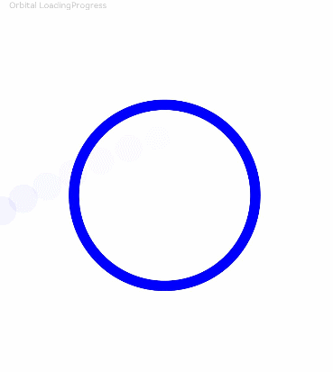
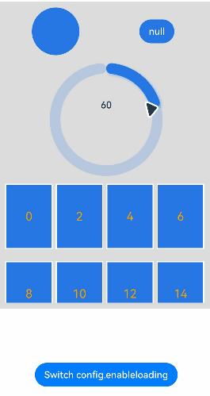

# LoadingProgress

The **\<LoadingProgress>** component is used to create a loading animation.

>  **NOTE**
>
> This component is supported since API version 8. Updates will be marked with a superscript to indicate their earliest API version.


## Child Components

Not supported


## APIs

LoadingProgress()

Creates a **\<LoadingProgress>** component.

**Widget capability**: This API can be used in ArkTS widgets since API version 9.

**Atomic service API**: This API can be used in atomic services since API version 11.

## Attributes

In addition to the [universal attributes](ts-universal-attributes-size.md), the following attributes are supported.

### color

color(value: ResourceColor)

Sets the foreground color for the **\<LoadingProgress>** component.

**Widget capability**: This API can be used in ArkTS widgets since API version 9.

**Atomic service API**: This API can be used in atomic services since API version 11.

**System capability**: SystemCapability.ArkUI.ArkUI.Full

**Parameters** 

| Name | Type                                      | Mandatory | Description                                                        |
| ------ | ------------------------------------------ | ---- | ------------------------------------------------------------ |
| value  | [ResourceColor](ts-types.md#resourcecolor) | Yes  | Foreground color of the **\<LoadingProgress>** component.<br>Default value:<br>API version 10 or earlier: **'#99666666'**<br>API version 11 or later: **'#ff666666'** |

### enableLoading<sup>10+</sup>

enableLoading(value: boolean)

Sets whether to show the loading animation. The component still takes up space in the layout when the loading animation is not shown. The universal attribute [Visibility.Hidden](ts-universal-attributes-visibility.md#visibility) hides the entire component area, including the borders and paddings. In contrast, **enableLoading=false** only hides the loading animation itself and does not affect the borders or other elements.

**Widget capability**: This API can be used in ArkTS widgets since API version 9.

**Atomic service API**: This API can be used in atomic services since API version 11.

**System capability**: SystemCapability.ArkUI.ArkUI.Full

**Parameters** 

| Name | Type   | Mandatory | Description                                          |
| ------ | ------- | ---- | ---------------------------------------------- |
| value  | boolean | Yes  | Whether to show the loading animation.<br>Default value: **true** |

### contentModifier<sup>12+</sup>

contentModifier(modifier: ContentModifier\<LoadingProgressConfiguration>)

Creates a content modifier.

**System capability**: SystemCapability.ArkUI.ArkUI.Full

**Parameters**

| Name | Type                                         | Mandatory | Description                                            |
| ------ | --------------------------------------------- | ---- | ------------------------------------------------ |
| modifier  | [ContentModifier\<LoadingProgressConfiguration>](#loadingprogressconfiguration12) | Yes  | Content modifier to apply to the current component.<br>**modifier**: content modifier. You need a custom class to implement the **ContentModifier** API. |

## Events

The [universal events](ts-universal-events-click.md) are supported.

## LoadingProgressConfiguration<sup>12+</sup>

You need a custom class to implement the **ContentModifier** API.

| Name | Type   |    Default Value     |  Description             |
| ------ | ------ | ------ |-------------------------------- |
| enableloading | boolean | true |Whether to show the loading animation.<br>Default value: **true** |

## Example

### Example 1

```ts
// xxx.ets
@Entry
@Component
struct LoadingProgressExample {
  build() {
    Column({ space: 5 }) {
      Text('Orbital LoadingProgress ').fontSize(9).fontColor(0xCCCCCC).width('90%')
      LoadingProgress()
        .color(Color.Blue)
        .layoutWeight(1)
    }.width('100%').margin({ top: 5 })
  }
}
```



### Example 2

```ts
// This example implements a custom <LoadingProgress> component, enabling the component's visibility to be switched through a button. When the button is clicked, config.enableLoading is switched to false, and the component is not displayed.
// xxx.ets
import hilog from '@ohos.hilog'

import promptAction from '@ohos.promptAction'

class MyLoadingProgressStyle implements ContentModifier<LoadingProgressConfiguration> {
  enableLoading: boolean = false

  constructor(enableLoading: boolean) {
    this.enableLoading = enableLoading
  }

  applyContent(): WrappedBuilder<[LoadingProgressConfiguration]> {
    return wrapBuilder(buildLoadingProgress)
  }
}

let arr1: string[] = ["0", "1", "2", "3", "4", "5", "6", "7", "8", "9", "10", "11", "12", "13", "14", "15", "16", "17", "18", "19"]
let arr2: string[] = ["0", "1", "2", "3", "4", "5", "6", "7", "8", "9"]

@Builder
function buildLoadingProgress(config: LoadingProgressConfiguration) {
  Column({ space: 8 }) {
    Row() {
      Column() {
        Circle({
          width: ((config.contentModifier as MyLoadingProgressStyle).enableLoading) ? 100 : 80,
          height: ((config.contentModifier as MyLoadingProgressStyle).enableLoading) ? 100 : 80
        })
          .fill(((config.contentModifier as MyLoadingProgressStyle).enableLoading) ? Color.Grey : 0x2577e3)
      }.width('50%')

      Column() {
        Button('' + ((config.contentModifier as MyLoadingProgressStyle).enableLoading))
          .onClick((event: ClickEvent) => {
            promptAction.showToast({
              message: ((config.contentModifier as MyLoadingProgressStyle).enableLoading) + ''
            })
          })
          .fontColor(Color.White)
          .backgroundColor(((config.contentModifier as MyLoadingProgressStyle).enableLoading) ? Color.Grey : 0x2577e3)
      }.width('50%')

    }

    Row() {
      Column() {
        Gauge({
          value: (config.contentModifier as MyLoadingProgressStyle).enableLoading?50:30, min: 11, max: 100
        }) {
          Column() {
            Text('60')
              .maxFontSize("180sp")
              .minFontSize("160.0vp")
              .fontWeight(FontWeight.Medium)
              .fontColor("#ff182431")
              .width('40%')
              .height('30%')
              .textAlign(TextAlign.Center)
              .margin({ top: '22.2%' })
              .textOverflow({ overflow: TextOverflow.Ellipsis })
              .maxLines(1)
          }.width('100%').height('100%')
        }

        .colors(((config.contentModifier as MyLoadingProgressStyle).enableLoading) ? Color.Grey : 0x2577e3)
        .width(200)
        .strokeWidth(18)
        .padding(5)
        .trackShadow({ radius: 7, offsetX: 7, offsetY: 7 })
        .height(200)
      }.width('100%')

    }

    Column() {
      List({ space: 20, initialIndex: 0 }) {
        ForEach(arr2, (item: string) => {
          ListItem() {
            Text((config.contentModifier as MyLoadingProgressStyle).enableLoading ? '' + item : Number(item) * 2 + '')
              .width('100%')
              .height('100%')
              .fontColor((config.contentModifier as MyLoadingProgressStyle).enableLoading ? Color.White : Color.Orange)
              .fontSize((config.contentModifier as MyLoadingProgressStyle).enableLoading ? 16 : 20)
              .textAlign(TextAlign.Center)
              .backgroundColor((config.contentModifier as MyLoadingProgressStyle).enableLoading ? Color.Grey : 0x2577e3)
          }
          .height(110)
          .border({
            width: 2,
            color: Color.White
          })
        }, (item: string) => item)
      }
      .height(200)
      .width('100%')
      .friction(0.6)

      .lanes({ minLength: (config.contentModifier as MyLoadingProgressStyle).enableLoading?40:80, maxLength: (config.contentModifier as MyLoadingProgressStyle).enableLoading?40:80 })
      .scrollBar(BarState.Off)
    }

  }.width("100%").padding(10)
}


@Entry
@Component
struct LoadingProgressDemoExample {
  @State loadingProgressList: (boolean | undefined | null)[] = [undefined, true, null, false]
  @State widthList: (number | string)[] = ['110%', 220, '40%', 80]
  @State loadingProgressIndex: number = 0
  @State clickFlag: number = 0
  scroller: Scroller = new Scroller()

  build() {
    Column() {
      Scroll(this.scroller) {
        Column({ space: 5 }) {
          Column() {
            LoadingProgress()
              .color('#106836')
              .size({ width: '100%' })
              .contentModifier(new MyLoadingProgressStyle(this.loadingProgressList[this.loadingProgressIndex]))
          }.width('100%').backgroundColor(0xdcdcdc)
        }.width('100%').margin({ top: 5 })
      }.height('85%')

      Button ('Switch config.enableloading').onClick () => {
        this.clickFlag++
        this.loadingProgressIndex = (this.loadingProgressIndex + 1) % this.loadingProgressList.length
        console.log('enableLoading:' + this.loadingProgressList[this.loadingProgressIndex])
      }).margin(20)
    }

  }
}
```

