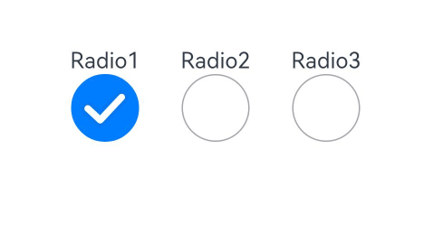
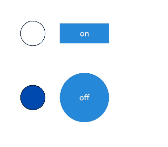

# Radio

The **Radio** component allows users to select from a set of mutually exclusive options.

>  **NOTE**
>
>  Since API version 12, the default indicator type for the **Radio** component changes from **RadioIndicatorType.DOT** to **RadioIndicatorType.TICK**.
>
>  This component is supported since API version 8. Updates will be marked with a superscript to indicate their earliest API version.


## Child Components

Not supported


## APIs

Radio(options: RadioOptions)

Creates a radio button.

**Widget capability**: This API can be used in ArkTS widgets since API version 9.

**Atomic service API**: This API can be used in atomic services since API version 11.

**System capability**: SystemCapability.ArkUI.ArkUI.Full

**Parameters**

| Name | Type                                 | Mandatory| Description              |
| ------- | ------------------------------------- | ---- | ------------------ |
| options | [RadioOptions](#radiooptions) | Yes  | Parameters of the radio button.|

## RadioOptions

**System capability**: SystemCapability.ArkUI.ArkUI.Full

| Name| Type| Mandatory| Description|
| -------- | -------- | -------- | -------- |
| value | string | Yes| Current value of the radio button.<br>**Widget capability**: This API can be used in ArkTS widgets since API version 9.<br>**Atomic service API**: This API can be used in atomic services since API version 11.|
| group | string | Yes| Name of the group to which the radio button belongs. Only one radio button in a given group can be selected at a time.<br>**Widget capability**: This API can be used in ArkTS widgets since API version 9.<br>**Atomic service API**: This API can be used in atomic services since API version 11.|
| indicatorType<sup>12+</sup> | [RadioIndicatorType](#radioindicatortype12) | No| Indicator type of the radio button. If no value is specified, the value of **RadioIndicatorType.TICK** is used.<br>**Widget capability**: This API can be used in ArkTS widgets since API version 12.<br>**Atomic service API**: This API can be used in atomic services since API version 12.|
| indicatorBuilder<sup>12+</sup> | [CustomBuilder](ts-types.md#custombuilder8) | No| Custom component to indicate that the radio button is selected. This custom component is center aligned with the radio button. If this parameter is set to **undefined**, the value of **RadioIndicatorType.TICK** is used as the indicator type.<br>**Widget capability**: This API can be used in ArkTS widgets since API version 12.<br>**Atomic service API**: This API can be used in atomic services since API version 12.|

## RadioIndicatorType<sup>12+</sup>

**Widget capability**: This API can be used in ArkTS widgets since API version 12.

**Atomic service API**: This API can be used in atomic services since API version 12.

**System capability**: SystemCapability.ArkUI.ArkUI.Full

| Name           | Value          | Description                          |
| --------------- | -------------------------------- | -------------------------------- |
| TICK            | 0           | Default tick icon. |
| DOT             | 1            | Default dot icon.  |
| CUSTOM          | 2         | Custom component.|

## Attributes

In addition to the [universal attributes](ts-component-general-attributes.md), the following attributes are supported.

### checked

checked(value: boolean)

Sets whether the radio button is selected.

Since API version 10, this attribute supports two-way binding through [$$](../../../ui/state-management/arkts-two-way-sync.md).

**Widget capability**: This API can be used in ArkTS widgets since API version 9.

**Atomic service API**: This API can be used in atomic services since API version 11.

**System capability**: SystemCapability.ArkUI.ArkUI.Full

**Parameters**

| Name| Type   | Mandatory| Description                                                        |
| ------ | ------- | ---- | ------------------------------------------------------------ |
| value  | boolean | Yes  | Whether the radio button is selected.<br>Default value: **false**<br>**true**: The radio button is selected. **false**: The radio button is not selected.|

### radioStyle<sup>10+</sup>

radioStyle(value?: RadioStyle)

Sets the style of the radio button in selected or deselected state.

Since API version 10, this API is supported in ArkTS widgets.

**Atomic service API**: This API can be used in atomic services since API version 11.

**System capability**: SystemCapability.ArkUI.ArkUI.Full

**Parameters**

| Name| Type                               | Mandatory| Description                              |
| ------ | ----------------------------------- | ---- | ---------------------------------- |
| value  | [RadioStyle](#radiostyle10) | No  | Style of the radio button in selected or deselected state.|

### contentModifier<sup>12+</sup>

contentModifier(modifier: ContentModifier\<RadioConfiguration>)

Creates a content modifier.

**Atomic service API**: This API can be used in atomic services since API version 12.

**System capability**: SystemCapability.ArkUI.ArkUI.Full

**Parameters**

| Name| Type                                         | Mandatory| Description                                            |
| ------ | --------------------------------------------- | ---- | ------------------------------------------------ |
| modifier  | [ContentModifier\<RadioConfiguration>](#radioconfiguration12) | Yes  | Content modifier to apply to the current component.<br>**modifier**: content modifier. You need a custom class to implement the **ContentModifier** API.|

## Events

In addition to the [universal events](ts-component-general-events.md), the following events are supported.

### onChange

onChange(callback: (isChecked: boolean) => void)

Triggered when the selected state of the radio button changes.

**Widget capability**: This API can be used in ArkTS widgets since API version 9.

**Atomic service API**: This API can be used in atomic services since API version 11.

**System capability**: SystemCapability.ArkUI.ArkUI.Full

**Parameters**

| Name   | Type   | Mandatory| Description                                                        |
| --------- | ------- | ---- | ------------------------------------------------------------ |
| isChecked | boolean | Yes  | Selected state of the radio button.<br>The value **true** means that the radio button changes from unselected to selected, and **false** means that the radio button changes from selected to unselected.|

## RadioStyle<sup>10+</sup>

**Atomic service API**: This API can be used in atomic services since API version 11.

**System capability**: SystemCapability.ArkUI.ArkUI.Full

| Name                  | Type                                      | Mandatory| Description                                                        |
| ---------------------- | ------------------------------------------ | ---- | ------------------------------------------------------------ |
| checkedBackgroundColor | [ResourceColor](ts-types.md#resourcecolor) | No  | Color of the background when the radio button is selected.<br>Default value: **$r('sys.color.ohos_id_color_text_primary_activated')**                     |
| uncheckedBorderColor   | [ResourceColor](ts-types.md#resourcecolor) | No  | Color of the border when the radio button is deselected.<br>Default value: **$r('sys.color.ohos_id_color_switch_outline_off')**                      |
| indicatorColor         | [ResourceColor](ts-types.md#resourcecolor) | No  | Color of the indicator when the radio button is selected. Since API version 12, this parameter takes effect only when **indicatorType** is set to **RadioIndicatorType.TICK** or **RadioIndicatorType.DOT**.  <br>Default value: **$r('sys.color.ohos_id_color_foreground_contrary')**|

## RadioConfiguration<sup>12+</sup>

You need a custom class to implement the **ContentModifier** API.

**Atomic service API**: This API can be used in atomic services since API version 12.

**System capability**: SystemCapability.ArkUI.ArkUI.Full

| Name | Type   | Read Only| Optional |  Description             |
| ------ | ------ |-------------------------------- |-------------------------------- |-------------------------------- |
| value | string | No| No|Current value of the radio button.|
| checked | boolean| No| No| Whether the radio button is selected.<br>Default value: **false**<br>**true**: The radio button is selected. **false**: The radio button is not selected.|
| triggerChange |Callback\<boolean>|No|No|Changes the selected state of the radio button.<br>The value **true** means that the radio button changes from unselected to selected, and **false** means that the radio button changes from selected to unselected.|


## Example
### Example 1: Setting the Background Color
This example demonstrates how to set **checkedBackgroundColor** to customize the background color of a radio button.
```ts
// xxx.ets
@Entry
@Component
struct RadioExample {
  build() {
    Flex({ direction: FlexDirection.Row, justifyContent: FlexAlign.Center, alignItems: ItemAlign.Center }) {
      Column() {
        Text('Radio1')
        Radio({ value: 'Radio1', group: 'radioGroup' }).checked(true)
          .radioStyle({
            checkedBackgroundColor: Color.Pink
          })
          .height(50)
          .width(50)
          .onChange((isChecked: boolean) => {
            console.log('Radio1 status is ' + isChecked)
          })
      }
      Column() {
        Text('Radio2')
        Radio({ value: 'Radio2', group: 'radioGroup' }).checked(false)
          .radioStyle({
            checkedBackgroundColor: Color.Pink
          })
          .height(50)
          .width(50)
          .onChange((isChecked: boolean) => {
            console.log('Radio2 status is ' + isChecked)
          })
      }
      Column() {
        Text('Radio3')
        Radio({ value: 'Radio3', group: 'radioGroup' }).checked(false)
          .radioStyle({
            checkedBackgroundColor: Color.Pink
          })
          .height(50)
          .width(50)
          .onChange((isChecked: boolean) => {
            console.log('Radio3 status is ' + isChecked)
          })
      }
    }.padding({ top: 30 })
  }
}
```

### Example 2: Setting the Indicator Type
This example shows how to customize the appearance of a radio button when it is selected by configuring **indicatorType** and **indicatorBuilder**.
```ts
// xxx.ets
@Entry
@Component
struct RadioExample {
  @Builder 
  indicatorBuilder() {
    Image($r("app.media.star"))
  }
  build() {
    Flex({ direction: FlexDirection.Row, justifyContent: FlexAlign.Center, alignItems: ItemAlign.Center }) {
      Column() {
        Text('Radio1')
        Radio({ value: 'Radio1', group: 'radioGroup',
          indicatorType:RadioIndicatorType.TICK
        }).checked(true)
          .height(50)
          .width(80)
          .onChange((isChecked: boolean) => {
            console.log('Radio1 status is ' + isChecked)
          })
      }
      Column() {
        Text('Radio2')
        Radio({ value: 'Radio2', group: 'radioGroup',
          indicatorType:RadioIndicatorType.DOT
        }).checked(false)
          .height(50)
          .width(80)
          .onChange((isChecked: boolean) => {
            console.log('Radio2 status is ' + isChecked)
          })
      }
      Column() {
        Text('Radio3')
        Radio({ value: 'Radio3', group: 'radioGroup',
          indicatorType:RadioIndicatorType.CUSTOM,
          indicatorBuilder:()=>{this.indicatorBuilder()}
        }).checked(false)
          .height(50)
          .width(80)
          .onChange((isChecked: boolean) => {
            console.log('Radio3 status is ' + isChecked)
          })
      }
    }.padding({ top: 30 })
  }
}
```

### Example 3: Implementing a Custom Radio Button
This example illustrates how to implement a custom radio button using the **contentModifier** API.
```ts
class MyRadioStyle implements ContentModifier<RadioConfiguration> {
  type: number = 0
  selectedColor: ResourceColor = Color.Black

  constructor(numberType: number, colorType: ResourceColor) {
    this.type = numberType
    this.selectedColor = colorType
  }

  applyContent(): WrappedBuilder<[RadioConfiguration]> {
    return wrapBuilder(buildRadio)
  }
}

@Builder
function buildRadio(config: RadioConfiguration) {
  Row({ space: 30 }) {
    Circle({ width: 50, height: 50 })
      .stroke(Color.Black)
      .fill(config.checked ? (config.contentModifier as MyRadioStyle).selectedColor : Color.White)
    Button(config.checked ? "off" : "on")
      .width(100)
      .type(config.checked ? (config.contentModifier as MyRadioStyle).type : ButtonType.Normal)
      .backgroundColor('#2787D9')
      .onClick(() => {
        if (config.checked) {
          config.triggerChange(false)
        } else {
          config.triggerChange(true)
        }
      })
  }
}

@Entry
@Component
struct refreshExample {
  build() {
    Column({ space: 50 }) {
      Row() {
        Radio({ value: 'Radio1', group: 'radioGroup' })
          .contentModifier(new MyRadioStyle(1, '#004AAF'))
          .checked(false)
          .width(300)
          .height(100)
      }

      Row() {
        Radio({ value: 'Radio2', group: 'radioGroup' })
          .checked(true)
          .width(300)
          .height(60)
          .contentModifier(new MyRadioStyle(2, '#004AAF'))
      }
    }
  }
}
```

