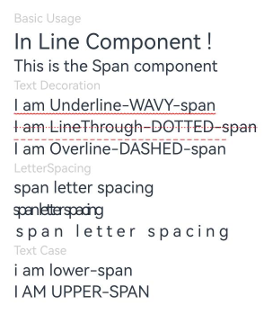
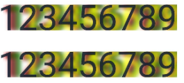
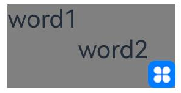

# Span

As a child of the [\<Text>](ts-basic-components-text.md) and [\<ContainerSpan>](ts-basic-components-containerspan.md) components, the \<Span> component is used to display inline text.

>  **NOTE**
>
>  This component is supported since API version 7. Updates will be marked with a superscript to indicate their earliest API version.
>
>  Since API version 10, this component can inherit the attributes of the **\<Text>** parent component. That is, if no attribute is set for this component, it inherits the attributes (if set) of its parent component. Only the following attributes can be inherited: **fontColor**, **fontSize**, **fontStyle**, **fontWeight**, **decoration**, **letterSpacing**, **textCase**, **fontfamily**, and **textShadow**.


## Child Components

Not supported


## APIs

Span(value: string | Resource)

**Widget capability**: This API can be used in ArkTS widgets since API version 9.

**Atomic service API**: This API can be used in atomic services since API version 11.

**Parameters**

| Name | Type | Mandatory | Description |
| -------- | -------- | -------- | -------- |
| value | string \| [Resource](ts-types.md#resource) | Yes | Plain text. |


## Attributes

The attributes inherit from [BaseSpan](#basespan). Only the [universal text attributes](ts-universal-attributes-text-style.md) are supported.

### decoration

decoration(value: DecorationStyleInterface)

Style and color of the text decorative line.

**Widget capability**: This API can be used in ArkTS widgets since API version 9.

**Atomic service API**: This API can be used in atomic services since API version 11.

**System capability**: SystemCapability.ArkUI.ArkUI.Full

**Parameters** 

| Name | Type                                                        | Mandatory | Description                                                        |
| ------ | ------------------------------------------------------------ | ---- | ------------------------------------------------------------ |
| value  | [DecorationStyleInterface<sup>12+</sup>](ts-universal-styled-string.md#decorationstyleinterface)  | Yes  | Style of the text decorative line.<br>Default value:<br>{<br> type: TextDecorationType.None,<br> color: Color.Black,<br> style: TextDecorationStyle.SOLID <br>}<br>**NOTE**<br>The **style** parameter cannot be used in widgets. |

### letterSpacing

letterSpacing(value: number | string)

Letter spacing. A negative value tightens the spacing; a positive value loosens the spacing, and the letters are spread farther apart with the value.

**Widget capability**: This API can be used in ArkTS widgets since API version 9.

**Atomic service API**: This API can be used in atomic services since API version 11.

**System capability**: SystemCapability.ArkUI.ArkUI.Full

**Parameters** 

| Name | Type                      | Mandatory | Description          |
| ------ | -------------------------- | ---- | -------------- |
| value  | number \| string | Yes  | Letter spacing. |

### textCase

textCase(value: TextCase)

Text case.

**Widget capability**: This API can be used in ArkTS widgets since API version 9.

**Atomic service API**: This API can be used in atomic services since API version 11.

**System capability**: SystemCapability.ArkUI.ArkUI.Full

**Parameters** 

| Name | Type                                     | Mandatory | Description                                    |
| ------ | ----------------------------------------- | ---- | ---------------------------------------- |
| value  | [TextCase](ts-appendix-enums.md#textcase) | Yes  | Text case.<br>Default value: **TextCase.Normal** |

### lineHeight<sup>10+</sup>

lineHeight(value: Length)

Sets the line height for the text.

**Atomic service API**: This API can be used in atomic services since API version 11.

**System capability**: SystemCapability.ArkUI.ArkUI.Full

**Parameters** 

| Name | Type                                                        | Mandatory | Description          |
| ------ | ------------------------------------------------------------ | ---- | -------------- |
| value  | [Length](ts-types.md#length) | Yes  | Line height of the text. |

### font<sup>10+</sup>

font(value: Font)

Text style, covering the font size, font width, Font family, and font style.

**Atomic service API**: This API can be used in atomic services since API version 11.

**System capability**: SystemCapability.ArkUI.ArkUI.Full

**Parameters** 

| Name | Type                    | Mandatory | Description      |
| ------ | ------------------------ | ---- | ---------- |
| value  | [Font](ts-types.md#font) | Yes  | Text style. |

### textShadow<sup>11+</sup>

textShadow(value: ShadowOptions | Array&lt;ShadowOptions&gt;)

Text shadow. It supports input parameters in an array to implement multiple text shadows. This API does not work with the **fill** attribute or coloring strategy.

**Atomic service API**: This API can be used in atomic services since API version 12.

**System capability**: SystemCapability.ArkUI.ArkUI.Full

**Parameters** 

| Name | Type                                                        | Mandatory | Description          |
| ------ | ------------------------------------------------------------ | ---- | -------------- |
| value  | [ShadowOptions](ts-universal-attributes-image-effect.md#shadowoptions) \|  Array&lt;[ShadowOptions](ts-universal-attributes-image-effect.md#shadowoptions)> | Yes  | Text shadow. |

## Events

Among all the universal events, only the [click event](ts-universal-events-click.md) is supported.

>  **NOTE**
>
>  As the **\<Span>** component does not include size information, the **target** attribute of the **ClickEvent** object returned by the click event is invalid.

## BaseSpan

Defines the **BaseSpan** base class, including the common attributes of the span.

**System capability**: SystemCapability.ArkUI.ArkUI.Full

**Atomic service API**: This API can be used in atomic services since API version 12.

### textBackgroundStyle<sup>11+</sup>

textBackgroundStyle(style: TextBackgroundStyle)

Background style. This attribute prioritizes the value separately set for the component. If it is not set, the component can inherit the settings from its parent [\<ContainerSpan>](ts-basic-components-containerspan.md).

**Atomic service API**: This API can be used in atomic services since API version 12.

**System capability**: SystemCapability.ArkUI.ArkUI.Full

**Parameters** 

| Name | Type                                                        | Mandatory | Description                                                        |
| ------ | ------------------------------------------------------------ | ---- | ------------------------------------------------------------ |
| style  | [TextBackgroundStyle](ts-basic-components-containerspan.md#textbackgroundstyle)  | Yes  | Background style.<br>Default value:<br>{<br>  color: Color.Transparent,<br>  radius: 0<br>} |

### baselineOffset<sup>12+</sup>

baselineOffset(value: LengthMetrics)

Sets the offset of the baseline. This attribute coexists with the **baselineOffset** attribute of the parent component.

**System capability**: SystemCapability.ArkUI.ArkUI.Full

**Parameters** 

| Name | Type                                                        | Mandatory | Description                                                        |
| ------ | ------------------------------------------------------------ | ---- | ------------------------------------------------------------ |
| value  | [LengthMetrics](../js-apis-arkui-graphics.md#lengthmetrics12) | Yes  | Offset of the baseline. If the value specified is a percentage, the default value is used.<br>A positive number is offset upwards, and a negative number is offset downwards.<br>Default value: **0**<br>In an image span, setting this parameter to a non-zero value will cause **verticalAlign** to become ineffective. |

## Example
### Example 1

This example shows how to set the **decoration**, **letterSpacing**, and **textCase** attributes.

```ts
// xxx.ets
@Entry
@Component
struct SpanExample {
  build() {
    Flex({ direction: FlexDirection.Column, alignItems: ItemAlign.Start, justifyContent: FlexAlign.SpaceBetween }) {
      Text('Basic Usage').fontSize(9).fontColor(0xCCCCCC)
      Text() {
        Span('In Line')
        Span(' Component')
        Span(' !')
      }

      Text() {
        Span('This is the Span component').fontSize(12).textCase(TextCase.Normal)
          .decoration({ type: TextDecorationType.None, color: Color.Red })
      }

      // Add a line under the text.
      Text('Text Decoration').fontSize(9).fontColor(0xCCCCCC)
      Text() {
        Span('I am Underline-WAVY-span').decoration({ type: TextDecorationType.Underline, color: Color.Red, style: TextDecorationStyle.WAVY }).fontSize(12)
      }

      Text() {
        Span('I am LineThrough-DOTTED-span')
          .decoration({ type: TextDecorationType.LineThrough, color: Color.Red, style: TextDecorationStyle.DOTTED })
          .fontSize(12)
      }

      Text() {
        Span('I am Overline-DASHED-span').decoration({ type: TextDecorationType.Overline, color: Color.Red, style: TextDecorationStyle.DASHED }).fontSize(12)
      }

      // Set the letter spacing.
      Text('LetterSpacing').fontSize(9).fontColor(0xCCCCCC)
      Text() {
        Span('span letter spacing')
          .letterSpacing(0)
          .fontSize(12)
      }

      Text() {
        Span('span letter spacing')
          .letterSpacing(-2)
          .fontSize(12)
      }

      Text() {
        Span('span letter spacing')
          .letterSpacing(3)
          .fontSize(12)
      }


      // Set the text case.
      Text('Text Case').fontSize(9).fontColor(0xCCCCCC)
      Text() {
        Span('I am Lower-span').fontSize(12)
          .textCase(TextCase.LowerCase)
          .decoration({ type: TextDecorationType.None })
      }

      Text() {
        Span('I am Upper-span').fontSize(12)
          .textCase(TextCase.UpperCase)
          .decoration({ type: TextDecorationType.None })
      }
    }.width('100%').height(250).padding({ left: 35, right: 35, top: 35 })
  }
}
```



### Example 2
``` ts
@Entry
@Component
struct TextSpanExample {
  @State textShadows : ShadowOptions | Array<ShadowOptions> = [{ radius: 10, color: Color.Red, offsetX: 10, offsetY: 0 },{ radius: 10, color: Color.Black, offsetX: 20, offsetY: 0 },
      { radius: 10, color: Color.Brown, offsetX: 30, offsetY: 0 },{ radius: 10, color: Color.Green, offsetX: 40, offsetY: 0 },
      { radius: 10, color: Color.Yellow, offsetX: 100, offsetY: 0 }]
  build() {
    Column({ space: 8 }) {
      Text() {
        Span('123456789').fontSize(50).textShadow(this.textShadows)
      }
      Text() {
        Span('123456789') // span can inherit text shadow & font size from outer text
      }.fontSize(50).textShadow(this.textShadows)
    }
  }
}
```


### Example 3
``` ts
// xxx.ets
@Component
@Entry
struct Index {
  build() {
    Column() {
      Text() {
        Span('   Hello World !   ')
          .fontSize('20fp')
          .textBackgroundStyle({color: "#7F007DFF", radius: "5vp"})
          .fontColor(Color.White)
      }
    }.width('100%').margin({bottom: '5vp'}).alignItems(HorizontalAlign.Center)
  }
}
```


### Example 4

This example shows how to set the offset of the span baseline.

```ts
import { LengthUnit, LengthMetrics } from '@kit.ArkUI';

@Entry
@Component
struct Index {

  build() {
    Row() {
      Column() {
        Text(){
          Span('word1')
            .baselineOffset(new LengthMetrics(20,LengthUnit.VP))
          Span('word2')
            .baselineOffset(new LengthMetrics(0,LengthUnit.VP))
          ImageSpan($r("app.media.icon"))
            .width('45px')
            .baselineOffset(new LengthMetrics(-20,LengthUnit.VP))
        }
        .backgroundColor(Color.Gray)
      }
      .width('100%')
    }
    .height('100%')
  }
}
```


