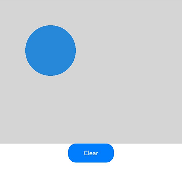

#  Canvas

The **Canvas** component can be used to customize drawings.

> **NOTE**
>
>  This component is supported since API version 8. Updates will be marked with a superscript to indicate their earliest API version.

## Child Components

Not supported

## APIs

### Canvas

Canvas(context?: CanvasRenderingContext2D | DrawingRenderingContext)

**Widget capability**: This API can be used in ArkTS widgets since API version 9.

**Atomic service API**: This API can be used in atomic services since API version 11.

**System capability**: SystemCapability.ArkUI.ArkUI.Full

**Parameters**

| Name | Type   | Mandatory| Description  |
| ------- | ------------------------------------------------------------ | ---- | ------------------------------------------------------------ |
| context | [CanvasRenderingContext2D](ts-canvasrenderingcontext2d.md) \| [DrawingRenderingContext<sup>12+</sup>](ts-drawingrenderingcontext.md) | No  | 2D rendering context for a canvas.<br>**CanvasRenderingContext2D**: Canvases cannot share one **CanvasRenderingContext2D** object. For details, see [CanvasRenderingContext2D](ts-canvasrenderingcontext2d.md). **DrawingRenderingContext**: Canvases cannot share one **DrawingRenderingContext** object. For details, see [DrawingRenderingContext](ts-drawingrenderingcontext.md).|

### Canvas<sup>12+</sup>

Canvas(context: CanvasRenderingContext2D | DrawingRenderingContext, imageAIOptions: ImageAIOptions)

**Atomic service API**: This API can be used in atomic services since API version 12.

**System capability**: SystemCapability.ArkUI.ArkUI.Full

**Parameters**

| Name | Type | Mandatory| Description|
| ------- | ------------------------------------------------------------ | ---- | ------------------------------------------------------------ |
| context | [CanvasRenderingContext2D](ts-canvasrenderingcontext2d.md) \| [DrawingRenderingContext<sup>12+</sup>](ts-drawingrenderingcontext.md) | Yes  | 2D rendering context for a canvas.<br>**CanvasRenderingContext2D**: Canvases cannot share one **CanvasRenderingContext2D** object. For details, see [CanvasRenderingContext2D](ts-canvasrenderingcontext2d.md). **DrawingRenderingContext**: Canvases cannot share one **DrawingRenderingContext** object. For details, see [DrawingRenderingContext](ts-drawingrenderingcontext.md).|
| imageAIOptions  | [ImageAIOptions](ts-image-common.md#imageaioptions) | Yes  | AI image analysis options. You can configure the analysis type or bind an analyzer controller through this parameter.|

## Attributes

In addition to the [universal attributes](ts-component-general-attributes.md), the following attributes are supported.

### enableAnalyzer<sup>12+</sup>

Sets whether to enable the AI analyzer, which supports subject recognition, text recognition, and object lookup.
For the settings to take effect, this attribute must be used together with [StartImageAnalyzer](ts-canvasrenderingcontext2d.md#startimageanalyzer12) and [StopImageAnalyzer](ts-canvasrenderingcontext2d.md#stopimageanalyzer12) of [CanvasRenderingContext2D](ts-canvasrenderingcontext2d.md#canvasrenderingcontext2d).
This attribute cannot be used together with the [overlay](ts-universal-attributes-overlay.md#overlay) attribute. If they are set at the same time, the **CustomBuilder** attribute in **overlay** has no effect. This feature depends on device capabilities.

**Atomic service API**: This API can be used in atomic services since API version 12.

**System capability**: SystemCapability.ArkUI.ArkUI.Full

**Parameters**

| Name| Type   | Mandatory| Description|
| ------ | ------- | ---- | ------------------------------------------------------------ |
| enable  | boolean | Yes  | Whether to enable the AI analyzer. The value **true** means to enable the AI analyzer.<br>Default value: **false**|

## Events

In addition to the [universal events](ts-component-general-events.md), the following events are supported.

### onReady

onReady(event: () => void)

Triggered when the **Canvas** component is initialized or when its size changes.

When this event is triggered, the canvas is cleared. The width and height of the **Canvas** component are then determined and can be obtained, allowing you to use APIs related to the **Canvas** component for drawing. If only the position of the canvas changes, only the [onAreaChange](ts-universal-component-area-change-event.md#onAreaChange) event is triggered, not the **onReady** event. The [onAreaChange](ts-universal-component-area-change-event.md#onAreaChange) event is triggered after the **onReady** event.

**Widget capability**: This API can be used in ArkTS widgets since API version 9.

**Atomic service API**: This API can be used in atomic services since API version 11.

**System capability**: SystemCapability.ArkUI.ArkUI.Full

## Example

### Example 1: Using APIs in CanvasRenderingContext2D

This example describes how to use the APIs in **CanvasRenderingContext2D** for drawing on a canvas.

```ts
// xxx.ets
@Entry
@Component
struct CanvasExample {
  private settings: RenderingContextSettings = new RenderingContextSettings(true)
  private context: CanvasRenderingContext2D = new CanvasRenderingContext2D(this.settings)

  build() {
    Flex({ direction: FlexDirection.Column, alignItems: ItemAlign.Center, justifyContent: FlexAlign.Center }) {
      Canvas(this.context)
        .width('100%')
        .height('100%')
        .backgroundColor('#ffff00')
        .onReady(() => {
          this.context.fillRect(0, 30, 100, 100)
        })
    }
    .width('100%')
    .height('100%')
  }
}
```
  

### Example 2: Using APIs in DrawingRenderingContext

This example describes how to use the APIs in **DrawingRenderingContext** for drawing on a canvas.

```ts
// xxx.ets
@Entry
@Component
struct CanvasExample {
  private context: DrawingRenderingContext = new DrawingRenderingContext()

  build() {
    Flex({ direction: FlexDirection.Column, alignItems: ItemAlign.Center, justifyContent: FlexAlign.Center }) {
      Canvas(this.context)
        .width('100%')
        .height('100%')
        .backgroundColor('#ffff00')
        .onReady(() => {
          this.context.canvas.drawCircle(200, 200, 100)
          this.context.invalidate()
        })
    }
    .width('100%')
    .height('100%')
  }
}
```
  
