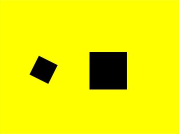

# Matrix2D

**Matrix2D** allows you to perform matrix transformation, such as scaling, rotating, and translating.

>  **NOTE**
> 
> The APIs of this module are supported since API version 8. Updates will be marked with a superscript to indicate their earliest API version.

## APIs

Matrix2D(unit?: LengthMetricsUnit)

**Widget capability**: This API can be used in ArkTS widgets since API version 9.

**Atomic service API**: This API can be used in atomic services since API version 11.

**System capability**: SystemCapability.ArkUI.ArkUI.Full

**Parameters**

| Name| Type| Mandatory| Description                             |
| ------ | -------- | ---- | ------------------------------------- |
| unit<sup>12+</sup>  | [LengthMetricsUnit](../js-apis-arkui-graphics.md#lengthmetricsunit12) | No  | Unit mode of the **Matrix2D** object. The value cannot be dynamically changed once set. The configuration method is the same as that of [CanvasRenderingContext2D](ts-canvasrenderingcontext2d.md#lengthmetricsunit12).<br>Default value: **DEFAULT**|

## Attributes

**Widget capability**: This API can be used in ArkTS widgets since API version 9.

**Atomic service API**: This API can be used in atomic services since API version 11.

**System capability**: SystemCapability.ArkUI.ArkUI.Full

| Name| Type| Read Only| Optional  | Description|
| ----- | ----- | --------------- | ------ | ------------------------ |
| scaleX         | number | No| Yes| Horizontal scale factor.          |
| scaleY         | number | No| Yes| Vertical scale factor.          |
| rotateX       | number | No| Yes| Horizontal tilt coefficient.          |
| rotateY       | number | No| Yes| Vertical tilt coefficient.          |
| translateX | number | No| Yes| Distance to translate on the x-axis.<br>Default unit: vp.|
| translateY | number | No| Yes| Distance to translate on the y-axis.<br>Default unit: vp.|

>  **NOTE**
>  
>  You can use the [px2vp](ts-pixel-units.md#pixel-unit-conversion) API to convert the unit.

**Example**

```ts
// xxx.ets
@Entry
@Component
struct Parameter {
  private settings: RenderingContextSettings = new RenderingContextSettings(true);
  private context: CanvasRenderingContext2D = new CanvasRenderingContext2D(this.settings);
  private matrix: Matrix2D = new Matrix2D();

  build() {
    Flex({ direction: FlexDirection.Column, alignItems: ItemAlign.Center, justifyContent: FlexAlign.Center }) {
      Canvas(this.context)
        .width('240vp')
        .height('180vp')
        .backgroundColor('#ffff00')
        .onReady(() => {
          this.context.fillRect(100, 20, 50, 50)
          this.matrix.scaleX = 1
          this.matrix.scaleY = 1
          this.matrix.rotateX = -0.5
          this.matrix.rotateY = 0.5
          this.matrix.translateX = 10
          this.matrix.translateY = 10
          this.context.setTransform(this.matrix)
          this.context.fillRect(100, 20, 50, 50)
        })
    }
    .width('100%')
    .height('100%')
  }
}
```


## Methods

### identity

identity(): Matrix2D

Creates an identity matrix.

**Widget capability**: This API can be used in ArkTS widgets since API version 9.

**Atomic service API**: This API can be used in atomic services since API version 11.

**System capability**: SystemCapability.ArkUI.ArkUI.Full

**Return value**

| Type                 | Description      |
| --------------------- | ---------- |
| [Matrix2D](#matrix2d) | Identity matrix.|

**Example**

```ts
// xxx.ets
@Entry
@Component
struct Identity {
  private settings: RenderingContextSettings = new RenderingContextSettings(true);
  private context: CanvasRenderingContext2D = new CanvasRenderingContext2D(this.settings);
  private matrix: Matrix2D = new Matrix2D();

  build() {
    Flex({ direction: FlexDirection.Column, alignItems: ItemAlign.Center, justifyContent: FlexAlign.Center }) {
      Canvas(this.context)
        .width('240vp')
        .height('180vp')
        .backgroundColor('#ffff00')
        .onReady(() => {
          this.context.fillRect(100, 20, 50, 50)
          this.matrix = this.matrix.identity()
          this.context.setTransform(this.matrix)
          this.context.fillRect(100, 100, 50, 50)
        })
    }
    .width('100%')
    .height('100%')
  }
}
```


### invert

invert(): Matrix2D

Obtains an inverse of this matrix.

**Widget capability**: This API can be used in ArkTS widgets since API version 9.

**Atomic service API**: This API can be used in atomic services since API version 11.

**System capability**: SystemCapability.ArkUI.ArkUI.Full

**Return value**

| Type                 | Description        |
| --------------------- | ------------ |
| [Matrix2D](#matrix2d) | Inverse of the current matrix.|

**Example**

```ts
// xxx.ets
@Entry
@Component
struct Invert {
  private settings: RenderingContextSettings = new RenderingContextSettings(true);
  private context: CanvasRenderingContext2D = new CanvasRenderingContext2D(this.settings);
  private matrix: Matrix2D = new Matrix2D();

  build() {
    Flex({ direction: FlexDirection.Column, alignItems: ItemAlign.Center, justifyContent: FlexAlign.Center }) {
      Canvas(this.context)
        .width('240vp')
        .height('180vp')
        .backgroundColor('#ffff00')
        .onReady(() => {
          this.context.fillRect(100, 110, 50, 50)
          this.matrix.scaleX = 1
          this.matrix.scaleY = 1
          this.matrix.rotateX = -0.5
          this.matrix.rotateY = 0.5
          this.matrix.translateX = 10
          this.matrix.translateY = 10
          this.matrix.invert()
          this.context.setTransform(this.matrix)
          this.context.fillRect(100, 110, 50, 50)
        })
    }
    .width('100%')
    .height('100%')
  }
}
```


### multiply<sup>(deprecated)</sup>

multiply(other?: Matrix2D): Matrix2D

Multiplies this matrix by the target matrix.

**Widget capability**: This API can be used in ArkTS widgets since API version 9. This API is an empty API.

This API is deprecated since API version 10, and does not provide any actual rendering effects. Therefore, no examples are provided.

**Parameters**

| Name | Type    | Mandatory|  Description  |
| ----- | -------- | ---- | ---------- |
| other | Matrix2D | No| Target matrix.<br>Default value: **null**|

**Return value**

| Type                 | Description          |
| --------------------- | -------------- |
| [Matrix2D](#matrix2d) | Matrix of the multiplication result.|

### rotate<sup>(deprecated)</sup>

rotate(rx?: number, ry?: number): Matrix2D

Performs a rotation operation on this matrix.

**Widget capability**: This API can be used in ArkTS widgets since API version 9. This API is an empty API.

This API is deprecated since API version 10. You are advised to use [rotate](#rotate10) instead.

**Parameters**

| Name| Type  | Mandatory| Description                         |
| ---- | ------ | ---- | -------------------------------- |
| rx   | number | No  | Horizontal coordinate of the rotation point.<br>Default unit: vp.|
| ry   | number | No  | Vertical coordinate of the rotation point.<br>Default unit: vp.|

**Return value**

| Type                 | Description                |
| --------------------- | -------------------- |
| [Matrix2D](#matrix2d) | Matrix of the rotation result.|

**Example**

```ts
// xxx.ets
@Entry
@Component
struct Rotate {
  private settings: RenderingContextSettings = new RenderingContextSettings(true);
  private context: CanvasRenderingContext2D = new CanvasRenderingContext2D(this.settings);
  private matrix: Matrix2D = new Matrix2D();

  build() {
    Flex({ direction: FlexDirection.Column, alignItems: ItemAlign.Center, justifyContent: FlexAlign.Center }) {
      Canvas(this.context)
        .width('240vp')
        .height('180vp')
        .backgroundColor('#ffff00')
        .onReady(() => {
          this.context.fillRect(50, 110, 50, 50)
          this.matrix.scaleX = 1
          this.matrix.scaleY = 1
          this.matrix.rotateX = -0.5
          this.matrix.rotateY = 0.5
          this.matrix.translateX = 10
          this.matrix.translateY = 10
          this.matrix.rotate(5, 5)
          this.context.setTransform(this.matrix)
          this.context.fillRect(50, 110, 50, 50)
        })
    }
    .width('100%')
    .height('100%')
  }
}
```


### rotate<sup>10+</sup>

rotate(degree: number, rx?: number, ry?: number): Matrix2D

Performs a right multiplication rotation operation on this matrix, with the specified rotation point as the transform origin.

**Widget capability**: This API can be used in ArkTS widgets since API version 10.

**Atomic service API**: This API can be used in atomic services since API version 11.

**System capability**: SystemCapability.ArkUI.ArkUI.Full

**Parameters**

| Name  | Type  | Mandatory| Description                                                        |
| ------ | ------ | ---- | ------------------------------------------------------------ |
| degree | number | Yes | Rotation angle. Positive angles represent clockwise rotation. You can convert the angle to radians using the following formula: degree * Math.PI/180.<br>Default unit: radian.|
| rx     | number | No | Horizontal coordinate of the rotation point.<br>Default unit: vp.<br>Default value: **0**   |
| ry     | number | No | Vertical coordinate of the rotation point.<br>Default unit: vp.<br>Default value: **0**   |

**Return value**

| Type                 | Description                |
| --------------------- | -------------------- |
| [Matrix2D](#matrix2d) | Matrix of the rotation result.|

**Example**

```ts
// xxx.ets
@Entry
@Component
struct Rotate {
  private settings: RenderingContextSettings = new RenderingContextSettings(true);
  private context: CanvasRenderingContext2D = new CanvasRenderingContext2D(this.settings);
  private matrix: Matrix2D = new Matrix2D();

  build() {
    Flex({ direction: FlexDirection.Column, alignItems: ItemAlign.Center, justifyContent: FlexAlign.Center }) {
      Canvas(this.context)
        .width('240vp')
        .height('180vp')
        .backgroundColor('#ffff00')
        .onReady(() => {
          this.context.fillRect(60, 80, 50, 50)
          this.matrix.scaleX = 1
          this.matrix.scaleY = 1
          this.matrix.rotateX = -0.5
          this.matrix.rotateY = 0.5
          this.matrix.translateX = 10
          this.matrix.translateY = 10
          this.matrix.rotate(-60 * Math.PI / 180, 5, 5)
          this.context.setTransform(this.matrix)
          this.context.fillRect(60, 80, 50, 50)
        })
    }
    .width('100%')
    .height('100%')
  }
}
```


### translate

translate(tx?: number, ty?: number): Matrix2D

Performs a left multiplication translation operation on this matrix.

**Widget capability**: This API can be used in ArkTS widgets since API version 9.

**Atomic service API**: This API can be used in atomic services since API version 11.

**System capability**: SystemCapability.ArkUI.ArkUI.Full

**Parameters**

| Name| Type  | Mandatory| Description                 |
| ---- | ------ | ---- | ---------------------------- |
| tx   | number | No  | Distance to translate on the X axis.<br>Default unit: vp.<br>Default value: **0**|
| ty   | number | No  | Distance to translate on the Y axis.<br>Default unit: vp.<br>Default value: **0**|

**Return value**

| Type                 | Description                |
| --------------------- | -------------------- |
| [Matrix2D](#matrix2d) | Matrix of the translation result.|

**Example**

```ts
// xxx.ets
@Entry
@Component
struct Translate {
  private settings: RenderingContextSettings = new RenderingContextSettings(true)
  private context: CanvasRenderingContext2D = new CanvasRenderingContext2D(this.settings)
  private matrix: Matrix2D = new Matrix2D()

  build() {
    Flex({ direction: FlexDirection.Column, alignItems: ItemAlign.Center, justifyContent: FlexAlign.Center }) {
      Canvas(this.context)
        .width('240vp')
        .height('180vp')
        .backgroundColor('#ffff00')
        .onReady(() => {
          this.context.fillRect(40, 20, 50, 50)
          this.matrix.scaleX = 1
          this.matrix.scaleY = 1
          this.matrix.rotateX = 0
          this.matrix.rotateY = 0
          this.matrix.translateX = 0
          this.matrix.translateY = 0
          this.matrix.translate(100, 100)
          this.context.setTransform(this.matrix)
          this.context.fillRect(40, 20, 50, 50)
        })
    }
    .width('100%')
    .height('100%')
  }
}
```


### scale

scale(sx?: number, sy?: number): Matrix2D

Performs a right multiplication scaling operation on this matrix.

**Widget capability**: This API can be used in ArkTS widgets since API version 9.

**Atomic service API**: This API can be used in atomic services since API version 11.

**System capability**: SystemCapability.ArkUI.ArkUI.Full

**Parameters**

| Parameter| Type  | Mandatory| Description              |
| ---- | ------ | ---- | ------------------ |
| sx   | number | No  | Horizontal scale factor.<br>Default value: **1.0**.|
| sy   | number | No  | Vertical scale factor.<br>Default value: **1.0**.|

**Return value**

| Type                 | Description              |
| --------------------- | ------------------ |
| [Matrix2D](#matrix2d) | Matrix of the scale result.|

**Example**

```ts
// xxx.ets
@Entry
@Component
struct Scale {
  private settings: RenderingContextSettings = new RenderingContextSettings(true);
  private context: CanvasRenderingContext2D = new CanvasRenderingContext2D(this.settings);
  private matrix: Matrix2D = new Matrix2D();

  build() {
    Flex({ direction: FlexDirection.Column, alignItems: ItemAlign.Center, justifyContent: FlexAlign.Center }) {
      Canvas(this.context)
        .width('240vp')
        .height('180vp')
        .backgroundColor('#ffff00')
        .onReady(() => {
          this.context.fillRect(120, 70, 50, 50)
          this.matrix.scaleX = 1
          this.matrix.scaleY = 1
          this.matrix.rotateX = -0.5
          this.matrix.rotateY = 0.5
          this.matrix.translateX = 10
          this.matrix.translateY = 10
          this.matrix.scale(0.5, 0.5)
          this.context.setTransform(this.matrix)
          this.context.fillRect(120, 70, 50, 50)
        })
    }
    .width('100%')
    .height('100%')
  }
}
```


