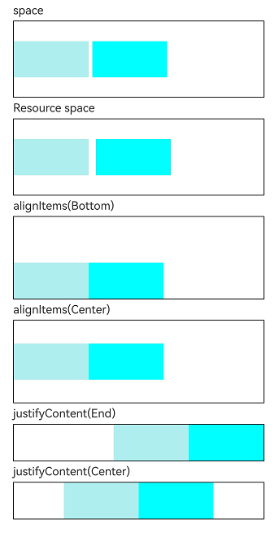

# Row

The **Row** component lays out child components horizontally.

>  **NOTE**
>
>  This component is supported since API version 7. Updates will be marked with a superscript to indicate their earliest API version.


## Child Components

Supported


## APIs

Row(value?:{space?:  string | number })

**Widget capability**: This API can be used in ArkTS widgets since API version 9.

**Atomic service API**: This API can be used in atomic services since API version 11.

**System capability**: SystemCapability.ArkUI.ArkUI.Full

**Parameters**

| Name| Type| Mandatory| Description|
| -------- | -------- | -------- | -------- |
| space | string \| number | No| Horizontal spacing between two adjacent child components.<br>Since API version 9, this parameter does not take effect when it is set to a negative number or when **justifyContent** is set to **FlexAlign.SpaceBetween**, **FlexAlign.SpaceAround** or **FlexAlign.SpaceEvenly**.<br>Default value: **0**, in vp<br>**NOTE**<br>The value can be a number greater than or equal to 0 or a string that can be converted to a number.|


## Attributes

In addition to the [universal attributes](ts-universal-attributes-size.md), the following attributes are supported.

### alignItems

alignItems(value: VerticalAlign)

Sets the alignment mode of child components in the vertical direction.

**Widget capability**: This API can be used in ArkTS widgets since API version 9.

**Atomic service API**: This API can be used in atomic services since API version 11.

**System capability**: SystemCapability.ArkUI.ArkUI.Full

**Parameters**

| Name| Type                                               | Mandatory| Description                                                        |
| ------ | --------------------------------------------------- | ---- | ------------------------------------------------------------ |
| value  | [VerticalAlign](ts-appendix-enums.md#verticalalign) | Yes  | Alignment mode of child components in the vertical direction.<br>Default value: **VerticalAlign.Center**|

### justifyContent<sup>8+</sup>

justifyContent(value: FlexAlign)

Sets the alignment mode of the child components in the horizontal direction.

**Widget capability**: This API can be used in ArkTS widgets since API version 9.

**Atomic service API**: This API can be used in atomic services since API version 11.

**System capability**: SystemCapability.ArkUI.ArkUI.Full

**Parameters**

| Name| Type                                       | Mandatory| Description                                                      |
| ------ | ------------------------------------------- | ---- | ---------------------------------------------------------- |
| value  | [FlexAlign](ts-appendix-enums.md#flexalign) | Yes  | Alignment mode of child components in the horizontal direction.<br>Default value: **FlexAlign.Start**|

>  **NOTE**
>
>  During row layout, child components do not shrink if [flexShrink](ts-universal-attributes-flex-layout.md#flexshrink) is not set for them. In this case, the total size of the child components on the main axis can exceed the size of the container on the main axis.

### reverse<sup>12+</sup>

reverse(isReversed: Optional\<boolean\>)

Sets whether to reverse the arrangement of child components on the main axis (horizontal direction).

**Widget capability**: This API can be used in ArkTS widgets since API version 12.

**Atomic service API**: This API can be used in atomic services since API version 12.

**System capability**: SystemCapability.ArkUI.ArkUI.Full

**Parameters**

| Name| Type                                       | Mandatory| Description                                                      |
| ------ | ------------------------------------------- | ---- | ---------------------------------------------------------- |
| isReversed  | Optional\<boolean\> | Yes  | Whether whether to reverse the arrangement of child components on the main axis (horizontal direction).<br>Default value: **true**|

>  **NOTE**
>
>  If the **reverse** attribute is not set, the arrangement on the main axis remains in the normal order. If the attribute is set to **undefined**, it defaults to **true**, which reverses the arrangement on the main axis.<br>Keep in mind that the main axis arrangement direction is also affected by the **direction** attribute. If **reverse** is set to **true**, it effectively reverses the arrangement that results from the **direction** attribute settings.

## Events

The [universal events](ts-universal-events-click.md) are supported.

## Example

```ts
// xxx.ets
@Entry
@Component
struct RowExample {
  build() {
    Column({ space: 5 }) {
      // Set the horizontal spacing between two adjacent child components to 5.
      Text('space').width('90%')
      Row({ space: 5 }) {
        Row().width('30%').height(50).backgroundColor(0xAFEEEE)
        Row().width('30%').height(50).backgroundColor(0x00FFFF)
      }.width('90%').height(107).border({ width: 1 })

      // Set the alignment mode of the child components in the vertical direction.
      Text('alignItems(Bottom)').width('90%')
      Row() {
        Row().width('30%').height(50).backgroundColor(0xAFEEEE)
        Row().width('30%').height(50).backgroundColor(0x00FFFF)
      }.width('90%').alignItems(VerticalAlign.Bottom).height('15%').border({ width: 1 })

      Text('alignItems(Center)').width('90%')
      Row() {
        Row().width('30%').height(50).backgroundColor(0xAFEEEE)
        Row().width('30%').height(50).backgroundColor(0x00FFFF)
      }.width('90%').alignItems(VerticalAlign.Center).height('15%').border({ width: 1 })

      // Set the alignment mode of the child components in the horizontal direction.
      Text('justifyContent(End)').width('90%')
      Row() {
        Row().width('30%').height(50).backgroundColor(0xAFEEEE)
        Row().width('30%').height(50).backgroundColor(0x00FFFF)
      }.width('90%').border({ width: 1 }).justifyContent(FlexAlign.End)

      Text('justifyContent(Center)').width('90%')
      Row() {
        Row().width('30%').height(50).backgroundColor(0xAFEEEE)
        Row().width('30%').height(50).backgroundColor(0x00FFFF)
      }.width('90%').border({ width: 1 }).justifyContent(FlexAlign.Center)
    }.width('100%')
  }
}
```


