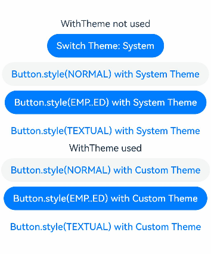

# WithTheme

The WithTheme component is used to set the customized theme style of the application partial page. You can set the dark and light color modes and customized colors for child components.

> **NOTE**
>
> This component is supported since API version 12. Updates will be marked with a superscript to indicate their earliest API version.

## Child Components

This component supports only one child component.

## Interface

WithTheme(options: WithThemeOptions)

**Parameters**

| Name                           | Type                                 | Mandatory | Description         |
|--------------------------------|---------------------------------------|-----|---------------|
| options | [WithThemeOptions](#withthemeoptions) | Yes  | Sets the color of the component in the scope. |

## Attributes

The [universal attributes](ts-universal-attributes-size.md) are not supported.

## Event

The [universal events](ts-universal-events-click.md) are not supported.

## WithThemeOptions
Sets the default style and dark light color mode of components in the WithTheme scope.

**Atomic service API**: This API can be used in atomic services since API version 12.

**Parameters**

| Name                   | Type                                                   | Mandatory | Description                                                            |
|------------------------|---------------------------------------------------------| ---- |------------------------------------------------------------------|
| theme     | [CustomTheme](../js-apis-arkui-theme.md#customtheme)    | No  | Used to customize the default color of components in the WithTheme scope.<br> Default value: undefined. The default style is the same as that of the system token.<br> |
| colorMode | [ThemeColorMode](ts-appendix-enums.md#themecolormode10) | No  | Specifies the dark light color mode of the component in the WithTheme scope.<br>Default value: **ThemeColorMode.System**<br>   |

## Example

To set the dark and light color of a part, you need to add the dark directory to the resources folder and add the dark.json resource file to the dark directory. The dark and light color mode takes effect only after the dark.json resource file is added to the dark directory.

```ts
//Specify the local deep light color mode.
@Entry
@Component
struct Index {
  build() {
    Column() {
    Default
      Column() {
        Text ('No WithTheme')
          .fontSize(40)
          .fontWeight(FontWeight.Bold)
      }
      .justifyContent(FlexAlign.Center)
      .width('100%')
      .height('33%')
      .backgroundColor($r('sys.color.background_primary'))
      //Set the component to the dark color mode.
      WithTheme({ colorMode: ThemeColorMode.DARK }) {
        Column() {
          Text('WithTheme')
            .fontSize(40)
            .fontWeight(FontWeight.Bold)
          Text('DARK')
            .fontSize(40)
            .fontWeight(FontWeight.Bold)
        }
        .justifyContent(FlexAlign.Center)
        .width('100%')
        .height('33%')
        .backgroundColor($r('sys.color.background_primary'))
      }
      //Set the component to the light color mode.
      WithTheme({ colorMode: ThemeColorMode.LIGHT }) {
        Column() {
          Text('WithTheme')
            .fontSize(40)
            .fontWeight(FontWeight.Bold)
          Text('LIGHT')
            .fontSize(40)
            .fontWeight(FontWeight.Bold)
        }
        .justifyContent(FlexAlign.Center)
        .width('100%')
        .height('33%')
        .backgroundColor($r('sys.color.background_primary'))
      }
    }
    .height('100%')
    .expandSafeArea([SafeAreaType.SYSTEM], [SafeAreaEdge.TOP, SafeAreaEdge.END, SafeAreaEdge.BOTTOM, SafeAreaEdge.START])
  }
}
```


```ts
//Customize the default color of components in the WithTheme scope.
import { CustomTheme, CustomColors } from '@kit.ArkUI';

class GreenColors implements CustomColors {
  fontPrimary = '#ff049404';
  fontEmphasize = '#FF00541F';
  fontOnPrimary = '#FFFFFFFF';
  compBackgroundTertiary = '#1111FF11';
  backgroundEmphasize = '#FF00541F';
  compEmphasizeSecondary = '#3322FF22';
}

class RedColors implements CustomColors {
  fontPrimary = '#fff32b3c';
  fontEmphasize = '#FFD53032';
  fontOnPrimary = '#FFFFFFFF';
  compBackgroundTertiary = '#44FF2222';
  backgroundEmphasize = '#FFD00000';
  compEmphasizeSecondary = '#33FF1111';
}

class PageCustomTheme implements CustomTheme {
  colors?: CustomColors

  constructor(colors: CustomColors) {
    this.colors = colors
  }
}

@Entry
@Component
struct IndexPage {
  static readonly themeCount = 3;
  themeNames: string[] = ['System', 'Custom (green)', 'Custom (red)'];
  themeArray: (CustomTheme | undefined)[] = [
    undefined, // System
    new PageCustomTheme(new GreenColors()),
    new PageCustomTheme(new RedColors())
  ]
  @State themeIndex: number = 0;

  build() {
    Column() {
      Column({ space: '8vp' }) {
        Text (`WithTheme is not used`)
        //Click the button to switch the partial skin.
        Button (`Switch theme color: ${this.themeNames[this.themeIndex]}`)
          .onClick(() => {
            this.themeIndex = (this.themeIndex + 1) % IndexPage.themeCount;
          })

        //Default button color
        Button('Button.style(NORMAL) with System Theme')
          .buttonStyle(ButtonStyleMode.NORMAL)
        Button('Button.style(EMP..ED) with System Theme')
          .buttonStyle(ButtonStyleMode.EMPHASIZED)
        Button('Button.style(TEXTUAL) with System Theme')
          .buttonStyle(ButtonStyleMode.TEXTUAL)
      }
      .margin({
        top: '50vp'
      })

      WithTheme({ theme: this.themeArray[this.themeIndex] }) {
        //WithTheme scope
        Column({ space: '8vp' }) {
          Text (`Use WithTheme`)
          Button('Button.style(NORMAL) with Custom Theme')
            .buttonStyle(ButtonStyleMode.NORMAL)
          Button('Button.style(EMP..ED) with Custom Theme')
            .buttonStyle(ButtonStyleMode.EMPHASIZED)
          Button('Button.style(TEXTUAL) with Custom Theme')
            .buttonStyle(ButtonStyleMode.TEXTUAL)
        }
        .width('100%')
      }
    }
  }
}
```

