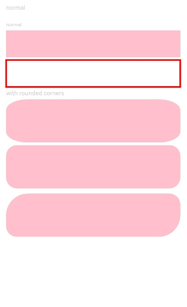
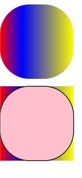

# Rect

The **\<Rect>** component is used to draw a rectangle.

>  **NOTE**
>
>  This component is supported since API version 9. Updates will be marked with a superscript to indicate their earliest API version.


## Child Components

Not supported


## APIs

Rect(value?: {width?: string | number,height?: string | number,radius?: string | number | Array&lt;string | number&gt;} |
  {width?: string | number,height?: string | number,radiusWidth?: string | number,radiusHeight?: string | number})

**Widget capability**: Since API version 9, this API is supported in ArkTS widgets.

**Parameters**

| Name| Type| Mandatory| Default Value| Description|
| -------- | -------- | -------- | -------- | -------- |
| width | string \| number | No| 0 | Width.<br>**NOTE**<br>An invalid value is handled as the default value.|
| height | string \| number | No| 0 | Height.<br>**NOTE**<br>An invalid value is handled as the default value.|
| radius | string \| number \| Array&lt;string \| number&gt; | No| 0 | Radius of the rounded corner. You can set separate radiuses for the four rounded corners.<br>This attribute works in a similar manner as **radiusWidth**/**radiusHeight**. When they are used together, it takes precedence over **radiusWidth**/**radiusHeight**.<br>**NOTE**<br>An invalid value is handled as the default value.|
| radiusWidth | string \| number | No| 0 | Width of the rounded corner.<br>**NOTE**<br>An invalid value is handled as the default value.|
| radiusHeight | string \| number | No| 0 | Height of the rounded corner.<br>**NOTE**<br>An invalid value is handled as the default value.|

## Attributes

In addition to the [universal attributes](ts-universal-attributes-size.md), the following attributes are supported.

### radiusWidth

radiusWidth(value: number | string)

Sets the width of the rounded corner. If not set, the height of the rounded corner is the same as its width. An invalid value is handled as the default value.

**Widget capability**: Since API version 9, this API is supported in ArkTS widgets.

**System capability**: SystemCapability.ArkUI.ArkUI.Full

**Parameters**

| Name| Type                      | Mandatory| Description                      |
| ------ | -------------------------- | ---- | -------------------------- |
| value  | number \| string | Yes  | Width of the rounded corner.<br>Default value: **0**|

### radiusHeight

radiusHeight(value: number | string)

Height of the rounded corner. If not set, the width of the rounded corner is the same as its height.  An invalid value is handled as the default value.

**Widget capability**: Since API version 9, this API is supported in ArkTS widgets.

**System capability**: SystemCapability.ArkUI.ArkUI.Full

**Parameters**

| Name| Type                      | Mandatory| Description                      |
| ------ | -------------------------- | ---- | -------------------------- |
| value  | number \| string | Yes  | Height of the rounded corner.<br>Default value: **0**|

### radius

radius(value: number | string | Array&lt;string | number&gt;)

Sets the radius of the rounded corner.  An invalid value is handled as the default value.

**Widget capability**: Since API version 9, this API is supported in ArkTS widgets.

**System capability**: SystemCapability.ArkUI.ArkUI.Full

**Parameters**

| Name| Type                                                        | Mandatory| Description                        |
| ------ | ------------------------------------------------------------ | ---- | ---------------------------- |
| value  | number \| string \| Array&lt;string \| number&gt; | Yes  | Radius of the rounded corner. You can set separate radiuses for the four rounded corners.<br>Default value: **0**|

### fill

fill(value: ResourceColor)

Color of the fill area. An invalid value is handled as the default value.

**Widget capability**: Since API version 9, this API is supported in ArkTS widgets.

**System capability**: SystemCapability.ArkUI.ArkUI.Full

**Parameters**

| Name| Type                                      | Mandatory| Description                                  |
| ------ | ------------------------------------------ | ---- | -------------------------------------- |
| value  | [ResourceColor](ts-types.md#resourcecolor) | Yes  | Color of the fill area.<br>Default value: **Color.Black**|

### fillOpacity

fillOpacity(value: number | string | Resource)

Opacity of the fill area. The value range is [0.0, 1.0]. A value less than 0.0 evaluates to the value **0.0**. A value greater than 1.0 evaluates to the value **1.0**. Any other value evaluates to the value **1.0**.

**Widget capability**: Since API version 9, this API is supported in ArkTS widgets.

**System capability**: SystemCapability.ArkUI.ArkUI.Full

**Parameters**

| Name| Type                                                        | Mandatory| Description                          |
| ------ | ------------------------------------------------------------ | ---- | ------------------------------ |
| value  | number \| string \| [Resource](ts-types.md#resource) | Yes  | Opacity of the fill area.<br>Default value: **1**|

### stroke

stroke(value: ResourceColor)

Stroke color. If this attribute is not set, the component does not have any stroke. If the value is invalid, no stroke will be drawn.

**Widget capability**: Since API version 9, this API is supported in ArkTS widgets.

**System capability**: SystemCapability.ArkUI.ArkUI.Full

**Parameters**

| Name| Type                                      | Mandatory| Description      |
| ------ | ------------------------------------------ | ---- | ---------- |
| value  | [ResourceColor](ts-types.md#resourcecolor) | Yes  | Stroke color.|

### strokeDashArray

strokeDashArray(value: Array&lt;any&gt;)

Stroke dashes. An invalid value is handled as the default value.

**Widget capability**: Since API version 9, this API is supported in ArkTS widgets.

**System capability**: SystemCapability.ArkUI.ArkUI.Full

**Parameters**

| Name| Type            | Mandatory| Description                     |
| ------ | ---------------- | ---- | ------------------------- |
| value  | Array&lt;any&gt; | Yes  | Stroke dashes.<br>Default value: **[]**|

### strokeDashOffset

strokeDashOffset(value: number | string)

Sets the offset of the start point for drawing the stroke. An invalid value is handled as the default value.

**Widget capability**: Since API version 9, this API is supported in ArkTS widgets.

**System capability**: SystemCapability.ArkUI.ArkUI.Full

**Parameters**

| Name| Type                      | Mandatory| Description                                |
| ------ | -------------------------- | ---- | ------------------------------------ |
| value  | number \| string | Yes  | Offset of the start point for drawing the stroke.<br>Default value: **0**|

### strokeLineCap

strokeLineCap(value: LineCapStyle)

Cap style of the stroke.

**Widget capability**: Since API version 9, this API is supported in ArkTS widgets.

**System capability**: SystemCapability.ArkUI.ArkUI.Full

**Parameters**

| Name| Type                                             | Mandatory| Description                                            |
| ------ | ------------------------------------------------- | ---- | ------------------------------------------------ |
| value  | [LineCapStyle](ts-appendix-enums.md#linecapstyle) | Yes  | Cap style of the stroke.<br>Default value: **LineCapStyle.Butt**|

### strokeLineJoin

strokeLineJoin(value: LineJoinStyle)

Join style of the stroke.

**Widget capability**: Since API version 9, this API is supported in ArkTS widgets.

**System capability**: SystemCapability.ArkUI.ArkUI.Full

**Parameters**

| Name| Type                                               | Mandatory| Description                                              |
| ------ | --------------------------------------------------- | ---- | -------------------------------------------------- |
| value  | [LineJoinStyle](ts-appendix-enums.md#linejoinstyle) | Yes  | Join style of the stroke.<br>Default value: **LineJoinStyle.Miter**|

### strokeMiterLimit

strokeMiterLimit(value: number | string)

Sets the limit on the ratio of the miter length to the value of **strokeWidth** used to draw a miter join. The miter length indicates the distance from the outer tip to the inner corner of the miter. This attribute works only when **strokeLineJoin** is set to **LineJoinStyle.Miter**.

The value must be greater than or equal to 1.0. If the value is in the [0, 1) range, the value **1.0** will be used. In other cases, the default value will be used.

**Widget capability**: Since API version 9, this API is supported in ArkTS widgets.

**System capability**: SystemCapability.ArkUI.ArkUI.Full

**Parameters**

| Name| Type                      | Mandatory| Description                                          |
| ------ | -------------------------- | ---- | ---------------------------------------------- |
| value  | number \| string | Yes  | Limit on the ratio of the miter length to the value of **strokeWidth** used to draw a miter join.<br>Default value: **4**|

### strokeOpacity

strokeOpacity(value: number | string | Resource)

Stroke opacity. The value range is [0.0, 1.0]. A value less than 0.0 evaluates to the value **0.0**. A value greater than 1.0 evaluates to the value **1.0**. Any other value evaluates to the value **1.0**.

**Widget capability**: Since API version 9, this API is supported in ArkTS widgets.

**System capability**: SystemCapability.ArkUI.ArkUI.Full

**Parameters**

| Name| Type                                                        | Mandatory| Description                      |
| ------ | ------------------------------------------------------------ | ---- | -------------------------- |
| value  | number \| string \| [Resource](ts-types.md#resource) | Yes  | Stroke opacity.<br>Default value: **1**|

### strokeWidth

strokeWidth(value: Length)

Stroke width. If of the string type, this parameter cannot be set in percentage. A percentage is processed as 1 px.

**Widget capability**: Since API version 9, this API is supported in ArkTS widgets.

**System capability**: SystemCapability.ArkUI.ArkUI.Full

**Parameters**

| Name| Type                        | Mandatory| Description                    |
| ------ | ---------------------------- | ---- | ------------------------ |
| value  | [Length](ts-types.md#length) | Yes  | Stroke width.<br>Default value: **1**|

### antiAlias

antiAlias(value: boolean)

Specifies whether anti-aliasing is enabled.

**Widget capability**: Since API version 9, this API is supported in ArkTS widgets.

**System capability**: SystemCapability.ArkUI.ArkUI.Full

**Parameters**

| Name| Type   | Mandatory| Description                                 |
| ------ | ------- | ---- | ------------------------------------- |
| value  | boolean | Yes  | Whether anti-aliasing is enabled.<br>Default value: **true**|

## Example
### Example 1

```ts
// xxx.ets
@Entry
@Component
struct RectExample {
  build() {
    Column({ space: 10 }) {
      Text('normal').fontSize(11).fontColor(0xCCCCCC).width('90%')
      // Draw a 90% x 50 rectangle.
      Column({ space: 5 }) {
        Text('normal').fontSize(9).fontColor(0xCCCCCC).width('90%')
        // Draw a 90% x 50 rectangle.
        Rect({ width: '90%', height: 50 })
          .fill(Color.Pink)
        // Draw a 90% x 50 rectangle.
        Rect()
          .width('90%')
          .height(50)
          .fillOpacity(0)
          .stroke(Color.Red)
          .strokeWidth(3)

        Text('with rounded corners').fontSize(11).fontColor(0xCCCCCC).width('90%')
        // Draw a 90% x 80 rectangle, with the width and height of its rounded corners being 40 and 20, respectively.
        Rect({ width: '90%', height: 80 })
          .radiusHeight(20)
          .radiusWidth(40)
          .fill(Color.Pink)
        // Draw a 90% x 80 rectangle, with the width and height of its rounded corners being both 20.
        Rect({ width: '90%', height: 80 })
          .radius(20)
          .fill(Color.Pink)
          .stroke(Color.Transparent)
      }.width('100%').margin({ top: 10 })
      // Draw a 90% x 50 rectangle, with the width and height of its rounded corners as follows: 40 for the upper left rounded corner, 20 for the upper right rounded corner, 40 for the lower right rounded corner, and 20 for the lower left rounded corner.
      Rect({ width: '90%', height: 80 })
        .radius([[40, 40], [20, 20], [40, 40], [20, 20]])
        .fill(Color.Pink)
    }.width('100%').margin({ top: 5 })
  }
}
```



### Example 2

```ts
// xxx.ets
@Entry
@Component
struct RectExample {
  build() {
    Column({ space: 10 }) {
      Column()
        .width(100)
        .height(100)
        .linearGradient({
          direction: GradientDirection.Right,
          colors: [[0xff0000, 0.0], [0x0000ff, 0.3], [0xffff00, 1.0]]
        })
        .clip(new Rect({ width: 100, height: 100, radius: 40 }))
      Rect()
        .width(100)
        .height(100)
        // Set the color of the fill area. To display the color gradient of the background, set .fillOpacity(0.0).
        .fill(Color.Pink)
        // Set the radius of the rounded corner to 40.
        .radius(40)
        .stroke(Color.Black)
        // Set the color gradient. It takes effect only for a 100 x 100 rectangular area. The boundary of the gradient does not contain rounded corners.
        .linearGradient({
          direction: GradientDirection.Right,
          colors: [[0xff0000, 0.0], [0x0000ff, 0.3], [0xffff00, 1.0]]
        })
    }
  }
}
```


