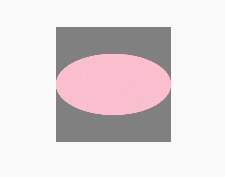

# Click Control
<!--deprecated_code_no_check-->

Click control attributes are used to set whether a component can respond to finger interactions such as click and touch events.

>  **NOTE**
>
>  This module is deprecated since API version 9. You are advised to use [hitTestBehavior](ts-universal-attributes-hit-test-behavior.md) instead.
>
>  The APIs of this module are supported since API version 7. Updates will be marked with a superscript to indicate their earliest API version.


## Attributes

**System capability**: SystemCapability.ArkUI.ArkUI.Full

| Name     | Type| Description                   |
| ----------- | -------- | ------------------------ |
| touchable<sup>(deprecated)</sup>   | boolean  | Whether the component can respond to finger interactions such as click and touch events.<br>**true** (default): The component can respond to finger interactions. **false**: The component cannot respond to finger interactions.|

## Example

```ts
// xxx.ets
@Entry
@Component
struct TouchAbleExample {
  @State text1: string = ''
  @State text2: string = ''

  build() {
    Stack() {
      Rect()
        .fill(Color.Gray).width(150).height(150)
        .onClick(() => {
          console.info(this.text1 = 'Rect Clicked')
        })
        .overlay(this.text1, { align: Alignment.Bottom, offset: { x: 0, y: 20 } })
      Ellipse()
        .fill(Color.Pink).width(150).height(80)
        .touchable(false) // When the Ellipse area is touched, the message "Ellipse Clicked" is not displayed.
        .onClick(() => {
          console.info(this.text2 = 'Ellipse Clicked')
        })
        .overlay(this.text2, { align: Alignment.Bottom, offset: { x: 0, y: 20 } })
    }.margin(100)
  }
}
```


