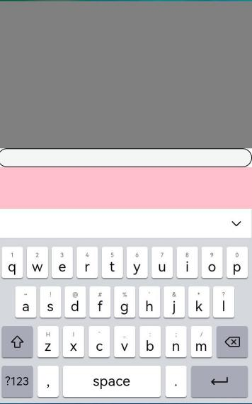

# Safe Area

A safe area refers to the display area that isn't covered by a status bar, navigation bar, or other components that the system includes in its non-safe-area. By default, all the content you develop is placed in the safe area. If necessary, you can expand a component's safe area through the **expandSafeArea attribute** – without changing the layout, and specify how to avoid the virtual keyboard through the **setKeyboardAvoidMode** attribute.

> **NOTE**
>
> This attribute is supported since API version 10. Updates will be marked with a superscript to indicate their earliest API version.

## expandSafeArea

expandSafeArea(types?: Array&lt;SafeAreaType&gt;, edges?: Array&lt;SafeAreaEdge&gt;)

Sets the safe area to be expanded to.

**System capability**: SystemCapability.ArkUI.ArkUI.Full

**Parameters**

| Name| Type                                              | Mandatory| Description                                                        |
| ------ | -------------------------------------------------- | ---- | ------------------------------------------------------------ |
| types  | Array <[SafeAreaType](ts-types.md#safeareatype10)> | No  | Type of the expanded safe zone.<br>Default value:<br>[SafeAreaType.SYSTEM, SafeAreaType.CUTOUT, SafeAreaType.KEYBOARD] |
| edges  | Array <[SafeAreaEdge](ts-types.md#safeareaedge10)> | No  | Edges for expanding the safe area.<br> Default value: [SafeAreaEdge.TOP, SafeAreaEdge.BOTTOM, SafeAreaEdge.START, SafeAreaEdge.END]<br>The default value expands the safe area on all available edges.|

>  **NOTE**
>
>To set the **expandSafeArea** attribute for a component, this component cannot have its width and height fixed (except to a percentage).
>
>The safe area does not restrict the layout or size of components inside, nor does it clip the components.

## setKeyboardAvoidMode<sup>11+</sup>

setKeyboardAvoidMode(value: KeyboardAvoidMode): void

Sets the avoidance mode for the virtual keyboard.

**System capability**: SystemCapability.ArkUI.ArkUI.Full

**Parameters**

| Name| Type                                                | Mandatory| Description                                                        |
| ------ | ---------------------------------------------------- | ---- | ------------------------------------------------------------ |
| value  | [KeyboardAvoidMode](ts-types.md#keyboardavoidmode11) | Yes  | Sets the avoidance mode for the virtual keyboard.<br>Default value: **KeyboardAvoidMode.OFFSET**<br>By default, offset is used to avoid the virtual keyboard.<br>**value**: avoidance mode for the virtual keyboard. This parameter is mandatory.|

## getKeyboardAvoidMode

getKeyboardAvoidMode(): KeyboardAvoidMode

Obtains the avoidance mode for the virtual keyboard.

**System capability**: SystemCapability.ArkUI.ArkUI.Full

**Return value**

| Name                                                | Description                              |
| ---------------------------------------------------- | ---------------------------------- |
| [KeyboardAvoidMode](ts-types.md#keyboardavoidmode11) | Obtains the avoidance mode for the virtual keyboard.|

## Example

### Example 1

```ts
// xxx.ets
@Entry
@Component
struct SafeAreaExample1 {
  @State text: string = ''
  controller: TextInputController = new TextInputController()

  build() {
    Row() {
        Column()
          .height('100%').width('100%')
          .backgroundImage($r('app.media.bg')).backgroundImageSize(ImageSize.Cover)
          .expandSafeArea([SafeAreaType.SYSTEM], [SafeAreaEdge.TOP, SafeAreaEdge.BOTTOM])
    }.height('100%')
  }
}
```


### Example 2

```ts
// xxx.ets
@Entry
@Component
struct SafeAreaExample {
  @State text: string = ''
  controller: TextInputController = new TextInputController()

  build() {
    Row() {
      Stack() {
        Column()
          .height('100%').width('100%')
          .backgroundImage($r('app.media.bg')).backgroundImageSize(ImageSize.Cover)
          .expandSafeArea([SafeAreaType.KEYBOARD, SafeAreaType.SYSTEM])
        Column() {
          Button('Set caretPosition 1')
            .onClick(() => {
              this.controller.caretPosition(1)
            })
          TextInput({ text: this.text, placeholder: 'input your word...', controller: this.controller })
            .placeholderFont({ size: 14, weight: 400 })
            .width(320).height(40).offset({y: 120})
            .fontSize(14).fontColor(Color.Black)
            .backgroundColor(Color.White)
        }.width('100%').alignItems(HorizontalAlign.Center)
      }
    }.height('100%')
  }
}
```


### Example 3

```ts
// EntryAbility.ets
import { KeyboardAvoidMode } from '@kit.ArkUI';

  onWindowStageCreate(windowStage: window.WindowStage) {
    // Main window is created, set main page for this ability
    hilog.info(0x0000, 'testTag', '%{public}s', 'Ability onWindowStageCreate');

    windowStage.loadContent('pages/Index', (err, data) => {
      let a = windowStage.getMainWindowSync().getUIContext().getKeyboardAvoidMode();
      windowStage.getMainWindowSync().getUIContext().setKeyboardAvoidMode(KeyboardAvoidMode.RESIZE);
      if (err.code) {
        hilog.error(0x0000, 'testTag', 'Failed to load the content. Cause: %{public}s', JSON.stringify(err) ?? '');
        return;
      }
      hilog.info(0x0000, 'testTag', 'Succeeded in loading the content. Data: %{public}s', JSON.stringify(data) ?? '');
    });
  }

// xxx.ets
@Entry
@Component
struct KeyboardAvoidExample {
    build() {
    Column() {
      Row().height("30%").width("100%").backgroundColor(Color.Gray)
      TextArea().width("100%").borderWidth(1)
      Text("I can see the bottom of the page").width("100%").textAlign(TextAlign.Center).backgroundColor(Color.Pink).layoutWeight(1)
    }.width('100%').height("100%")
  }
}
```


### Example 4

```ts
// EntryAbility.ets
import { KeyboardAvoidMode } from '@kit.ArkUI';

  onWindowStageCreate(windowStage: window.WindowStage) {
    // Main window is created, set main page for this ability
    hilog.info(0x0000, 'testTag', '%{public}s', 'Ability onWindowStageCreate');

    windowStage.loadContent('pages/Index', (err, data) => {
      let a = windowStage.getMainWindowSync().getUIContext().getKeyboardAvoidMode();
      windowStage.getMainWindowSync().getUIContext().setKeyboardAvoidMode(KeyboardAvoidMode.OFFSET);
      if (err.code) {
        hilog.error(0x0000, 'testTag', 'Failed to load the content. Cause: %{public}s', JSON.stringify(err) ?? '');
        return;
      }
      hilog.info(0x0000, 'testTag', 'Succeeded in loading the content. Data: %{public}s', JSON.stringify(data) ?? '');
    });
  }

// xxx.ets
@Entry
@Component
struct KeyboardAvoidExample {
    build() {
    Column() {
      Row().height("30%").width("100%").backgroundColor(Color.Gray)
      TextArea().width("100%").borderWidth(1)
      Text("I can see the bottom of the page").width("100%").textAlign(TextAlign.Center).backgroundColor(Color.Pink).layoutWeight(1)
    }.width('100%').height("100%")
  }
}
```


