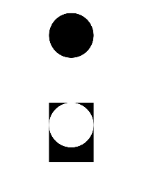

# Foreground Color

The foreground color attributes set the foreground color of a component.

>  **NOTE**
>
>  The initial APIs of this module are supported since API version 10. Newly added APIs will be marked with a superscript to indicate their earliest API version.

## foregroundColor

foregroundColor(value: ResourceColor | ColoringStrategy)

Sets the foreground color of the component. If the component does not have a foreground color set, it inherits the color from its parent component by default.

**Atomic service API**: This API can be used in atomic services since API version 11.

**System capability**: SystemCapability.ArkUI.ArkUI.Full

**Parameters**

| Name| Type                                                        | Mandatory| Description                                                |
| ------ | ------------------------------------------------------------ | ---- | ---------------------------------------------------- |
| value  | [ResourceColor](ts-types.md#resourcecolor) \| [ColoringStrategy](ts-types.md#coloringstrategy10) | Yes  | Foreground color. The value can be a specific color or a coloring strategy. Property animations are supported.|

## Example

### Example 1: Using Foreground Color Settings

This example demonstrates how to set the foreground color using **foregroundColor**.

```ts
// xxx.ets
@Entry
@Component
struct ForegroundColorExample {
  build() {
    Column({ space: 100 }) {
      // Draw a circle with a diameter of 150 and the default fill color black.
      Circle({ width: 150, height: 200 })
      // Draw a circle with a diameter of 150.
      Circle({ width: 150, height: 200 }).foregroundColor(Color.Red)
    }.width('100%').backgroundColor(Color.Blue)
  }
}
```


### Example 2: Setting the Foreground Color to Background Inverse

This example shows how to use **ColoringStrategy.INVERT** to set the foreground color to the inverse of the background color.

```ts
// xxx.ets
@Entry
@Component
struct ColoringStrategyExample {
  build() {
    Column({ space: 100 }) {
      // Draw a circle with a diameter of 150 and the default fill color black.
      Circle({ width: 150, height: 200 })
      // Draw a circle with a diameter of 150 and set its foreground color to the inverse of the component background color.
      Circle({ width: 150, height: 200 })
        .backgroundColor(Color.Black)
        .foregroundColor(ColoringStrategy.INVERT)
    }.width('100%')
  }
}
```


### Example 3: Implementing a Foreground Color Not Inherited from Parent Component

This example compares the effects of setting both foreground and background colors on a component versus setting only the background color. When a foreground color is explicitly set on a component, the component does not inherit the color from its parent component.

```ts
// xxx.ets
@Entry
@Component
struct foregroundColorInherit {
  build() {
    Column() {
      Button('Foreground Color: Set to Orange').fontSize(20).foregroundColor(Color.Orange).backgroundColor(Color.Gray)
      Divider()
      Button ('Foreground Color: Inherited from Parent Component When Not Set').fontSize(20).backgroundColor(Color.Gray)
    }.foregroundColor(Color.Red)
  }
}
```


