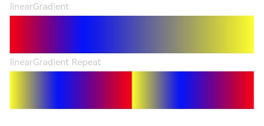
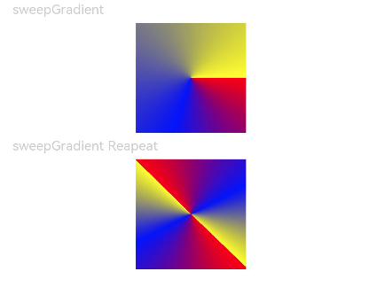

# Color Gradient

Create a more gorgeous look for a component by applying a color gradient effect to it.

>  **NOTE**
>
> The APIs of this module are supported since API version 7. Updates will be marked with a superscript to indicate their earliest API version.
>
> Color gradients are considered part of the component's content and are drawn above the background.
>
> Color gradients do not support explicit width and height animations. When the width or height of a component is animated with a color gradient, the gradient will jump straight to the final size.

## linearGradient

linearGradient(value: {angle?: number | string; direction?: GradientDirection; colors: Array\<[ResourceColor, number]>; repeating?: boolean;})

Creates a linear gradient.

**Widget capability**: This API can be used in ArkTS widgets since API version 9.

**Atomic service API**: This API can be used in atomic services since API version 11.

**System capability**: SystemCapability.ArkUI.ArkUI.Full

**Parameters**

| Name| Type                                                        | Mandatory| Description                                                        |
| ------ | ------------------------------------------------------------ | ---- | ------------------------------------------------------------ |
| value  | {<br>angle?: number \| string,<br>direction?: [GradientDirection](ts-appendix-enums.md#gradientdirection),<br>colors: Array&lt;[[ResourceColor](ts-types.md#resourcecolor), number]&gt;,<br>repeating?: boolean<br>} | Yes  | Linear gradient.<br> Value range: (-∞, +∞)<br>- **angle**: start angle of the linear gradient. A positive value indicates a clockwise rotation from the origin, (0, 0).<br>  Default value: **180**<br>If the angle is specified with a string, only the deg, grad, rad, and turn types are supported.<br>- **direction**: direction of the linear gradient. It does not take effect when **angle** is set.<br>  Default value: **GradientDirection.Bottom**<br>- [colors](#radialgradientoptions18): array of color stops, each of which consists of a color and its stop position. Invalid colors are automatically skipped.<br>- **repeating**: whether the colors are repeated.<br>  Default value: **false**|

## linearGradient<sup>18+</sup>

linearGradient(options: Optional\<LinearGradientOptions>)

Creates a linear gradient. Compared with [linearGradient](#lineargradient), this API supports the **undefined** type for the **options** parameter.

**Widget capability**: This API can be used in ArkTS widgets since API version 18.

**Atomic service API**: This API can be used in atomic services since API version 18.

**System capability**: SystemCapability.ArkUI.ArkUI.Full

**Parameters**

| Name | Type                                                        | Mandatory| Description                                                        |
| ------- | ------------------------------------------------------------ | ---- | ------------------------------------------------------------ |
| options | Optional\<[LinearGradientOptions](#lineargradientoptions18)> | Yes  | Linear gradient.<br>If **options** is **undefined**, the linear gradient is disabled.|

## LinearGradientOptions<sup>18+</sup>

Defines the linear gradient parameters.

**Atomic service API**: This API can be used in atomic services since API version 16.

**System capability**: SystemCapability.ArkUI.ArkUI.Full

| Name                                      | Type                                                        | Mandatory| Description                                                        |
| ------------------------------------------ | ------------------------------------------------------------ | ---- | ------------------------------------------------------------ |
| angle                                      | number \| string                                   | No  | Start angle of the linear gradient. A positive value indicates a clockwise rotation from the origin, (0, 0). The default value is **180**. If the angle is specified with a string, only the deg, grad, rad, and turn types are supported.|
| direction                                  | [GradientDirection](ts-appendix-enums.md#gradientdirection)  | No  | Direction of the linear gradient. It does not take effect when **angle** is set. <br>Default value: **GradientDirection.Bottom**.|
| [colors](#radialgradientoptions18) | Array[[ResourceColor](ts-types.md#resourcecolor), number] | Yes  | Array of color stops, each of which consists of a color and its stop position. Invalid colors are automatically skipped.|
| repeating                                  | boolean                                                      | No  | Whether the colors are repeated. Default value: **false**.                       |

## sweepGradient

sweepGradient(value: {center: [Length, Length]; start?: number | string; end?: number | string; rotation?: number | string; colors: Array\<[ResourceColor, number]>; repeating?: boolean;})

Creates a sweep gradient.

**Atomic service API**: This API can be used in atomic services since API version 11.

**System capability**: SystemCapability.ArkUI.ArkUI.Full

**Widget capability**: This API can be used in ArkTS widgets since API version 9.

**Parameters**

| Name| Type                                                        | Mandatory| Description                                                        |
| ------ | ------------------------------------------------------------ | ---- | ------------------------------------------------------------ |
| value  | {<br>center: [[Length](./ts-types.md#length), Length],<br>start?: number \| string,<br>end?: number \| string,<br>rotation?: number \| string,<br>colors: Array&lt;[[ResourceColor](ts-types.md#resourcecolor), number]&gt;,<br>repeating?: boolean<br>} | Yes  | Sweep gradient, which can sweep around the specified center point in the 0–360 degree range. If the rotation angle exceeds the range, a monochrome color instead of a gradient will be drawn.<br>- **center**: center of the sweep gradient, that is, the coordinates relative to the upper left corner of the current component.<br>- **start**: start angle of the sweep gradient.<br> Default value: **0**<br>If the angle is specified with a string, only the deg, grad, rad, and turn types are supported.<br>- **end**: end angle of the sweep gradient.<br> Default value: **0**<br>If the angle is specified with a string, only the deg, grad, rad, and turn types are supported.<br>- **rotation**: rotation angle of the sweep gradient.<br> Default value: **0**<br>If the angle is specified with a string, only the deg, grad, rad, and turn types are supported.<br>- [colors](#radialgradientoptions18): array of color stops, each of which consists of a color and its stop position. Invalid colors are automatically skipped.<br>- **repeating**: whether the colors are repeated.<br>  Default value: **false**<br>**NOTE**<br>A value less than 0 is treated as **0**. A value greater than 360 is treated as **360**.<br>When **start**, **end**, or **rotation** is specified with a string, the string must be a number or a number followed by one of the following units: deg, rad, grad, and turn. Valid value examples are "90", "90deg", and "1.57rad".|

## sweepGradient<sup>18+</sup>

sweepGradient(options: Optional\<SweepGradientOptions>)

Creates a sweep gradient. Compared with [sweepGradient](#sweepgradient), this API supports the **undefined** type for the **options** parameter.

**Atomic service API**: This API can be used in atomic services since API version 18.

**System capability**: SystemCapability.ArkUI.ArkUI.Full

**Widget capability**: This API can be used in ArkTS widgets since API version 18.

**Parameters**

| Name | Type                                                        | Mandatory| Description                                                        |
| ------- | ------------------------------------------------------------ | ---- | ------------------------------------------------------------ |
| options | Optional\<[SweepGradientOptions](#sweepgradientoptions18)> | Yes  | Sweep gradient.<br>If **options** is **undefined**, the sweep gradient is disabled.|

## SweepGradientOptions<sup>18+</sup>

Defines the sweep gradient parameters.

**Atomic service API**: This API can be used in atomic services since API version 18.

**System capability**: SystemCapability.ArkUI.ArkUI.Full

| Name                                      | Type                                                        | Mandatory| Description                                                        |
| ------------------------------------------ | ------------------------------------------------------------ | ---- | ------------------------------------------------------------ |
| center                                     | [[Length](./ts-types.md#length), Length]                     | Yes  | Center of the sweep gradient, that is, the coordinates relative to the upper left corner of the current component.          |
| start                                      | number \| string                                   | No  | Start point of the sweep gradient. <br>Default value: **0**.                           |
| end                                        | number \| string                                   | No  | End point of the sweep gradient. <br>Default value: **0**.                           |
| rotation                                   | number \| string                                   | No  | Rotation angle of the sweep gradient. Default value: **0**.                             |
| [colors](#radialgradientoptions18) | Array&lt;[[ResourceColor](ts-types.md#resourcecolor), number] | Yes  | Array of color stops, each of which consists of a color and its stop position. Invalid colors are automatically skipped.|
| repeating                                  | boolean                                                      | No  | Whether the colors are repeated. Default value: **false**.                       |

## radialGradient

radialGradient(value: { center: [Length, Length]; radius: number | string; colors: Array\<[ResourceColor, number]>; repeating?: boolean })

Creates a radial gradient.

**Atomic service API**: This API can be used in atomic services since API version 11.

**System capability**: SystemCapability.ArkUI.ArkUI.Full

**Widget capability**: This API can be used in ArkTS widgets since API version 9.

**Parameters**


| Name| Type                                                        | Mandatory| Description                                                        |
| ------ | ------------------------------------------------------------ | ---- | ------------------------------------------------------------ |
| value  | {<br>center: [[Length](./ts-types.md#length), Length],<br> radius: number \| string,<br>colors: Array&lt;[[ResourceColor](ts-types.md#resourcecolor), number]&gt;,<br>repeating?: boolean<br>} | Yes  | Radial gradient.<br>- **center**: center of the radial gradient, that is, the coordinates relative to the upper left corner of the current component.<br>- **radius**: radius of the radial gradient.<br> Value range: [0, +∞).<br>**NOTE**<br>A value less than 0 is treated as **0**.<br>- [colors](#radialgradientoptions18): array of color stops, each of which consists of a color and its stop position. Invalid colors are automatically skipped.<br>- **repeating**: whether the colors are repeated.<br>  Default value: **false**.|

## radialGradient<sup>18+</sup>

radialGradient(options: Optional\<RadialGradientOptions>)

Creates a radial gradient. Compared with [radialGradient](#radialgradient), this API supports the **undefined** type for the **options** parameter.

**Atomic service API**: This API can be used in atomic services since API version 18.

**System capability**: SystemCapability.ArkUI.ArkUI.Full

**Widget capability**: This API can be used in ArkTS widgets since API version 18.

**Parameters**


| Name    | Type                                        | Mandatory                            | Description                              |
| -------------- | -------------------------------------------- | ----------------------------------- | ----------------------------------- |
| options | Optional\<[RadialGradientOptions](#radialgradientoptions18)> | Yes| Radial gradient.<br>If **options** is **undefined**, the radial gradient is disabled.|
## RadialGradientOptions<sup>18+</sup>

Defines the radial gradient parameters.

**Atomic service API**: This API can be used in atomic services since API version 18.

**System capability**: SystemCapability.ArkUI.ArkUI.Full

| Name     | Type                                                        | Mandatory| Description                                                  |
| --------- | ------------------------------------------------------------ | ---- | ------------------------------------------------------ |
| center    |  [[Length](./ts-types.md#length), Length]               | Yes  | Center of the radial gradient, that is, the coordinates relative to the upper left corner of the current component.      |
| radius    | number \| string                                        | Yes  | Radius of the radial gradient.<br>Value range: [0, +∞).              |
| colors    | Array&lt;[[ResourceColor](ts-types.md#resourcecolor), number]&gt; | Yes  | Array of color stops, each of which consists of a color and its stop position. Invalid colors are automatically skipped.|
| repeating | boolean                                                     | No  | Whether the colors are repeated. Default value: **false**.                 |

>  **NOTE**
>
>  When using the **colors** parameter, take note of the following:
>
>  [ResourceColor](ts-types.md#resourcecolor) indicates the color, and **number** indicates the color's position, which ranges from 0 to 1.0: **0** indicates the start of the container, and **1.0** indicates the end of the container. To create a gradient with multiple color stops, you are advised to set the **number** values in ascending order. If a value of **number** in an array is smaller than that in the previous one, it is considered as equal to the previous value.


## Example

### Example 1: Creating a Linear Gradient

This example demonstrates how to create a linear gradient using **linearGradient**.

```ts
// xxx.ets
@Entry
@Component
struct ColorGradientExample {
  build() {
    Column({ space: 5 }) {
      Text('linearGradient').fontSize(12).width('90%').fontColor(0xCCCCCC)
      Row()
        .width('90%')
        .height(50)
        .linearGradient({
          angle: 90,
          colors: [[0xff0000, 0.0], [0x0000ff, 0.3], [0xffff00, 1.0]]
        })
      Text('linearGradient Repeat').fontSize(12).width('90%').fontColor(0xCCCCCC)
      Row()
        .width('90%')
        .height(50)
        .linearGradient({
          direction: GradientDirection.Left, // Gradient direction.
          repeating: true, // Whether the gradient colors are repeated.
          colors: [[0xff0000, 0.0], [0x0000ff, 0.3], [0xffff00, 0.5]] // The gradient colors are repeated because the last color stop is less than 1.
        })
    }
    .width('100%')
    .padding({ top: 5 })
  }
}
```



### Example 2: Creating a Sweep Gradient

This example demonstrates how to create a sweep gradient that changes color based on a rotation angle using **sweepGradient**.

```ts
@Entry
@Component
struct ColorGradientExample {
  build() {
    Column({ space: 5 }) {
      Text('sweepGradient').fontSize(12).width('90%').fontColor(0xCCCCCC)
      Row()
        .width(100)
        .height(100)
        .sweepGradient({
          center: [50, 50],
          start: 0,
          end: 359,
          colors: [[0xff0000, 0.0], [0x0000ff, 0.3], [0xffff00, 1.0]]
        })
      
      Text('sweepGradient Repeat').fontSize(12).width('90%').fontColor(0xCCCCCC)
      Row()
        .width(100)
        .height(100)
        .sweepGradient({
          center: [50, 50],
          start: 0,
          end: 359,
          rotation: 45, // Rotation angle.
          repeating: true, // Whether the gradient colors are repeated.
          colors: [[0xff0000, 0.0], [0x0000ff, 0.3], [0xffff00, 0.5]] // The gradient colors are repeated because the last color stop is less than 1.
        })
    }
    .width('100%')
    .padding({ top: 5 })
  }
}
```



### Example 3: Creating a Radial Gradient

This example demonstrates how to create a radial gradient using **radialGradient**.

```ts
// xxx.ets
@Entry
@Component
struct ColorGradientExample {
  build() {
    Column({ space: 5 }) {
      Text('radialGradient').fontSize(12).width('90%').fontColor(0xCCCCCC)
      Row()
        .width(100)
        .height(100)
        .radialGradient({
          center: [50, 50],
          radius: 60,
          colors: [[0xff0000, 0.0], [0x0000ff, 0.3], [0xffff00, 1.0]]
        })
      Text('radialGradient Repeat').fontSize(12).width('90%').fontColor(0xCCCCCC)
      Row()
        .width(100)
        .height(100)
        .radialGradient({
          center: [50, 50],
          radius: 60,
          repeating: true,
          colors: [[0xff0000, 0.0], [0x0000ff, 0.3], [0xffff00, 0.5]] // The gradient colors are repeated because the last color stop is less than 1.
        })
    }
    .width('100%')
    .padding({ top: 5 })
  }
}
```


