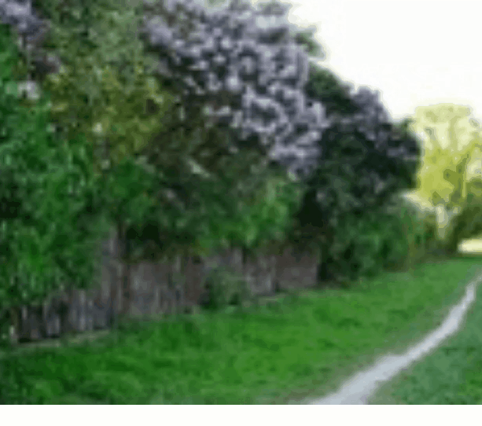

# Motion Blur

You can apply a motion blur effect to a component being scaled or moved. This effect must be used together with the **onFinish** parameter of **AnimateParam**.

>  **NOTE**
>
>  This feature is supported since API version 12. Updates will be marked with a superscript to indicate their earliest API version.


## motionBlur

motionBlur(value: MotionBlurOptions)

Apply a motion blur effect to the component being scaled or moved.

1. Do not use this API in intra-component transitions, shared element transitions, implicit element transitions, or particle animations. Doing so may cause unexpected results.

2. The **radius** parameter of **motionBlur** must be set to **0** for the initial state. Otherwise, there may be unexpected results during a cold start.

3. This API must be used together with the **onFinish** parameter of **AnimateParam**. Its **radius** parameter must be set to **0** when the animation ends; otherwise, there may be unexpected results.

4. When using this API, do not frequently change the blur radius of the same component; otherwise, there may be unexpected results. For example, if you frequently click the image in the example, the blur effect may not work sometimes.

5. To avoid unexpected results, make sure the coordinates of the motion blur anchor point are the same as those of the animation scaling anchor point.

6. To avoid unexpected results, set the blur radius to a value less than 1.

**Atomic service API**: This API can be used in atomic services since API version 12.

**System capability**: SystemCapability.ArkUI.ArkUI.Full

**Parameters**

| Name | Type                                                        | Mandatory| Description                                                        |
| ------- | ------------------------------------------------------------ | ---- | ------------------------------------------------------------ |
| value   | [MotionBlurOptions](#motionbluroptions) | Yes  | Motion blur options.|

## MotionBlurOptions

**Atomic service API**: This API can be used in atomic services since API version 12.

**System capability**: SystemCapability.ArkUI.ArkUI.Full

| Name         | Type                                                       | Mandatory | Description                                                        |
| ------------- | ----------------------------------------------------------- | ----- | ------------------------------------------------------------ |
| radius | number      | Yes   | Blur radius. The value range is [0.0, ∞). You are advised to set it to a value less than 1.0.|
| anchor | [MotionBlurAnchor](#motionbluranchor) | Yes   | Coordinates of the motion blur anchor point. They must be the same as those of the animation scaling anchor point.|

## MotionBlurAnchor

**Atomic service API**: This API can be used in atomic services since API version 12.

**System capability**: SystemCapability.ArkUI.ArkUI.Full

| Name         | Type                                                       | Mandatory | Description                                                        |
| ------------- | ----------------------------------------------------------- | ----- | ------------------------------------------------------------ |
| x | number      | Yes   | X-coordinate of the anchor point. The value range is [0.0, 1.0].|
| y | number      | Yes   | Y-coordinate of the anchor point. The value range is [0.0, 1.0].|

## Example

This example demonstrates how to apply a motion blur effect.
```ts
// xxx.ets
import { curves } from '@kit.ArkUI';

@Entry
@Component
struct motionBlurTest {
  @State widthSize: number = 400;
  @State heightSize: number = 320;
  @State flag: boolean = true;
  @State radius: number = 0;
  @State x: number = 0;
  @State y: number = 0;

  build() {
    Column() {
      Column() {
        Image($r('app.media.testImg'))
          .width(this.widthSize)
          .height(this.heightSize)
          .onClick(() => {
            this.radius = 5;
            this.x = 0.5;
            this.y = 0.5;
            if (this.flag) {
              this.widthSize = 100;
              this.heightSize = 80;
            } else {
              this.widthSize = 400;
              this.heightSize = 320;
            }
            this.flag = !this.flag;
          })
          .animation({
            duration: 2000,
            curve: curves.springCurve(10, 1, 228, 30),
            onFinish: () => {
              this.radius = 0;
            }
          })
          .motionBlur({ radius: this.radius, anchor: { x: this.x, y: this.y } })
      }
    }.width('100%').margin({ top: 5 })
  }
}
```


