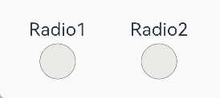

# Polymorphic Style

You can set state-specific styles for components.

>  **NOTE**
>
>  The APIs of this module are supported since API version 8. Updates will be marked with a superscript to indicate their earliest API version.


## Attributes

| Name| Type| Description|
| -------- | -------- | -------- |
| stateStyles | StateStyles | Styles of the component for different states.<br>Since API version 9, this API is supported in ArkTS widgets.|

## StateStyles

Since API version 9, this API is supported in ArkTS widgets. Only the [universal attributes](ts-universal-attributes-size.md) are supported.

| Name| Type| Mandatory| Description|
| -------- | -------- | -------- | -------- |
| normal | ()=&gt;void | No| Style of the component when being stateless.|
| pressed | ()=&gt;void | No| Style of the component in the pressed state.|
| disabled | ()=&gt;void | No| Style of the component in the disabled state.|
| focused | ()=&gt;void | No| Style of the component in the focused state.|
| clicked | ()=&gt;void | No| Style of the component in the clicked state.|
| selected<sup>10+</sup> | ()=&gt;void | No| Style of the component in the selected state.|

**Notes about the selected state:**

- The selected state style depends on the value of the component's selected attribute. You can change the attribute value through [onClick](ts-universal-events-click.md) or [$$](../../quick-start/arkts-two-way-sync.md).

- The table below lists the components that support the selected state style and their selected attributes or parameters.

  | Component                                                        | Selected Parameter/Attribute| Initial API Version|
  | ------------------------------------------------------------ | --------------- | ----------- |
  | [Checkbox](ts-basic-components-checkbox.md) | select          | 10          |
  | [CheckboxGroup](ts-basic-components-checkboxgroup.md) | selectAll       | 10          |
  | [Radio](ts-basic-components-radio.md)  | checked         | 10          |
  | [Toggle](ts-basic-components-toggle.md) | isOn            | 10          |
  | [ListItem](ts-container-listitem.md) | selected         | 10          |
  | [GridItem](ts-container-griditem.md) | selected         | 10          |
  | [MenuItem](ts-basic-components-menuitem.md) | selected         | 10          |

## Example

### Example 1

```ts
// xxx.ets
@Entry
@Component
struct StyleExample {
  @State isEnable: boolean = true

  @Styles pressedStyles():void {
    .backgroundColor("#ED6F21")
    .borderRadius(10)
    .borderStyle(BorderStyle.Dashed)
    .borderWidth(2)
    .borderColor("#33000000")
    .width(120)
    .height(30)
    .opacity(1)
  }

  @Styles disabledStyles():void {
    .backgroundColor("#E5E5E5")
    .borderRadius(10)
    .borderStyle(BorderStyle.Solid)
    .borderWidth(2)
    .borderColor("#2a4c1919")
    .width(90)
    .height(25)
    .opacity(1)
  }

  @Styles normalStyles():void {
    .backgroundColor("#0A59F7")
    .borderRadius(10)
    .borderStyle(BorderStyle.Solid)
    .borderWidth(2)
    .borderColor("#33000000")
    .width(100)
    .height(25)
    .opacity(1)
  }

  build() {
    Flex({ direction: FlexDirection.Column, alignItems: ItemAlign.Center }) {
      Text("normal")
        .fontSize(14)
        .fontColor(Color.White)
        .opacity(0.5)
        .stateStyles({
          normal: this.normalStyles,
        })
        .margin({ bottom: 20 })
        .textAlign(TextAlign.Center)
      Text("pressed")
        .backgroundColor("#0A59F7")
        .borderRadius(20)
        .borderStyle(BorderStyle.Dotted)
        .borderWidth(2)
        .borderColor(Color.Red)
        .width(100)
        .height(25)
        .opacity(1)
        .fontSize(14)
        .fontColor(Color.White)
        .stateStyles({
          pressed: this.pressedStyles,
        })
        .margin({ bottom: 20 })
        .textAlign(TextAlign.Center)
      Text(this.isEnable == true ? "effective" : "disabled")
        .backgroundColor("#0A59F7")
        .borderRadius(20)
        .borderStyle(BorderStyle.Solid)
        .borderWidth(2)
        .borderColor(Color.Gray)
        .width(100)
        .height(25)
        .opacity(1)
        .fontSize(14)
        .fontColor(Color.White)
        .enabled(this.isEnable)
        .stateStyles({
          disabled: this.disabledStyles,
        })
        .textAlign(TextAlign.Center)
      Text("control disabled")
        .onClick(() => {
          this.isEnable = !this.isEnable
          console.log(`${this.isEnable}`)
        })
    }
    .width(350).height(300)
  }
}
```


### Example 2

```ts
// xxx.ets
@Entry
@Component
struct Index {
  @State value: boolean = false
  @State value2: boolean = false

  @Styles
  normalStyles(): void{
    .backgroundColor("#E5E5E1")
  }

  @Styles
  selectStyles(): void{
    .backgroundColor("#ED6F21")
    .borderWidth(2)
  }

  build() {
    Flex({ direction: FlexDirection.Row, justifyContent: FlexAlign.Center, alignItems: ItemAlign.Center }) {
      Column() {
        Text('Radio1')
          .fontSize(25)
        Radio({ value: 'Radio1', group: 'radioGroup1' })
          .checked(this.value)
          .height(50)
          .width(50)
          .borderWidth(0)
          .borderRadius(30)
          .onClick(() => {
            this.value = !this.value
          })
          .stateStyles({
            normal: this.normalStyles,
            selected: this.selectStyles,
          })
      }
      .margin(30)

      Column() {
        Text('Radio2')
          .fontSize(25)
        Radio({ value: 'Radio2', group: 'radioGroup2' })
          .checked($$this.value2)
          .height(50)
          .width(50)
          .borderWidth(0)
          .borderRadius(30)
          .stateStyles({
            normal: this.normalStyles,
            selected: this.selectStyles,
          })
      }
      .margin(30)
    }.padding({ top: 30 })
  }
}
```


