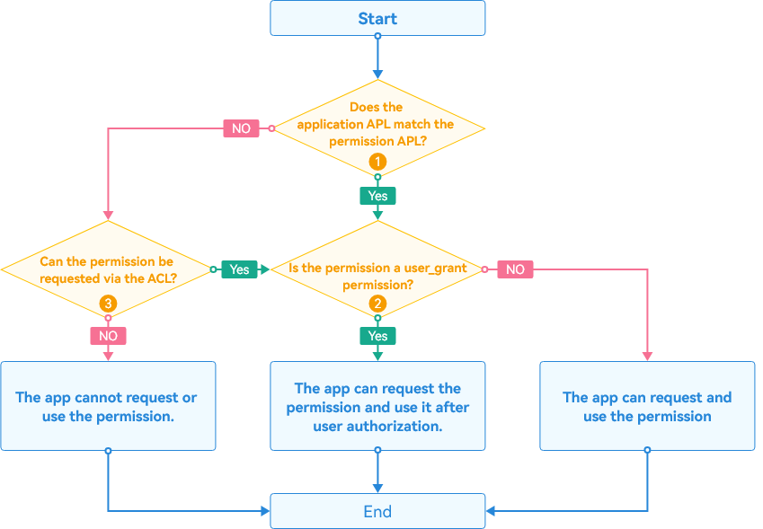

# Workflow for Requesting Permissions

You need to determine whether your application needs related permissions before accessing data or performing an operation. If permissions are required, request the permissions in the application installation package.

Different permissions have different Ability Privilege Levels (APLs), authorization modes, and requesting methods. The workflow in the following figure helps you determine whether your application needs to request a permission.



**NOTE**

- ① For details about the mappings between application APLs and permission APLs, see [APL](app-permission-mgmt-overview.md#basic-concepts-in-the-permission-mechanism).

- ② Permissions can be classified into system_grant permissions and user_grant permissions based on the authorization mode. For details, see [Authorization Mode](app-permission-mgmt-overview.md#authorization-mode).
  - A system_grant permission is pre-granted when the application is installed.
  - For a user_grant permission, apply for the permission as follows:
     1. In the configuration file, declare the permissions required by your application.
     2. Associate the object that requires the permission in the application with the permission. This allows the users to know what operations need user authorization.
     3. When the application in running needs to access the target object, an API will be called to trigger a dialog box for requesting user authorization. This API first checks whether the user has granted the permission required. If no, a dialog box will be displayed to request authorization from the user.
     4. Check the user authorization result. Allow subsequent operations only after the user has granted the permission to the application successfully.

- ③ You can use the access control list (ACL) to allow an application to have a higher-level permission. For details, see <!--RP1-->[ACL](app-permission-mgmt-overview.md#basic-concepts-in-the-permission-mechanism).<!--RP1End-->

The operation for requesting a permission varies, depending on the permission APL and authorization mode.

## Requesting Permissions for <!--Del-->normal <!--DelEnd-->Applications

| Permission Type| Authorization Mode| Operation Path|
| -------- | -------- | -------- |
| [Permissions for all applications](permissions-for-all.md#system_grant-permissions)| system_grant | [Declare permission](declare-permissions.md) &gt; Access API|
| [Permissions for all applications](permissions-for-all.md#user_grant-permissions)| user_grant  | [Declare permission](declare-permissions.md) &gt; [Request user authorization](request-user-authorization.md) &gt; Access API|
| <!--DelRow-->[system_grant permissions available for normal applications via ACL](permissions-for-system-apps.md#system_grant-permissions-requestable-via-acl)| system_grant | [Request restricted permission](declare-permissions-in-acl.md) &gt; [Declare permission](declare-permissions.md) > Access API |
| <!--DelRow-->[user_grant permissions available for normal applications via ACL](permissions-for-system-apps.md#user_grant-permissions-requestable-via-acl)| user_grant | [Request restricted permission](declare-permissions-in-acl.md) &gt; [Declare permission](declare-permissions.md) > [Request user authorization](request-user-authorization.md) > Access API |
<!--RP2--><!--RP2End-->

<!--Del-->
> **NOTE**
>
> - A normal application cannot request a system_basic permission whose **Enable via ACL** is **false**.
> - You can use DevEco Studio to [request a permission via ACL](https://developer.huawei.com/consumer/en/doc/harmonyos-guides-V14/ide-signing-V14). However, this method applies to the applications in debug phase, but not to the applications to be released to the app market. For a commercial application, apply for a release certificate and profile in the app market.

## Requesting Permissions for system_basic Applications

| Permission APL| Authorization Mode| Enable via ACL| Operation Path|
| -------- | -------- | -------- | -------- |
| normal or system_basic| system_grant | - | [Declare permission](declare-permissions.md) &gt; Access API|
| normal or system_basic| user_grant | - | [Declare permission](declare-permissions.md) &gt; [Request user authorization](request-user-authorization.md) &gt; Access API|
| system_core | system_grant | true | [Request restricted permission](declare-permissions-in-acl.md) &gt; [Declare permission](declare-permissions.md) > Access API |
| system_core | user_grant | true | [Request restricted permission](declare-permissions-in-acl.md) &gt; [Declare permission](declare-permissions.md) > [Request user authorization](request-user-authorization.md) > Access API |

To change the application APL to system_basic or system_core, modify the HarmonyAppProvision file (**Toolchains/_{Version}_/lib/UnsgnedReleasedProfileTemplate.json** file in the SDK directory) of the application when developing the application installation package, and sign the application again.

**Example**

Modify the **"bundle-info"** &gt; **"apl"** field in the file.

```json
"bundle-info" : {
    // ...
    "apl": "system_basic",
    // ...
},
```

> **NOTE**
>
> Modifying the HarmonyAppProvision configuration file applies to the applications in the debug phase, but not to the applications released to the app market. For a commercial application, apply for a release certificate and profile in the app market.

<!--DelEnd-->
