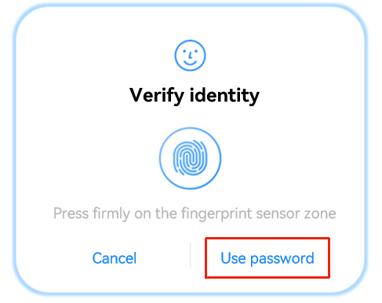

# Applying Custom Authentication


The user authentication framework also provides a mechanism for switching from the authentication types supported by the system to the authentication types customized by device vendors.


For example, if the facial or fingerprint authentication provided by the system fails in a payment process, the user can switch to the password authentication defined by the device vendor.


Because the payment password authentication is not a system authentication capability, a navigation button with **Use payment password** must be passed in to initiate the custom authentication.


After the user taps this button, the application that initiates the custom authentication will receive a special authentication result returned by the user authentication framework, indicating that the service system authentication is complete and the page for the custom authentication will be started. As a result, the payment password authentication page customized by the service is displayed.





You can set **WidgetParam.navigationButtonText** to specify the text displayed on the navigation button.


> **NOTE**
> The lock screen password authentication and custom authentication are mutually exclusive.


| Authentication Type| Switch to Custom Authentication| 
| -------- | -------- |
| Lock screen password authentication| × | 
| Facial authentication| √ | 
| Fingerprint authentication| √ | 
| Facial + lock screen password authentication| × | 
| Fingerprint + lock screen password authentication| × | 
| Facial + fingerprint + lock screen password authentication| × | 


## Development Example

To implement the switchover from a system-supported authentication type to a custom authentication type, the **widgetParam** parameter passed in [initiating authentication](start-authentication.md) must contain **navigationButtonText**.

The following example only covers how to configure the page for switching to the custom authentication page. You need to implement the process of starting the related page based on the comments in the sample code.

```ts
import type {BusinessError} from '@ohos.base';
import userAuth from '@ohos.userIAM.userAuth';

const authParam: userAuth.AuthParam = {
  challenge: new Uint8Array([49, 49, 49, 49, 49, 49]),
  authType: [userAuth.UserAuthType.FACE],
  authTrustLevel: userAuth.AuthTrustLevel.ATL3,
};
// Set navigationButtonText for the authentication page.
const widgetParam: userAuth.WidgetParam = {
  title: 'Verify identity',
  navigationButtonText: 'Use password',
};
try {
  // Obtain a UserAuthInstance object.
  let userAuthInstance = userAuth.getUserAuthInstance(authParam, widgetParam);
  console.log('get userAuth instance success');
  // Subscribe to the authentication result.
  userAuthInstance.on('result', {
    onResult(result) {
      // If the ResultCode 12500000 is returned, the operation is successful.
      console.log('userAuthInstance callback result = ' + JSON.stringify(result));
      // If the ResultCode 12500011 is returned, the user taps the navigation button to switch to the custom authentication page.
      if (result.result == 12500011) {
        // You need to implement the process of starting the custom authentication page.
      }
    }
  });
  console.log('auth on success');
  userAuthInstance.start();
  console.log('auth start success');
} catch (error) {
  const err: BusinessError = error as BusinessError;
  console.error(`auth catch error. Code is ${err?.code}, message is ${err?.message}`);
}
```
