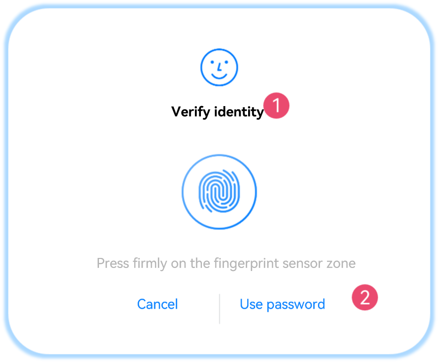
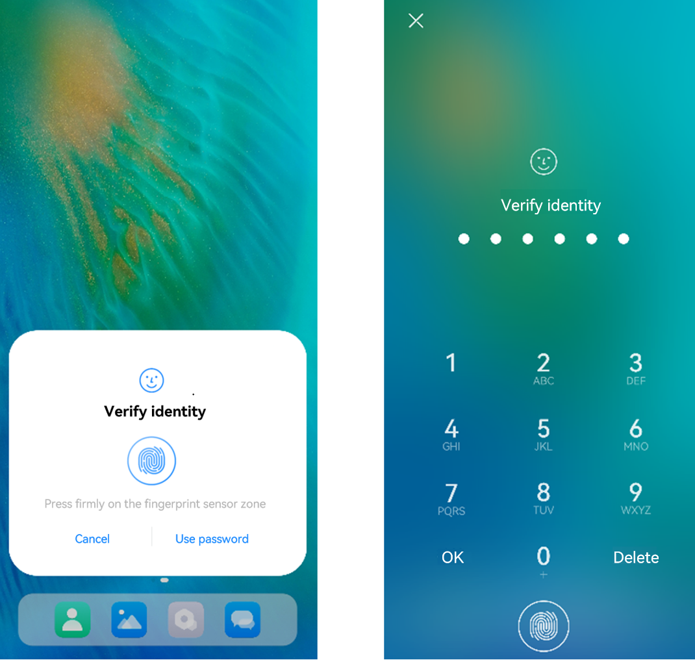

# Initiating User Authentication


A user authentication is required before an application accesses a critical functionality or sensitive data. This topic walks you through the process.


## Available APIs

For details about the parameters, return values, and error codes, see [User Authentication](../../reference/apis-user-authentication-kit/js-apis-useriam-userauth.md#userauthgetuserauthinstance10).

| API| Description| 
| -------- | -------- |
| getUserAuthInstance(authParam: AuthParam, widgetParam: WidgetParam): UserAuthInstance | Obtains a **UserAuthInstance** object for user authentication. The unified [user authentication widget](#user-authentication-widget) is also supported.| 
| on(type: 'result', callback: IAuthCallback): void | Subscribes to the user authentication result.| 
| off(type: 'result', callback?: IAuthCallback): void | Unsubscribes from the user authentication result.| 
| start(): void | Starts user authentication.| 


## User Authentication Widget

The system provides a unified user authentication widget, which stands out with following features:

- The user authentication widget identifies and authenticates user information and returns the authentication result to the application. The overall process is secure and controllable.

- The widget comes with a unified UI component style to elevate user experience.

The following figure shows the style of the user authentication widget, which can be set via the [WidgetParam](../../reference/apis-user-authentication-kit/js-apis-useriam-userauth.md#widgetparam10) parameter.

<!--RP1-->

<!--RP1End-->

- ①: Title (**WidgetParam.title**) of the user authentication page, which cannot exceed 500 characters. You can set the title based on actual requirements.

- ②: Text on the navigation button (**WidgetParam.navigationButtonText**), which cannot exceed 60 characters. This parameter can be set only for a single fingerprint or facial authentication.
   
  If biometric authentication fails, the authentication widget button is displayed. You can click this button to apply custom authentication.

<!--Del-->
- The following shows the display modes (**WidgetParam.windowMode**) of the user authentication widget.
  
  The user authentication widget provides two display modes: dialog box (default mode, as shown in figure on the left) and full screen (as shown in the figure on the right).

  Currently, the full screen mode is available only for system applications.

  
<!--DelEnd-->

The user authentication widget supports the following types of authentication:

- Lock screen password authentication

- Facial authentication

- Fingerprint authentication

- Facial + lock screen password authentication

- Fingerprint + lock screen password authentication

- Facial + fingerprint + lock screen password authentication

> **NOTE**
> Currently, the text on the navigation button (**WidgetParam.navigationButtonText**) can be set only for a single fingerprint or facial authentication.


## How to Develop

1. Check that the application has the ohos.permission.ACCESS_BIOMETRIC permission. For details about how to request permissions, see [Requesting Permissions](prerequisites.md#requesting-permissions).

2. Set [AuthParam](../../reference/apis-user-authentication-kit/js-apis-useriam-userauth.md#authparam10) (including the challenge, [UserAuthType](../../reference/apis-user-authentication-kit/js-apis-useriam-userauth.md#userauthtype8), and [AuthTrustLevel](../../reference/apis-user-authentication-kit/js-apis-useriam-userauth.md#authtrustlevel8)), configure [WidgetParam](../../reference/apis-user-authentication-kit/js-apis-useriam-userauth.md#widgetparam10), and use [getUserAuthInstance](../../reference/apis-user-authentication-kit/js-apis-useriam-userauth.md#userauthgetuserauthinstance10) to obtain a **UserAuthInstance** instance.

3. Use [UserAuthInstance.on](../../reference/apis-user-authentication-kit/js-apis-useriam-userauth.md#on10) to subscribe to the authentication result.

4. Use [UserAuthInstance.start](../../reference/apis-user-authentication-kit/js-apis-useriam-userauth.md#start10) to start authentication. The authentication result [UserAuthResult](../../reference/apis-user-authentication-kit/js-apis-useriam-userauth.md#userauthresult10) is returned through [IAuthCallback](../../reference/apis-user-authentication-kit/js-apis-useriam-userauth.md#iauthcallback10).
   If the authentication is successful, [UserAuthType](../../reference/apis-user-authentication-kit/js-apis-useriam-userauth.md#userauthtype8) and token information (**AuthToken**) are returned.

**Example 1**

 Initiate facial authentication and lock screen password authentication with the authentication trust level greater than or equal to ATL3.

```ts
// API version 10
import { BusinessError } from '@kit.BasicServicesKit';
import { cryptoFramework } from '@kit.CryptoArchitectureKit';
import { userAuth } from '@kit.UserAuthenticationKit';

try {
  const rand = cryptoFramework.createRandom();
  const len: number = 16;
  const randData: Uint8Array = rand?.generateRandomSync(len)?.data;
  // Set authentication parameters.
  const authParam: userAuth.AuthParam = {
    challenge: randData,
    authType: [userAuth.UserAuthType.PIN, userAuth.UserAuthType.FACE],
    authTrustLevel: userAuth.AuthTrustLevel.ATL3,
  };
  // Set the authentication page.
  const widgetParam: userAuth.WidgetParam = {
    title: 'Verify identity',
  };
  // Obtain a UserAuthInstance object.
  const userAuthInstance = userAuth.getUserAuthInstance(authParam, widgetParam);
  console.info('get userAuth instance success');
  // Subscribe to the authentication result.
  userAuthInstance.on('result', {
    onResult(result) {
      console.info(`userAuthInstance callback result: ${JSON.stringify(result)}`);
      // Unsubscribe from the authentication result if required.
      userAuthInstance.off('result');
    }
  });
  console.info('auth on success');
  userAuthInstance.start();
  console.info('auth start success');
} catch (error) {
  const err: BusinessError = error as BusinessError;
  console.error(`auth catch error. Code is ${err?.code}, message is ${err?.message}`);
}
```
**Example 2**

Initiate facial authentication with the authentication trust level greater than or equal to ATL3, and enable the device unlock result to be reused for the same type of authentication within the specified time.

```ts
// API version 10
import { BusinessError } from  '@kit.BasicServicesKit';
import { cryptoFramework } from '@kit.CryptoArchitectureKit';
import { userAuth } from '@kit.UserAuthenticationKit';

// Set authentication parameters.
let reuseUnlockResult: userAuth.ReuseUnlockResult = {
  reuseMode: userAuth.ReuseMode.AUTH_TYPE_RELEVANT,
  reuseDuration: userAuth.MAX_ALLOWABLE_REUSE_DURATION,
}
try {
  const rand = cryptoFramework.createRandom();
  const len: number = 16;
  const randData: Uint8Array = rand?.generateRandomSync(len)?.data;
  const authParam: userAuth.AuthParam = {
    challenge: randData,
    authType: [userAuth.UserAuthType.FACE],
    authTrustLevel: userAuth.AuthTrustLevel.ATL3,
    reuseUnlockResult: reuseUnlockResult,
  };
  // Set the authentication page.
  const widgetParam: userAuth.WidgetParam = {
    title: 'Verify identity',
  };
  // Obtain a UserAuthInstance object.
  const userAuthInstance = userAuth.getUserAuthInstance(authParam, widgetParam);
  console.info('get userAuth instance success');
  // Subscribe to the authentication result.
  userAuthInstance.on('result', {
    onResult(result) {
      console.info(`userAuthInstance callback result: ${JSON.stringify(result)}`);
      // Unsubscribe from the authentication result if required.
      userAuthInstance.off('result');
    }
  });
  console.info('auth on success');
  userAuthInstance.start();
  console.info('auth start success');
} catch (error) {
  const err: BusinessError = error as BusinessError;
  console.error(`auth catch error. Code is ${err?.code}, message is ${err?.message}`);
}
```
