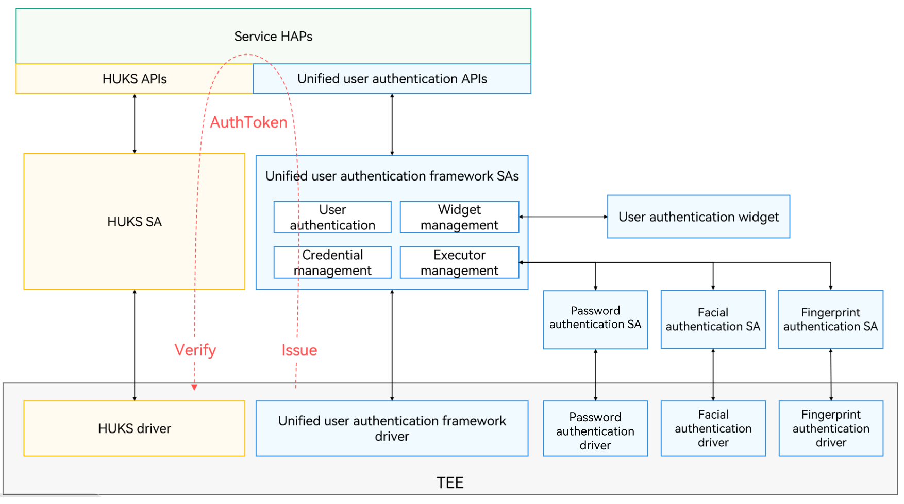

# User Authentication Overview

The user authentication framework provides system-level identity authentication and a system-level user authentication widget, which provides unified user authentication across devices with diversified authentication modes (facial, fingerprint, and PIN authentication).

Before accessing personal data or performing sensitive operations upon a user request, the application or system service invokes the user authentication widget to authenticate the user identity. The data can be accessed or the sensitive operation can be performed only when the authentication is successful.

User identity authentication can be used in authentication scenarios, such as in-app login and payment.

## Working Mechanism

The following figure shows the architecture of the user authentication framework.

The unified user authentication framework consists of the following:

1. Unified user authentication APIs: provide unified APIs for implementing user authentication capabilities.

2. Unified user authentication framework: consists of authentication SAs and drivers. The framework schedules various identity authentication capabilities and the user authentication widget to complete user authentication requests initiated by services through the unified user authentication APIs.

3. User authentication widget: provides the interaction interfaces for different authentication modes to ensure consistent user authentication experience regardless of the authentication mode.

4. Authentication capabilities: provides capabilities of PIN (password) authentication, facial authentication, and fingerprint authentication for the unified user authentication framework to schedule.

If the user authentication is successful, the unified user authentication framework issues an AuthToken in the trusted execution environment (TEE) of the device.

User authentication can also be used to control the access to the keys in the HUKS. For the keys that can be accessed only with user authentication, the application needs to provide a key invocation request with the obtained AuthToken to the [HUKS](../UniversalKeystoreKit/huks-overview.md). After verifying the validity and validity of the AuthToken in the TEE, the HUKS service responds to the service request and performs the related key operation.

### AuthToken Struct

Plaintext

| Name| Content| Type| Description|
| -------- | -------- | -------- | -------- |
| version | Token version| int32_t | Currently, the token version is 2.0.|
| challenge | Random challenge for authentication| uint8[32] | One-off random challenge generated by the service that needs to verify the authentication result.|
| time | Authentication timestamp| uint64 | Timestamp when the authentication is successful.| 
| authTrustLevel | Authentication trust level| uint32 | See [Authentication Trust Levels](#authentication-trust-levels).|
| authType | Authentication type| uint32 | Authentication type, which can be facial authentication, fingerprint authentication, or PIN authentication (lock screen password authentication).|
| authMode | Operation type| uint32 | Identification/authentication.| 
| securityLevel | Security level of the token issuing environment| uint32 | Security level of the environment where the token is issued.|

Ciphertext

| Name| Content| Type| Description|
| -------- | -------- | -------- | -------- |
| userId | User ID| uint64 | ID allocated by the system to a user when the user is created.|
| secureUid | Secure user ID| uint64 | ID randomly allocated to a user when the user registers the system password. The ID will be deleted when the password is deleted. It remains unchanged when the password is changed.|
| enrolledId | Credential enrollment ID| uint64 | ID generated each time a credential of this type is enrolled. The ID remains unchanged if the credential is deleted.|
| credentialId | Credential ID| uint64 | ID of a credential (such as the face or fingerprint) enrolled by the user.|

Tag

| Name| Content| Type| Description|
| -------- | -------- | -------- | -------- |
| tag | Tag of the ciphertext| uint8[16] | Tag generated after the ciphertext is encrypted using AES-GCM.|
| iv | Initialization vector (IV) used to encrypt the ciphertext.| uint8[12] | Random IV used for AES-GCM encryption.|
| sign | Signature of the AuthToken| uint8[32] | Signature used to protect the integrity of the AuthToken.|

### Authentication Trust Levels

The system uses the following metrics to measure the authentication trust level (**AuthTrustLevel**). The following table lists the authentication trust levels supported by the system.

- False Rejection Rate (FRR): percentage of the times that a user is incorrectly rejected by a system.

- False Acceptance Rate (FAR): percentage of times that an imposter is incorrectly accepted by a system.

- Spoof Acceptance Rate (SAR): percentage of times that a non-lived, previously recorded sample is accepted by a system.

The lower the FAR, the higher the FRR. In other words, the more secure the authentication, the lower the ease of the use.

| AuthTrustLevel| Metrics| Description and Example| Application Scenario|
| -------- | -------- | -------- | -------- |
| ATL4 | When FRR = 10%, FAR ≤ 0.001%, SAR ≤ 3%| The authentication can accurately identify individual users and provides powerful liveness detection capabilities. For example, PIN (min. 6 digits) authentication with a secure keyboard and fingerprint or 3D facial authentication with special security hardening.| Small-amount payment|
| ATL3 | When FRR = 10%, FAR ≤ 0.002%, SAR ≤ 7%| The authentication can accurately identify individual users and provides strong liveness detection capabilities. For example, 2D facial authentication with special security hardening.| Device unlocking|
| ATL2 | When FRR = 10%, FAR ≤ 0.002%, 7% < SAR ≤ 20%| The authentication can accurately identify individual users and provides regular liveness detection capabilities. For example, 2D facial authentication using common a camera to collect images.| Maintaining the unlocked state of a device|
| ATL1 | When FRR = 10%, FAR ≤ 1%, 7% < SAR ≤ 20%| The authentication can identify individual users and provides limited liveness detection capabilities. For example, voiceprint authentication.| Service risk control, targeted recommendations, and personalized services|
