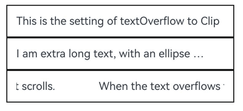
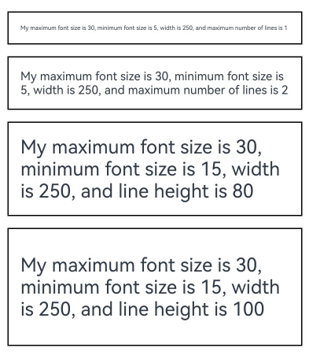
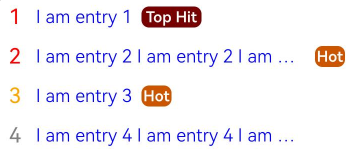

# Text Display (Text/Span)


The **Text** component is used to display a piece of textual information. The **Span** component is used to display inline text. 

For details, see [Text](../reference/apis-arkui/arkui-ts/ts-basic-components-text.md) and [Span](../reference/apis-arkui/arkui-ts/ts-basic-components-span.md).


## Creating Text

You can create text in either of the following ways:


- Entering strings

  ```ts
  Text('I am a piece of text')
  ```


- Referencing Resource objects

  You can use **$r** to create a **Resource** object to reference resources in **/resources/base/element/string.json**.


  ```ts
  Text($r('app.string.module_desc'))
    .baselineOffset(0)
    .fontSize(30)
    .border({ width: 1 })
    .padding(10)
    .width(300)
  ```

  


## Adding Child Components

The [Span](../reference/apis-arkui/arkui-ts/ts-basic-components-span.md) component can only act as a child of the [Text](../reference/apis-arkui/arkui-ts/ts-basic-components-text.md) and [RichEditor](../reference/apis-arkui/arkui-ts/ts-basic-components-richeditor.md) components. You can add one or more **Span** child components to a **Text** component to display a piece of information, such as the product description and statement of commitment.

- Creating a Span Component

  The **Span** component works only when included in a **Text** component. It does not display any content when used alone. If both the **Span** and **Text** components have text configured, the text of the **Span** overwrites that of the **Text** component.


  ```ts
  Text('I am Text') {
    Span('I am Span')
  }
  .padding(10)
  .borderWidth(1)
  ```

  

- Set the text decorative line.

  Use the [decoration](../reference/apis-arkui/arkui-ts/ts-basic-components-span.md#decoration) attribute to set the style and color of the text decorative line.


  ```ts
  Text() {
    Span('I am Span1,').fontSize(16).fontColor(Color.Grey)
      .decoration({ type: TextDecorationType.LineThrough, color: Color.Red })
    Span('I am Span2').fontColor(Color.Blue).fontSize(16)
      .fontStyle(FontStyle.Italic)
      .decoration({ type: TextDecorationType.Underline, color: Color.Black })
    Span('I am Span3').fontSize(16).fontColor(Color.Grey)
      .decoration({ type: TextDecorationType.Overline, color: Color.Green })
  }
  .borderWidth(1)
  .padding(10)
  ```

  

- Use the [textCase](../reference/apis-arkui/arkui-ts/ts-basic-components-span.md#textcase) attribute to set the text case.

  ```ts
  Text() {
    Span('I am Upper-span').fontSize(12)
      .textCase(TextCase.UpperCase)
  }
  .borderWidth(1)
  .padding(10)
  ```

  

- Add events.

  The **Span** component does not have size information. Therefore, only an [onClick](../reference/apis-arkui/arkui-ts/ts-universal-events-click.md#onclick) event can be added for this component.


  ```ts
  Text() {
    Span('I am Upper-span').fontSize(12)
      .textCase(TextCase.UpperCase)
      .onClick(()=>{
        console.info('I am Span - onClick')
      })
  }
  ```


## Setting Styles

- Use the [textAlign](../reference/apis-arkui/arkui-ts/ts-basic-components-text.md#textalign) attribute to set the alignment mode of text.

  ```ts
  Text('Left aligned')
    .width(300)
    .textAlign(TextAlign.Start)
    .border({ width: 1 })
    .padding(10)
  Text('Center aligned')
    .width(300)
    .textAlign(TextAlign.Center)
    .border({ width: 1 })
    .padding(10)
  Text('Right aligned')
    .width(300)
    .textAlign(TextAlign.End)
    .border({ width: 1 })
    .padding(10)
  ```

  

- Use the [textOverflow](../reference/apis-arkui/arkui-ts/ts-basic-components-text.md#textoverflow) attribute to set the display mode for when the text is too long. This attribute must be used together with [maxLines](../reference/apis-arkui/arkui-ts/ts-basic-components-text.md#maxlines). By default, the text is automatically wrapped.

  ```ts
  Text('This is the setting of textOverflow to Clip text content This is the setting of textOverflow to None text content. This is the setting of textOverflow to Clip text content This is the setting of textOverflow to None text content.')
    .width(250)
    .textOverflow({ overflow: TextOverflow.None })
    .maxLines(1)
    .fontSize(12)
    .border({ width: 1 })
    .padding(10)
  Text('I am extra long text, with an ellipse displayed for any excess.')
    .width(250)
    .textOverflow({ overflow: TextOverflow.Ellipsis })
    .maxLines(1)
    .fontSize(12)
    .border({ width: 1 })
    .padding(10)
  Text('When the text overflows the container, it scrolls.')      
    .width(250)
    .textOverflow({ overflow: TextOverflow.MARQUEE })                 
    .maxLines(1)       
    .fontSize(12)
    .border({ width: 1 })
    .padding(10)                       
  ```

  

- Use the [lineHeight](../reference/apis-arkui/arkui-ts/ts-basic-components-text.md#lineheight) attribute to set the text line height.

  ```ts
  Text('This is the text with the line height set. This is the text with the line height set.')
    .width(300).fontSize(12).border({ width: 1 }).padding(10)
  Text('This is the text with the line height set. This is the text with the line height set.')
    .width(300).fontSize(12).border({ width: 1 }).padding(10)
    .lineHeight(20)
  ```

  

- Use the [decoration](../reference/apis-arkui/arkui-ts/ts-basic-components-text.md#decoration) attribute to set the style and color of the text decorative line.

  ```ts
  Text('This is the text')
    .decoration({
      type: TextDecorationType.LineThrough,
      color: Color.Red
    })
    .borderWidth(1).padding(10).margin(5)
  Text('This is the text')
    .decoration({
      type: TextDecorationType.Overline,
      color: Color.Red
    })
    .borderWidth(1).padding(10).margin(5)
  Text('This is the text')
    .decoration({
      type: TextDecorationType.Underline,
      color: Color.Red
    })
    .borderWidth(1).padding(10).margin(5)
  ```

  

- Use the [baselineOffset](../reference/apis-arkui/arkui-ts/ts-basic-components-text.md#baselineoffset) attribute to set the baseline offset of the text.

  ```ts
  Text('This is the text content with baselineOffset 0.')
    .baselineOffset(0)
    .fontSize(12)
    .border({ width: 1 })
    .padding(10)
    .width('100%')
    .margin(5)
  Text('This is the text content with baselineOffset 30.')
    .baselineOffset(30)
    .fontSize(12)
    .border({ width: 1 })
    .padding(10)
    .width('100%')
    .margin(5)

  Text('This is the text content with baselineOffset -20.')
    .baselineOffset(-20)
    .fontSize(12)
    .border({ width: 1 })
    .padding(10)
    .width('100%')
    .margin(5)
  ```

  

- Use the [letterSpacing](../reference/apis-arkui/arkui-ts/ts-basic-components-text.md#letterspacing) attribute to set the letter spacing.

  ```ts
  Text('This is the text content with letterSpacing 0.')
    .letterSpacing(0)
    .fontSize(12)
    .border({ width: 1 })
    .padding(10)
    .width('100%')
    .margin(5)
  Text('This is the text content with letterSpacing 3.')
    .letterSpacing(3)
    .fontSize(12)
    .border({ width: 1 })
    .padding(10)
    .width('100%')
    .margin(5)
  Text('This is the text content with letterSpacing -1.')
    .letterSpacing(-1)
    .fontSize(12)
    .border({ width: 1 })
    .padding(10)
    .width('100%')
    .margin(5)
  ```

  

- Use the [minFontSize](../reference/apis-arkui/arkui-ts/ts-basic-components-text.md#minfontsize) and [maxFontSize](../reference/apis-arkui/arkui-ts/ts-basic-components-text.md#maxfontsize) attributes to set the minimum and maximum font size, respectively.

  For the settings to take effect, these attributes must be used together with [maxLines](../reference/apis-arkui/arkui-ts/ts-basic-components-text.md#maxlines) or layout constraint settings.

  ```ts
  Text('My maximum font size is 30, minimum font size is 5, width is 250, and maximum number of lines is 1')
    .width(250)
    .maxLines(1)
    .maxFontSize(30)
    .minFontSize(5)
    .border({ width: 1 })
    .padding(10)
    .margin(5)
  Text('My maximum font size is 30, minimum font size is 5, width is 250, and maximum number of lines is 2')
    .width(250)
    .maxLines(2)
    .maxFontSize(30)
    .minFontSize(5)
    .border({ width: 1 })
    .padding(10)
    .margin(5)
  Text('My maximum font size is 30, minimum font size is 15, width is 250, and line height is 50')
    .width(250)
    .height(50)
    .maxFontSize(30)
    .minFontSize(15)
    .border({ width: 1 })
    .padding(10)
    .margin(5)
  Text('My maximum font size is 30, minimum font size is 15, width is 250, and line height is 100')
    .width(250)
    .height(100)
    .maxFontSize(30)
    .minFontSize(15)
    .border({ width: 1 })
    .padding(10)
    .margin(5)
  ```

  

- Use the [textCase](../reference/apis-arkui/arkui-ts/ts-basic-components-text.md#textcase) attribute to set the text case.

  ```ts
  Text('This is the text content with textCase set to Normal.')
    .textCase(TextCase.Normal)
    .padding(10)
    .border({ width: 1 })
    .padding(10)
    .margin(5)

  // The text is displayed in lowercase.
  Text('This is the text content with textCase set to LowerCase.')
    .textCase(TextCase.LowerCase)
    .border({ width: 1 })
    .padding(10)
    .margin(5)

  // The text is displayed in uppercase.
  Text('This is the text content with textCase set to UpperCase.')
    .textCase(TextCase.UpperCase)
    .border({ width: 1 })
    .padding(10)
    .margin(5)
  ```

  

- Use the [copyOption](../reference/apis-arkui/arkui-ts/ts-basic-components-text.md#copyoption9) attribute to set whether copy and paste is allowed.

  ```ts
  Text("This text is copyable")
    .fontSize(30)
    .copyOption(CopyOptions.InApp)
  ```

  


## Adding Events

You can bind the **Text** component to the [onClick](../reference/apis-arkui/arkui-ts/ts-universal-events-click.md#onclick), [onTouch](../reference/apis-arkui/arkui-ts/ts-universal-events-touch.md#ontouch), or other universal events to respond to user operations.

```ts
Text ('Click Me')
  .onClick(()=>{
      console.info('I am the response to the click event');
   })
```

## Example Scenario

This example demonstrates how to implement a hot search list using the **maxLines**, **textOverflow**, **textAlign**, and **constraintSize** attributes.

```ts
// xxx.ets
@Entry
@Component
struct TextExample {
  build() {
    Column() {
      Row() {
        Text("1").fontSize(14).fontColor(Color.Red).margin({ left: 10, right: 10 })
        Text("I am entry 1")
          .fontSize(12)
          .fontColor(Color.Blue)
          .maxLines(1)
          .textOverflow({ overflow: TextOverflow.Ellipsis })
          .fontWeight(300)
        Text("Top Hit")
          .margin({ left: 6 })
          .textAlign(TextAlign.Center)
          .fontSize(10)
          .fontColor(Color.White)
          .fontWeight(600)
          .backgroundColor(0x770100)
          .borderRadius(5)
          .width(15)
          .height(14)
      }.width('100%').margin(5)

      Row() {
        Text("2").fontSize(14).fontColor(Color.Red).margin({ left: 10, right: 10 })
        Text("I am entry 2 I am entry 2 I am entry 2 I am entry 2")
          .fontSize(12)
          .fontColor(Color.Blue)
          .fontWeight(300)
          .constraintSize({ maxWidth: 200 })
          .maxLines(1)
          .textOverflow({ overflow: TextOverflow.Ellipsis })
        Text("Hot")
          .margin({ left: 6 })
          .textAlign(TextAlign.Center)
          .fontSize(10)
          .fontColor(Color.White)
          .fontWeight(600)
          .backgroundColor(0xCC5500)
          .borderRadius(5)
          .width(15)
          .height(14)
      }.width('100%').margin(5)

      Row() {
        Text("3").fontSize(14).fontColor(Color.Orange).margin({ left: 10, right: 10 })
        Text("I am entry 3")
          .fontSize(12)
          .fontColor(Color.Blue)
          .fontWeight(300)
          .maxLines(1)
          .constraintSize({ maxWidth: 200 })
          .textOverflow({ overflow: TextOverflow.Ellipsis })
        Text("Hot")
          .margin({ left: 6 })
          .textAlign(TextAlign.Center)
          .fontSize(10)
          .fontColor(Color.White)
          .fontWeight(600)
          .backgroundColor(0xCC5500)
          .borderRadius(5)
          .width(15)
          .height(14)
      }.width('100%').margin(5)

      Row() {
        Text("4").fontSize(14).fontColor(Color.Grey).margin({ left: 10, right: 10 })
        Text("I am entry 4 I am entry 4 I am entry 4 I am entry 4")
          .fontSize(12)
          .fontColor(Color.Blue)
          .fontWeight(300)
          .constraintSize({ maxWidth: 200 })
          .maxLines(1)
          .textOverflow({ overflow: TextOverflow.Ellipsis })
      }.width('100%').margin(5)
    }.width('100%')
  }
}

```


<!--RP1--><!--RP1End-->
