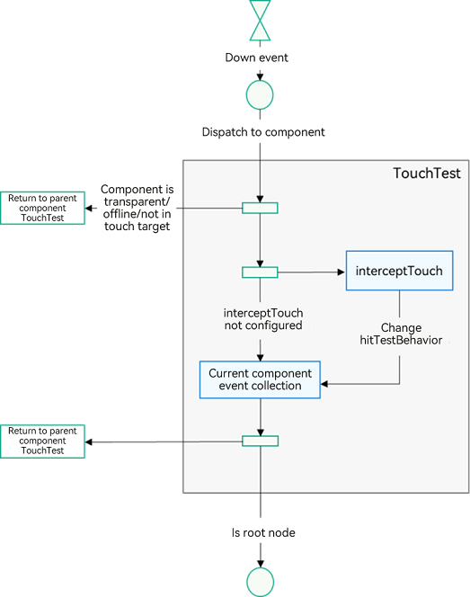
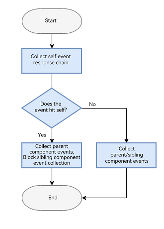

# Event Dispatch

## Overview

Event dispatch in ArkUI refers to the process where ArkUI receives pointer events generated by user interactions and dispatches these events to the respective components through hit testing, forming an event chain.

Touch events can be categorized by:

- Input device type: finger (screen touch), mouse, touchpad, stylus, joystick
- Event type: press, move, scroll

The system delivers events to corresponding UI components based on coordinates, event type, and UI layout. Multiple events can combine to trigger gestures or features, for example, long press, click, and drag.

## Event Interaction Pipeline

The event interaction pipeline describes the end-to-end process where ArkUI receives touch-type or mouse-type input events from upstream systems, collects event response chains based on developer-configured parameters, and dispatches them to components to trigger callbacks. This pipeline consists of three key phases:

1. Event Generation

   Hardware input devices report events to target ArkUI instances through drivers and multi-mode modules. The rendering pipeline of ArkUI performs unified event processing.

2. [Event Response Chain](#event-response-chain-mechanism) Formation and Event Dispatch

   The event response chain forms the core of the event interaction pipeline. After receiving an event, the pipeline performs hit testing to construct an event response chain, which drives decision-making for event dispatch and gesture recognition.

   (1) [Hit Testing](#hit-testing)

   After receiving an initial touch event, the pipeline performs spatial hit testing using event coordinates and component boundaries and constructs an event response chain. You can configure attributes to affect the formation of the event response chain.

   (2) [Dispatch to the Touch Event Response Chain](#dispatch-to-the-gesture-response-chain-and-gesture-recognition)

   Through the constructed touch response chain, the system delivers the touch event to target components.

   (3) [Dispatch to the Gesture Response Chain and Gesture Recognition](#dispatch-to-the-gesture-response-chain-and-gesture-recognition)

   Components with registered gestures form a gesture response chain. The system combines events to detect gestures, resolves gesture conflicts through competition logic, and triggers the callback of the winning gesture.

   (4) [Event Interception](#event-interception)

   You can intercept events at two levels:<br>Pre-chain: Configure hit test properties to affect the formation of the event response chain. Post-chain:

   During event dispatch to the touch event response chain, you can block touch event propagation using touch interceptors.

   During dispatch to the gesture response chain, you can suppress gesture recognition using gesture interceptors.

3. Callback Execution

   During response chain formation, registered callbacks are collected. Then, after response chain formation and event dispatch, callbacks are executed for qualifying events and gestures.

## Event Response Chain Mechanism

ArkUI constructs event response chains through hit testing using a reverse post-order traversal (right-subtree-first) of the component tree. The pseudocode implementation is as follows:

```
forEach((item, node.rbegin(),node.rend())=> {
    item.TouchTest();
})
node.collectEvent()
```

Consider the following component tree, where all components have **hitTestBehavior** set to **Default**. If the user taps component 5, the final response chain collected will be [5 -> 3 -> 1].

This is because component 3 has **hitTestBehavior** set to **Default**, which blocks the collection from its sibling nodes after receiving the event, thereby excluding the left subtree of component 1 (that is, component 2) from the response chain.

  

## Hit Testing

Hit testing occurs when ArkUI detects a touch-type pointer event or the start event of a mouse-type pointer event (for example, an event generated when a finger or a mouse cursor is pressed). Based on the coordinates of the received event, the process involves testing the response area of a component and gathering the event response chain.

You can influence the touch testing process by setting the following attributes:

- **hitTestBehavior**: For details, see [Hit Test Control](#hit-test-control).

- **interceptTouch**: For details, see [Custom Event Interception](#custom-event-interception).

- **responseRegion**: For details, see [Response Region Setting](#response-region-setting).

- **enabled**: For details, see [Enable/Disable Control](#enabledisable-control).

- [Security components](#security-components)

- Other attribute settings: such as opacity and component availability

The basic process of hit testing is as follows: Upon receiving the start event, the system traverses the component tree from top to bottom and from right to left, collects gestures and events bound to each component, and then integrates this information level by level up to the parent component, constructing a complete event response chain.

  

As shown in the figure, when the initial event is dispatched to a component, the component collects gestures and events bound to it, and then passes the collection result to the parent component until the root node is reached. If a component is transparent, has been removed from the component tree, or the event coordinates are outside the component's response region, the collection process is not triggered, and the parent component receives an empty response. Otherwise, all components will collect gestures and events and send the collection result to the parent component.

### Hit test control

When [hit test control](../reference/apis-arkui/arkui-ts/ts-universal-attributes-hit-test-behavior.md) is bound to a component, it may affect the hit testing of sibling nodes and parent and child nodes. The impact of a child component on its parent component's hit testing depends on the status of the last child component that is not blocked in hit testing.

You can configure hit test control to block the hit test of the component itself or other components.

- **HitTestMode.Default**: This mode is used by default when the **hitTestBehavior** attribute is not specified. In this mode, if the component itself is hit, it will block the hit testing of sibling components, but will not block the hit testing of child components.

  

- **HitTestMode.None**: In this mode, the component neither receives events nor interferes with the hit testing of its sibling components or child components.

  

- **HitTestMode.Block**: This mode blocks the hit testing of child components. If the component itself is hit during a hit test, it will also block the hit testing of sibling and parent components.

  

- **HitTestMode.Transparent**: This mode allows the component to participate in hit testing itself, without blocking the hit testing of sibling or parent components.

  

### Custom event interception

When a user performs a press action, the callback for [custom event interception](../reference/apis-arkui/arkui-ts/ts-universal-attributes-on-touch-intercept.md) bound to the component is triggered. You can dynamically adjust the **hitTestBehavior** attribute of the component based on the application status to affect the hit test process.

### Response region setting

[Touch target settings](../reference/apis-arkui/arkui-ts/ts-universal-attributes-touch-target.md) are another impact factor in the hit test. According to the [event interaction pipeline](#event-interaction-pipeline), the gestures and events bound to a component are collected and enter the event response chain only when the coordinates of an event hit the touch target of the component. As such, you can adjust the touch target of the component to control the hit test process. If the touch target is set to **0**, or defined as an untouchable area, the event is directly sent back to the parent node for subsequent hit tests.

### Enable/Disable Control

[Disabled](../reference/apis-arkui/arkui-ts/ts-universal-attributes-enable.md) components, including their children, do not initiate the hit test process; instead, they pass the events back to the parent to continue the hit test.

### Security Components

ArkUI provides security components, including [PasteButton](../security/AccessToken/pastebutton.md) and [SaveButton](../security/AccessToken/savebutton.md).

If a component has a higher [z-order](../reference/apis-arkui/arkui-ts/ts-universal-attributes-z-order.md) than a security component and covers it, the security component's touch events are sent directly to the parent node for further hit testing.

## Dispatch to the Touch Event Response Chain

Touch events bound to components form a touch response chain through hit testing. This chain dispatches events using an array structure.

During response chain collection, child components undergo hit testing before parent components. Therefore, touch events bound to child components are collected prior to parent components. As a result, during event dispatch, child component touch events respond first. Invoking event interception in child component touch callbacks can block parent component touch events.

## Dispatch to the Gesture Response Chain and Gesture Recognition

Gestures and events bound to components form a gesture response chain through hit testing. This chain dispatches events using a tree structure, where each node represents a gesture type.

During response chain collection, certain default gestures bound to specific components and events will also be collected. For example, a drag event bound to a component will be translated and collected as a sequential gesture group composed of long press and swipe gestures, while the swipe gesture bound by default to the **List** component will also be collected.

The gesture tree formed by the gesture response chain maintains a correspondence with the component tree. All gestures bound to the same component will form a subtree, which serves as a node in the gesture tree formed by the parent component.

After events are delivered to the gesture response chain, each gesture will undergo recognition. Ultimately, only those gestures that meet the recognition criteria and have not been intercepted will trigger their corresponding callbacks.

## Event Interception

Before the event response chain is formed, you can influence which components will participate in event handling through two mechanisms: [hit test control](#hit-test-control) and [custom event interception](#custom-event-interception). Once the system has established the event response chain, more precise interception becomes possible.

For standard touch events, you can [block event bubbling](../reference/apis-arkui/arkui-ts/ts-universal-events-touch.md#touchevent) through touch event callbacks.

This is particularly useful because the touch response chain processes events in child-to-parent order. When a child component blocks event bubbling, all parent components in the hierarchy will not receive that touch event.

For gesture events, you can implement interception through [custom gesture judgment](../reference/apis-arkui/arkui-ts/ts-gesture-customize-judge.md).

When a custom gesture bound to a component is about to be successfully recognized, the corresponding callback is triggered. By setting the return value, you can determine whether the gesture is successfully triggered, thereby achieving gesture interception.
