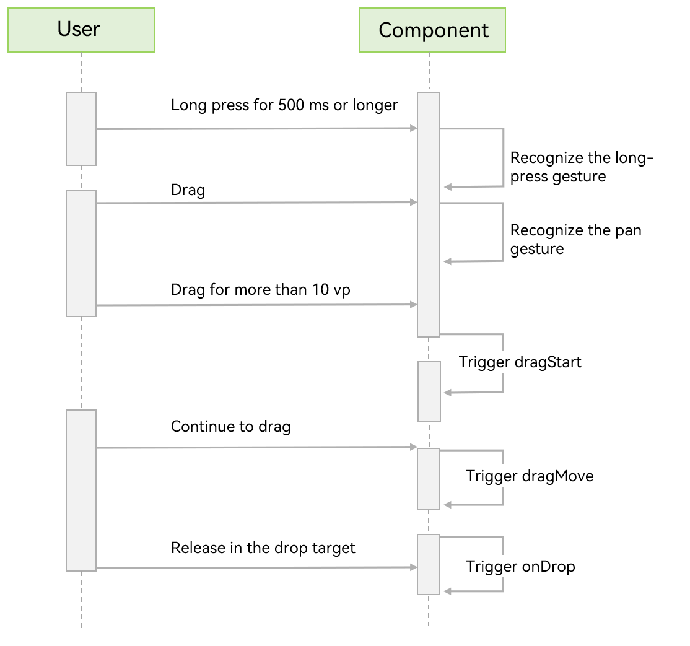
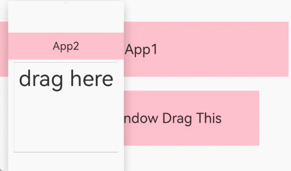

# Touchscreen Event


Touchscreen events are events triggered when a finger or stylus is placed on, moved along, or lifted from a component. They can be classified as [click event](#click-event), [drag event](#drag-event), or [touch event](#touch-event).


**Figure 1** Touchscreen event principles


## Click Event

A click event is triggered when a complete press and lift action is performed by using a finger or a stylus. When a click event occurs, the following callback is triggered:


```ts
onClick(event: (event?: ClickEvent) => void)
```


The **event** parameter provides the coordinates of the click relative to the window or component as well as the event source where the click occurs, for example, a button, a click on which shows or hides an image.

```ts
@Entry
@Component
struct IfElseTransition {
  @State flag: boolean = true;
  @State btnMsg: string = 'show';

  build() {
    Column() {
      Button(this.btnMsg).width(80).height(30).margin(30)
        .onClick(() => {
          if (this.flag) {
            this.btnMsg = 'hide';
          } else {
            this.btnMsg = 'show';
          }
          // Click the button to show or hide the image.
          this.flag = !this.flag;
        })
      if (this.flag) {
        Image($r('app.media.icon')).width(200).height(200)
      }
    }.height('100%').width('100%')
  }
}
```
**Figure 2** Showing or hiding an image through the click event of a button


## Drag Event

A drag event is triggered when a user long presses a component (&gt;= 500 ms) using a finger or stylus and drags the component to the drop target.

Whether a drag event can be triggered depends on the distance of finger or stylus movement on the screen. The drag event is triggered when this distance reaches 5 vp. ArkUI supports intra-application and cross-application drag events.

The following figure illustrates the process of triggering a drag event.





The drag event provides the following [APIs](../reference/arkui-ts/ts-universal-events-drag-drop.md).


| API                                    | Description                                      |
| ---------------------------------------- | ---------------------------------------- |
| onDragStart(event: (event?: DragEvent, extraParams?: string) =&gt; CustomBuilder \| DragItemInfo) | Triggered when dragging starts. Currently, only custom **pixelmap** objects and custom components are supported.          |
| onDragEnter(event: (event?: DragEvent, extraParams?: string) =&gt; void) | Triggered when the dragged item enters a valid drop target. **DragEvent**: position where the drag occurs.<br>**extraParmas**: custom information about the drag event.|
| onDragLeave(event: (event?: DragEvent, extraParams?: string) =&gt; void) | Triggered when the dragged item leaves a valid drop target. **DragEvent**: position where the drag occurs.<br>**extraParmas**: custom information about the drag event.|
| onDragMove(event: (event?: DragEvent, extraParams?: string) =&gt; void) | Triggered when the dragged item moves in a valid drop target. **DragEvent**: position where the drag occurs.<br>**extraParmas**: custom information about the drag event.|
| onDrop(event: (event?: DragEvent, extraParams?: string) =&gt; void) | Triggered when the dragged item is dropped on a valid drop target. **DragEvent**: position where the drag occurs.<br>**extraParmas**: custom information about the drag event.|


The following is an example of dragging a component out of a window in cross-window dragging:


```ts
import image from '@ohos.multimedia.image';

@Entry
@Component
struct Index {
  @State visible: Visibility = Visibility.Visible
  private pixelMapReader:image.PixelMap|undefined = undefined

  aboutToAppear() {
    console.info('begin to create pixmap has info message: ')
    this.createPixelMap()
  }

  createPixelMap() {
    let color = new ArrayBuffer(4 * 96 * 96);
    let buffer = new Uint8Array(color);
    for (let i = 0; i < buffer.length; i++) {
      buffer[i] = (i + 1) % 255;
    }
    class hw{
      height:number = 96
      width:number = 96
    }
    let hwo:hw = new hw()
    let ops:image.InitializationOptions|void = {
      'alphaType': 0,
      'editable': true,
      'pixelFormat': 4,
      'scaleMode': 1,
      'size': hwo
    }
    const promise: Promise<image.PixelMap> = image.createPixelMap(color, ops);
    promise.then((data:image.PixelMap|undefined) => {
      console.info('create pixmap has info message: ' + JSON.stringify(data))
      if(data){
        this.pixelMapReader = data;
      }
    })
  }

  @Builder pixelMapBuilder() {
    Text('drag item')
      .width('100%')
      .height(100)
      .fontSize(16)
      .textAlign(TextAlign.Center)
      .borderRadius(10)
      .backgroundColor(0xFFFFFF)
  }

  build() {
    Flex({ direction: FlexDirection.Column, alignItems: ItemAlign.Center, justifyContent: FlexAlign.Center }) {
      Text('App1')
        .width('40%')
        .height(80)
        .fontSize(20)
        .margin(30)
        .textAlign(TextAlign.Center)
        .backgroundColor(Color.Pink)
        .visibility(Visibility.Visible)

      Text('Across Window Drag This')
        .width('80%')
        .height(80)
        .fontSize(16)
        .margin(30)
        .textAlign(TextAlign.Center)
        .backgroundColor(Color.Pink)
        .visibility(this.visible)
        .onDragStart((event: DragEvent|undefined, extraParams: string|undefined):CustomBuilder | DragItemInfo => {
          console.info('Text onDrag start')
          return { pixelMap: this.pixelMapReader, extraInfo: 'custom extra info.' }
        })
        .onDrop((event: DragEvent|undefined, extraParams: string|undefined) => {
          console.info('Text onDragDrop,  ')
          this.visible = Visibility.None                    // Make the source invisible after the dragging is complete.
        })
    }

    .width('100%')
    .height('100%')
  }
}
```


The following is an example of dragging a component into a window in cross-window dragging:


```ts

@Entry
@Component
struct Index {
  @State number: string[] = ['drag here']
  @State text: string = ''
  @State bool1: boolean = false
  @State bool2: boolean = false
  @State visible: Visibility = Visibility.Visible
  @State visible2: Visibility = Visibility.None
  scroller: Scroller = new Scroller()

  build() {
    Flex({ direction: FlexDirection.Column, alignItems: ItemAlign.Center, justifyContent: FlexAlign.Center }) {
      Text('App2')
        .width('40%')
        .height(80)
        .fontSize(20)
        .margin(30)
        .textAlign(TextAlign.Center)
        .backgroundColor(Color.Pink)
        .visibility(Visibility.Visible)

      List({ space: 20, initialIndex: 0 }) {
        ForEach(this.number, (item:string) => {
          ListItem() {
            Text('' + item)
              .width('100%')
              .height(80)
              .fontSize(16)
              .borderRadius(10)
              .textAlign(TextAlign.Center)
              .backgroundColor(0xFFFFFF)
          }
        }, (item:string):string => item)

        ListItem() {
          Text('Across Window Drag This')
            .width('80%')
            .height(80)
            .fontSize(16)
            .margin(30)
            .textAlign(TextAlign.Center)
            .backgroundColor(Color.Pink)
            .visibility(this.visible2)
        }
      }
      .height('50%')
      .width('90%')
      .border({ width: 1 })
      .divider({ strokeWidth: 2, color: 0xFFFFFF, startMargin: 20, endMargin: 20 })
      .onDragEnter((event: DragEvent|undefined, extraParams: string|undefined) => {                         // Triggered when the dragged item enters a valid drop target.
        console.info('List onDragEnter, ' + extraParams)
      })
      .onDragMove((event: DragEvent|undefined, extraParams: string|undefined) => {                          // Triggered when the dragged item moves in a valid drop target.
        console.info('List onDragMove, ' + extraParams)
      })
      .onDragLeave((event: DragEvent|undefined, extraParams: string|undefined) => {                         // Triggered when the dragged item leaves a valid drop target.
        console.info('List onDragLeave, ' + extraParams)
      })
      .onDrop((event: DragEvent|undefined, extraParams: string|undefined) => {                              // Triggered when the dragged item is dropped on a valid drop target.
        console.info('List onDragDrop, ' + extraParams)
        this.visible2 = Visibility.Visible                                              // Make the dragged object visible.
      })
    }
    .width('100%')
    .height('100%')
  }
}
```


## Touch Event

A touch event is triggered when a finger or stylus is placed on, moved along, or lifted from a component.


```ts
onTouch(event: (event?: TouchEvent) => void)
```

- If **event.type** is **TouchType.Down**, the finger or stylus is placed on the component.

- If **event.type** is **TouchType.Up**, the finger or stylus is lifted from the component.

- If **event.type** is **TouchType.Move**, the finger or stylus is moved along the component.

The touch event supports single and multi-touch interactions. Information about the touch event can be obtained using the **event** parameter, such as the location of the finger that triggers the event, unique identifier of the finger, finger information changed, and the input device source.


```ts
// xxx.ets
@Entry
@Component
struct TouchExample {
  @State text: string = '';
  @State eventType: string = '';

  build() {
    Column() {
      Button('Touch').height(40).width(100)
        .onTouch((event?: TouchEvent) => {
          if(event){
            if (event.type === TouchType.Down) {
              this.eventType = 'Down';
            }
            if (event.type === TouchType.Up) {
              this.eventType = 'Up';
            }
            if (event.type === TouchType.Move) {
              this.eventType = 'Move';
            }
            this.text = 'TouchType:' + this.eventType + '\nDistance between touch point and touch element:\nx: '
            + event.touches[0].x + '\n' + 'y: ' + event.touches[0].y + '\nComponent globalPos:('
            + event.target.area.globalPosition.x + ',' + event.target.area.globalPosition.y + ')\nwidth:'
            + event.target.area.width + '\nheight:' + event.target.area.height
          }
        })
      Button('Touch').height(50).width(200).margin(20)
        .onTouch((event?: TouchEvent) => {
          if(event){
            if (event.type === TouchType.Down) {
              this.eventType = 'Down';
            }
            if (event.type === TouchType.Up) {
              this.eventType = 'Up';
            }
            if (event.type === TouchType.Move) {
              this.eventType = 'Move';
            }
            this.text = 'TouchType:' + this.eventType + '\nDistance between touch point and touch element:\nx: '
            + event.touches[0].x + '\n' + 'y: ' + event.touches[0].y + '\nComponent globalPos:('
            + event.target.area.globalPosition.x + ',' + event.target.area.globalPosition.y + ')\nwidth:'
            + event.target.area.width + '\nheight:' + event.target.area.height
          }
        })
      Text(this.text)
    }.width('100%').padding(30)
  }
}
```


