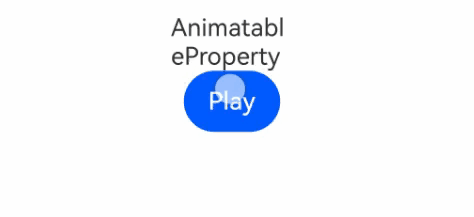

# Custom Property Animation


The property animation is an illusion of movement created on the UI when the value of an animatable property changes over time. It is implemented by setting continuous value changes of a property to the property API that can cause the UI re-render.


ArkUI provides the [@AnimatableExtend](../quick-start/arkts-animatable-extend.md) decorator for customizing animatable property APIs, which accepts only parameters of the number type or a custom type that implements [AnimtableArithmetic\<T>](../quick-start/arkts-animatable-extend.md) to deliver continuous value changes. During execution of **animateTo** or **animation** with a custom animatable property API and the animatable data type, the frame-by-frame callback is used to change the value of a non-animatable property so that an animation effect can be applied to the property.


## Animating Font Size Changes with Number Data Type and \@AnimatableExtend Decorator


```ts
// Step 1: Use the @AnimatableExtend decorator to customize an animatable property API.
@AnimatableExtend(Text)
function animatableFontSize(size: number) {
  .fontSize(size) // Invoke the system property API.
}

@Entry
@Component
struct AnimatablePropertyExample  {
  @State fontSize: number = 20;

  build() {
    Row() {
      Text("AnimatableProperty")
        .backgroundColor("#0C000000")
        .animatableFontSize(this.fontSize)// Step 2: Set the custom animatable property API on the component.
        .animation({ duration: 1000, curve: "ease" })// Step 3: Bind an animation to the custom animatable property API.
        .width(300)
        .height(140)
        .textAlign(TextAlign.Center)
        .onClick(() => {
          this.fontSize = this.fontSize == 20 ? 30 : 20; // Step 4: Change the value of the custom animatable property to generate an animation.
        })
    }.width("100%").height('100%').justifyContent(FlexAlign.Center)
    .padding(10)
  }
}
```





## Changing Graphic Shapes Using Custom Data Types and \@AnimatableExtend Decorator


```ts
declare type Point = number[];

// Define the parameter type of the animatable property API and implement the addition, subtraction, multiplication, and equivalence judgment functions in the AnimtableArithmetic<T> API.
class PointClass extends Array<number> {
  constructor(value: Point) {
    super(value[0], value[1])
  }

  add(rhs: PointClass): PointClass {
    let result: Point = new Array<number>() as Point;
    for (let i = 0; i < 2; i++) {
      result.push(rhs[i] + this[i])
    }
    return new PointClass(result);
  }

  subtract(rhs: PointClass): PointClass {
    let result: Point = new Array<number>() as Point;
    for (let i = 0; i < 2; i++) {
      result.push(this[i] - rhs[i]);
    }
    return new PointClass(result);
  }

  multiply(scale: number): PointClass {
    let result: Point = new Array<number>() as Point;
    for (let i = 0; i < 2; i++) {
      result.push(this[i] * scale)
    }
    return new PointClass(result);
  }
}

// Define the parameter type of the animatable property API and implement the addition, subtraction, multiplication, and equivalence judgment functions in the AnimtableArithmetic<T> API.
// Template T supports nested implementation of the AnimtableArithmetic<T> type.
class PointVector extends Array<PointClass> implements AnimatableArithmetic<Array<Point>> {
  constructor(initialValue: Array<Point>) {
    super();
    if (initialValue.length) {
      initialValue.forEach((p: Point) => this.push(new PointClass(p)))
    }
  }

  // implement the IAnimatableArithmetic interface
  plus(rhs: PointVector): PointVector {
    let result = new PointVector([]);
    const len = Math.min(this.length, rhs.length)
    for (let i = 0; i < len; i++) {
      result.push(this[i].add(rhs[i]))
    }
    return result;
  }

  subtract(rhs: PointVector): PointVector {
    let result = new PointVector([]);
    const len = Math.min(this.length, rhs.length)
    for (let i = 0; i < len; i++) {
      result.push(this[i].subtract(rhs[i]))
    }
    return result;
  }

  multiply(scale: number): PointVector {
    let result = new PointVector([]);
    for (let i = 0; i < this.length; i++) {
      result.push(this[i].multiply(scale))
    }
    return result;
  }

  equals(rhs: PointVector): boolean {
    if (this.length !== rhs.length) {
      return false;
    }
    for (let index = 0, size = this.length; index < size; ++index) {
      if (this[index][0] !== rhs[index][0] || this[index][1] !== rhs[index][1]) {
        return false;
      }
    }
    return true;
  }
}

// Define a custom animatable property API.
@AnimatableExtend(Polyline)
function animatablePoints(points: PointVector) {
  .points(points)
}

@Entry
@Component
struct AnimatedShape {
  squareStartPointX: number = 75;
  squareStartPointY: number = 25;
  squareWidth: number = 150;
  squareEndTranslateX: number = 50;
  squareEndTranslateY: number = 50;
  @State pointVec1: PointVector = new PointVector([
    [this.squareStartPointX, this.squareStartPointY],
    [this.squareStartPointX + this.squareWidth, this.squareStartPointY],
    [this.squareStartPointX + this.squareWidth, this.squareStartPointY + this.squareWidth],
    [this.squareStartPointX, this.squareStartPointY + this.squareWidth]
  ]);
  @State pointVec2: PointVector = new PointVector([
    [this.squareStartPointX + this.squareEndTranslateX, this.squareStartPointY + this.squareStartPointY],
    [this.squareStartPointX + this.squareWidth + this.squareEndTranslateX, this.squareStartPointY + this.squareStartPointY],
    [this.squareStartPointX + this.squareWidth, this.squareStartPointY + this.squareWidth],
    [this.squareStartPointX, this.squareStartPointY + this.squareWidth]
  ]);
  @State color: Color = Color.Green;
  @State fontSize: number = 20.0;
  @State polyline1Vec: PointVector = this.pointVec1;
  @State polyline2Vec: PointVector = this.pointVec2;

  build() {
    Row() {
      Polyline()
        .width(300)
        .height(200)
        .backgroundColor("#0C000000")
        .fill('#317AF7')
        .animatablePoints(this.polyline1Vec)
        .animation({ duration: 2000, delay: 0, curve: Curve.Ease })
        .onClick(() => {

          if (this.polyline1Vec.equals(this.pointVec1)) {
            this.polyline1Vec = this.pointVec2;
          } else {
            this.polyline1Vec = this.pointVec1;
          }
        })
    }
    .width('100%').height('100%').justifyContent(FlexAlign.Center)
  }
}
```


