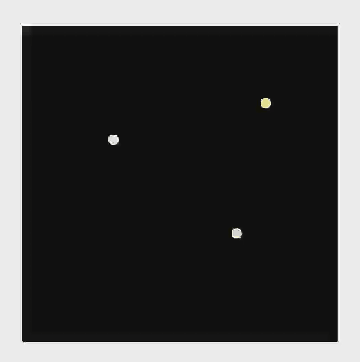
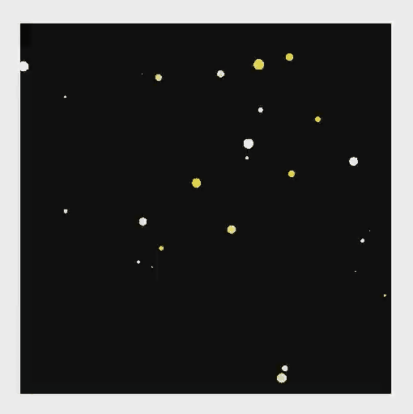

# Particle Animation

[Particle Animation](../reference/apis-arkui/arkui-ts/ts-particle-animation.md) is an animation composed of a large number of particles generated randomly within a certain range and moving. The animation elements are individual particles, which can be dots or images. Developers can create an atmosphere by animating changes in dimensions such as color, transparency, size, speed, acceleration, and spin angle of the particles, such as the snowfall effect, where the fluttering snowflakes are equivalent to particles in animation.

The effect of particle animation is displayed through the Particle component.

The basic example code and effect are as follows:
```ts
@Entry
@Component
struct ParticleExample {
  build() {
    Stack() {
      Text()
        .width(300).height(300).backgroundColor(Color.Black)
      Particle({ particles: [
        {
          emitter: {
            particle: {
              type: ParticleType.POINT, //Particle type
              config: {
                radius: 5 //Dot radius
              },
              count: 100, //Total number of particles
            },
          },
        },
      ]
      }).width(250).height(250)
    }.width("100%").height("100%").align(Alignment.Center)
  }
}
```


## Emitter

The particle emitter (Particle Emitter) is a component in particle animation used to generate and control particles, mainly used to define the initial properties of particles (such as type, position, color), control the rate of particle generation, and manage the life cycle of particles.

Supports dynamic updates to the emitter position. Adjust the position of the particle emitter, emission rate, and emission window size through the [emitter](../reference/apis-arkui/arkui-ts/ts-particle-animation.md) method.

```ts
// ...
@State emitterProperties: Array<EmitterProperty> = [
  {
    index: 0,
    emitRate: 100,
    position: { x: 60, y: 80 },
    size: { width: 200, height: 200 }
  }
]

Particle(...).width(300).height(300).emitter(this.emitterProperties) // Dynamically adjust the position of the particle emitter
// ...
```


## Color

Set the initial color random value distribution of particles through [distributionType](../reference/apis-arkui/arkui-ts/ts-particle-animation.md#particlecolorpropertyoptions). It can be set to uniform distribution or Gaussian (normal) distribution.

```ts
// ...
color: {
  range: [Color.White, Color.Yellow], // Initial color range
  distributionType: DistributionType.GAUSSIAN // Initial color random value distribution
},
// ...
```


## Lifecycle

The lifecycle (Lifecycle) of a particle is the process from its creation to its demise, used to specify the duration of the particle's life.

Set the particle lifecycle through [lifetime](../reference/apis-arkui/arkui-ts/ts-particle-animation.md#emitteroptions) and [lifetimeRange](../reference/apis-arkui/arkui-ts/ts-particle-animation.md#emitteroptions).

```ts
// ...
emitter: {
  particle: {
    // ...
    lifetime: 300, //Particle lifecycle, in ms
    lifetimeRange: 100 //Particle lifecycle value range, in ms
  },
  emitRate: 10, //Number of particles emitted per second
  position: [0, 0],
  shape: ParticleEmitterShape.RECTANGLE //Emitter shape
},
color: {
  range: [Color.White, Color.Yellow], // Initial color range
},
// ...
```




## Disturbance Field

The disturbance field is a mechanism used to affect the movement of particles. The disturbance field changes the trajectory and behavior of particles by applying specific forces in the spatial area where the particles are located, thereby achieving more complex and natural animation effects.

The disturbance field can be configured through the [disturbanceFields](../reference/apis-arkui/arkui-ts/ts-particle-animation.md) method.

```ts
// ...
Particle({ particles: [
  {
    emitter: // ...
    color: // ...
    scale: {
      range: [0.0, 0.0],
      updater: {
        type: ParticleUpdater.CURVE,
        config: [
          {
            from: 0.0,
            to: 0.5,
            startMillis: 0,
            endMillis: 3000,
            curve: Curve.EaseIn
          }
        ]
      }
    },
    acceleration: { //Acceleration configuration, changing from two dimensions of magnitude and direction, speed indicates the magnitude of acceleration, angle indicates the direction of acceleration
      speed: {
        range: [3, 9],
        updater: {
          type: ParticleUpdater.RANDOM,
          config: [1, 20]
        }
      },
      angle: {
        range: [90, 90]
      }
    }

  }
]
}).width(300).height(300).disturbanceFields([{
  strength: 10,
  shape: DisturbanceFieldShape.RECT,
  size: { width: 100, height: 100 },
  position: { x: 100, y: 100 },
  feather: 15,
  noiseScale: 10,
  noiseFrequency: 15,
  noiseAmplitude: 5
}])
// ... 
```


<!--no_check-->