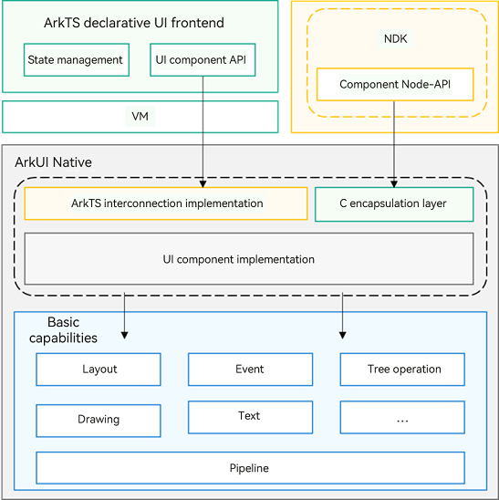
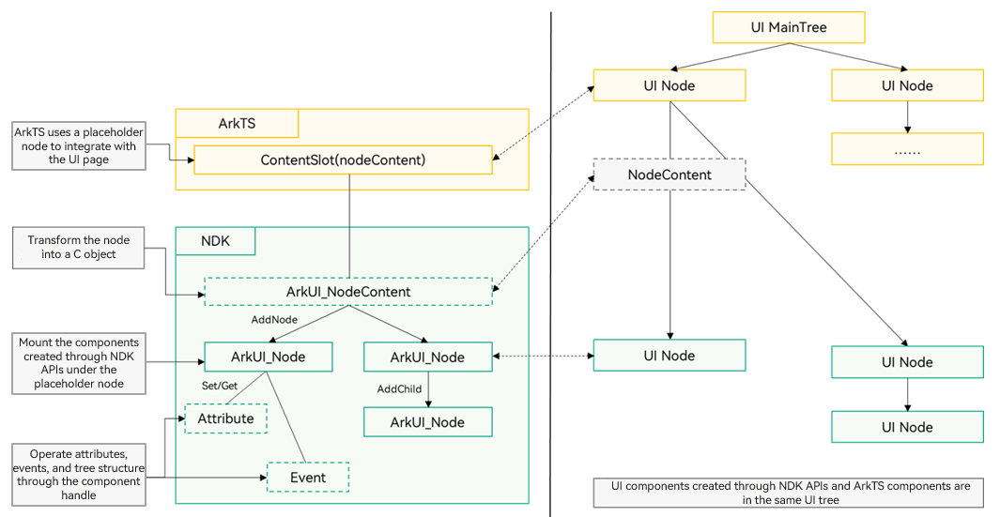

# NDK API Overview

The ArkUI development framework provides a wide array of NDK APIs that enable the construction of UI interfaces using C and C++ code within applications. These interfaces include the creation of UI components, UI tree operations, attribute settings, and event listening. For general UI development scenarios, it is recommended to use ArkTS code and the ArkUI declarative development framework. However, if you need to achieve one or more of the following goals, then the ArkUI NDK APIs can be very useful:

- To use UI component tree control interfaces to dynamically create and mount UI components, facilitating the implementation of your own UI development framework system bridging.

- To further enhance the performance of the UI interface, finely control the creation and attribute setting of components to reduce latency and handle extremely high UI loads.

- To reuse your own or other developers' C or C++ UI libraries.

The capabilities of the ArkUI NDK APIs mainly include:

- **Layout**

  Layout is a necessary element of UI, defining the size and position of components in the interface. The ArkUI NDK interface provides linear layouts, stacking layouts, flexible layouts, relative layouts, scrolling containers, carousel containers, etc.

- **Components**

  Components are a necessary element of UI, forming the appearance in the interface. They include both system-built-in components and components with user-defined layout drawing behaviors. System-built-in components include buttons, radio buttons, images, and text, and you can quickly create corresponding components and set attributes and events using the APIs provided by ArkUI NDK. The customization capabilities for UI components include layout measurement and drawing, through which you can build differentiated UI components.

- **Dialog boxes**

  Dialog boxes are an important element of UI  interaction. The ArkUI NDK interface provides interfaces related to custom dialog boxes, allowing you to customize the content of the dialog box UI  and call relevant APIs to display dialog boxes.

- **Animations**

  Animations are one of the important elements of UI. Excellent animation design can greatly enhance the user experience. The ArkUI NDK provides explicit animation APIs for quickly building property animations of components and achieving efficient and exquisite animation effects.

- **Interactive events**

  Interactive events are a necessary element for UI and user interaction. The ArkUI NDK APIs provide a variety of interactive events, including not only common events such as touch events, mouse events, focus events, but also gesture events that are recognized based on common events. Gesture events include single gestures such as tap gestures, long press gestures, drag gestures, pinch gestures, rotation gestures, swipe gestures, as well as composite gesture events formed by combining single gesture events.

# Overall Architecture

**Figure 1** NDK Interface and ArkTS Declarative Relationship Architecture Diagram

**Figure 2** Schematic Diagram of Component Mounting via NDK Interface

- The ArkTS declarative UI front end and NDK interfaces are both interface exposures for the underlying implementation of ArkUI. Compared to the ArkTS declarative UI front end, the NDK interface not only strips away the declarative UI syntax such as state management but also streamlines the component capabilities, encapsulating the core functions of ArkUI components and exposing them through C interfaces.

- UI components created by the NDK need to be mounted and displayed through placeholder components in the ArkTS layer. After mounting, the components created by the NDK and those created by ArkTS are on the same UI tree, and related layout rendering and event handling follow the same rules.

## Development Process

When developing a UI interface using the NDK interface, the main development process involves the following steps.

| Task | Introduction |
| -------- | -------- |
| [Integrating with ArkTS Pages](ndk-access-the-arkts-page.md) | Introduces how to mount the UI interface developed with NDK interfaces to the ArkTS home page for rendering and display. |
| [Listening for Component Events](ndk-listen-to-component-events.md) | Introduces how to register event listeners for components and add gesture interactions. |
| [Using Animations](ndk-use-animation.md) | Introduces how to add animations on the Native side. |
| [Developing Long List Interfaces with Lazy Loading](ndk-loading-long-list.md) | Introduces how to use lazy loading capabilities to develop high-performance long list interfaces on the Native side. |
| [Building Dialog Boxes](ndk-build-pop-up-window.md) | Introduces how to use popup interfaces to build UI interfaces for popup display. |
| [Building Custom Components](ndk-build-custom-components.md) | Introduces how to use NDK interface capabilities to build custom components and achieve differentiated UI components. |
| [Embedding ArkTS Components](ndk-embed-arkts-components.md) | Introduces how to build interfaces with ArkTS components on the Native side. |

# Precautions

When developing a UI with the NDK APIs, it is necessary to ensure that relevant UI interface calls are made on the application's main thread to avoid application crash issues caused by multi-threaded operations.
