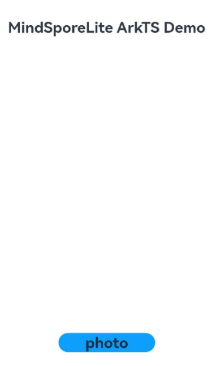
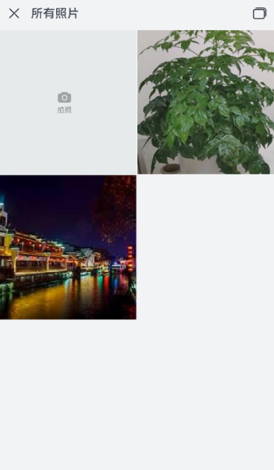
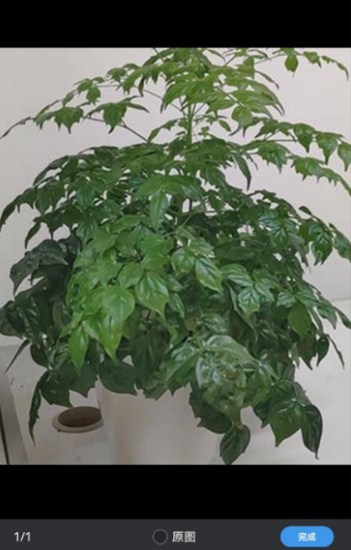

# 使用MindSpore Lite实现图像分类（ArkTS）

## 场景说明

开发者可以使用[@ohos.ai.mindSporeLite](../../reference/apis-mindspore-lite-kit/js-apis-mindSporeLite.md)，在UI代码中集成MindSpore Lite能力，快速部署AI算法，进行AI模型推理，实现图像分类的应用。

图像分类可实现对图像中物体的识别，在医学影像分析、自动驾驶、电子商务、人脸识别等有广泛的应用。

## 基本概念

在进行开发前，请先了解以下概念。

**张量**：它与数组和矩阵非常相似，是MindSpore Lite网络运算中的基本数据结构。

**Float16推理模式**：  Float16又称半精度，它使用16比特表示一个数。Float16推理模式表示推理的时候用半精度进行推理。 

## 接口说明

这里给出MindSpore Lite推理的通用开发流程中涉及的一些接口，具体请见下列表格。更多接口及详细内容，请见[@ohos.ai.mindSporeLite (推理能力)](../../reference/apis-mindspore-lite-kit/js-apis-mindSporeLite.md)。

| 接口名                                                       | 描述             |
| ------------------------------------------------------------ | ---------------- |
| loadModelFromFile(model: string, context?: Context): Promise&lt;Model&gt; | 从路径加载模型。 |
| getInputs(): MSTensor[]                                      | 获取模型的输入。 |
| predict(inputs: MSTensor[]): Promise&lt;MSTensor[]&gt;       | 推理模型。       |
| getData(): ArrayBuffer                                       | 获取张量的数据。 |
| setData(inputArray: ArrayBuffer): void                       | 设置张量的数据。 |

## 开发流程

1. 选择图像分类模型。
2. 在端侧使用MindSpore Lite推理模型，实现对选择的图片进行分类。

## 环境准备

安装DevEco Studio，要求版本 >= 4.1，并更新SDK到API 11或以上。

## 开发步骤

本文以对相册的一张图片进行推理为例，提供使用MindSpore Lite实现图像分类的开发指导。

### 选择模型

本示例程序中使用的图像分类模型文件为[mobilenetv2.ms](https://download.mindspore.cn/model_zoo/official/lite/mobilenetv2_openimage_lite/1.5/mobilenetv2.ms)，放置在entry/src/main/resources/rawfile工程目录下。

如果开发者有其他图像分类的预训练模型，请参考[MindSpore Lite 模型转换](mindspore-lite-converter-guidelines.md)介绍，将原始模型转换成.ms格式。

### 编写图像输入和预处理代码

1. 此处以获取相册图片为例，调用[@ohos.file.picker](../../reference/apis-core-file-kit/js-apis-file-picker.md) 实现相册图片文件的选择。

2. 根据模型的输入尺寸，调用[@ohos.multimedia.image](../../reference/apis-image-kit/arkts-apis-image.md) （实现图片处理）、[@ohos.file.fs](../../reference/apis-core-file-kit/js-apis-file-fs.md) （实现基础文件操作） API对选择图片进行裁剪、获取图片buffer数据，并进行标准化处理。

   ```ts
   // Index.ets
   import { photoAccessHelper } from '@kit.MediaLibraryKit';
   import { BusinessError } from '@kit.BasicServicesKit';
   import { image } from '@kit.ImageKit';
   import { fileIo } from '@kit.CoreFileKit';
   
   @Entry
   @Component
   struct Index {
     @State modelName: string = 'mobilenetv2.ms';
     @State modelInputHeight: number = 224;
     @State modelInputWidth: number = 224;
     @State uris: Array<string> = [];
   
     build() {
       Row() {
         Column() {
           Button() {
             Text('photo')
               .fontSize(30)
               .fontWeight(FontWeight.Bold)
           }
           .type(ButtonType.Capsule)
           .margin({
             top: 20
           })
           .backgroundColor('#0D9FFB')
           .width('40%')
           .height('5%')
           .onClick(() => {
             let resMgr = this.getUIContext()?.getHostContext()?.getApplicationContext().resourceManager;
             if (resMgr === null || resMgr === undefined){
               console.error('MS_LITE_ERR: get resMgr failed.');
               return
             }
             resMgr?.getRawFileContent(this.modelName).then(modelBuffer => {
               // 获取相册图片
               // 1.创建图片文件选择实例
               let photoSelectOptions = new photoAccessHelper.PhotoSelectOptions();
   
               // 2.设置选择媒体文件类型为IMAGE，设置选择媒体文件的最大数目
               photoSelectOptions.MIMEType = photoAccessHelper.PhotoViewMIMETypes.IMAGE_TYPE;
               photoSelectOptions.maxSelectNumber = 1;
   
               // 3.创建图库选择器实例，调用select()接口拉起图库界面进行文件选择。文件选择成功后，返回photoSelectResult结果集。
               let photoPicker = new photoAccessHelper.PhotoViewPicker();
               photoPicker.select(photoSelectOptions, async (
                 err: BusinessError, photoSelectResult: photoAccessHelper.PhotoSelectResult) => {
                 if (err) {
                   console.error('MS_LITE_ERR: PhotoViewPicker.select failed with err: ' + JSON.stringify(err));
                   return;
                 }
                 console.info('MS_LITE_LOG: PhotoViewPicker.select successfully, ' +
                   'photoSelectResult uri: ' + JSON.stringify(photoSelectResult));
                 this.uris = photoSelectResult.photoUris;
                 console.info('MS_LITE_LOG: uri: ' + this.uris);
   
                 // 预处理图片数据
                 try {
                   // 1.使用fileIo.openSync接口，通过uri打开这个文件得到fd
                   let file = fileIo.openSync(this.uris[0], fileIo.OpenMode.READ_ONLY);
                   console.info('MS_LITE_LOG: file fd: ' + file.fd);
   
                   // 2.通过fd使用fileIo.readSync接口读取这个文件内的数据
                   let inputBuffer = new ArrayBuffer(4096000);
                   let readLen = fileIo.readSync(file.fd, inputBuffer);
                   console.info('MS_LITE_LOG: readSync data to file succeed and inputBuffer size is:' + readLen);
   
                   // 3.通过PixelMap预处理
                   let imageSource = image.createImageSource(file.fd);
                   if (imageSource == undefined) {
                     console.error('MS_LITE_ERR: createImageSource failed.')
                     return
                   }
                   imageSource.createPixelMap().then((pixelMap) => {
                     pixelMap.getImageInfo().then((info) => {
                       console.info('MS_LITE_LOG: info.width = ' + info.size.width);
                       console.info('MS_LITE_LOG: info.height = ' + info.size.height);
                       // 4.根据模型输入的尺寸，将图片裁剪为对应的size，获取图片buffer数据readBuffer
                       pixelMap.scale(256.0 / info.size.width, 256.0 / info.size.height).then(() => {
                         pixelMap.crop(
                           { x: 16, y: 16, size: { height: this.modelInputHeight, width: this.modelInputWidth } }
                         ).then(async () => {
                           let info = await pixelMap.getImageInfo();
                           console.info('MS_LITE_LOG: crop info.width = ' + info.size.width);
                           console.info('MS_LITE_LOG: crop info.height = ' + info.size.height);
                           // 需要创建的像素buffer大小
                           let readBuffer = new ArrayBuffer(this.modelInputHeight * this.modelInputWidth * 4);
                           await pixelMap.readPixelsToBuffer(readBuffer);
                           console.info('MS_LITE_LOG: Succeeded in reading image pixel data, buffer: ' +
                           readBuffer.byteLength);
                           // 处理readBuffer，转换成float32格式，并进行标准化处理
                           const imageArr = new Uint8Array(
                             readBuffer.slice(0, this.modelInputHeight * this.modelInputWidth * 4));
                           console.info('MS_LITE_LOG: imageArr length: ' + imageArr.length);
                           let means = [0.485, 0.456, 0.406];
                           let stds = [0.229, 0.224, 0.225];
                           let float32View = new Float32Array(this.modelInputHeight * this.modelInputWidth * 3);
                           let index = 0;
                           for (let i = 0; i < imageArr.length; i++) {
                             if ((i + 1) % 4 == 0) {
                               float32View[index] = (imageArr[i - 3] / 255.0 - means[0]) / stds[0]; // B
                               float32View[index+1] = (imageArr[i - 2] / 255.0 - means[1]) / stds[1]; // G
                               float32View[index+2] = (imageArr[i - 1] / 255.0 - means[2]) / stds[2]; // R
                               index += 3;
                             }
                           }
                           console.info('MS_LITE_LOG: float32View length: ' + float32View.length);
                           let printStr = 'float32View data:';
                           for (let i = 0; i < 20; i++) {
                             printStr += ' ' + float32View[i];
                           }
                           console.info('MS_LITE_LOG: float32View data: ' + printStr);
                         })
                       })
                     })
                   })
                 } catch (err) {
                   console.error('MS_LITE_LOG: uri: open file fd failed.' + err);
                 }
               })
             })
           })
         }
         .width('100%')
       }
       .height('100%')
     }
   }
   ```

### 编写推理代码

1. 工程默认设备定义的能力集可能不包含MindSporeLite。需在DevEco Studio工程的entry/src/main目录下，手动创建syscap.json文件，内容如下：

   ```json
   {
     "devices": {
       "general": [
         // 需跟module.json5中deviceTypes保持一致。
         "default"
       ]
     },
     "development": {
       "addedSysCaps": [
         "SystemCapability.AI.MindSporeLite"
       ]
     }
   }
   ```

2. 调用[@ohos.ai.mindSporeLite](../../reference/apis-mindspore-lite-kit/js-apis-mindSporeLite.md)实现端侧推理。具体开发过程及细节如下：

   1. 创建上下文，设置线程数、设备类型等参数。本样例模型，不支持使用NNRt推理。
   2. 加载模型。本文从内存加载模型。
   3. 加载数据。模型执行之前需要先获取输入，再向输入的张量中填充数据。
   4. 执行推理。使用predict接口进行模型推理。

   ```ts
   // model.ets
   import { mindSporeLite } from '@kit.MindSporeLiteKit'
   
   export default async function modelPredict(
     modelBuffer: ArrayBuffer, inputsBuffer: ArrayBuffer[]): Promise<mindSporeLite.MSTensor[]> {
   
     // 1.创建上下文，设置线程数、设备类型等参数。本样例模型，不支持配置context.target = ["nnrt"]。
     let context: mindSporeLite.Context = {};
     context.target = ['cpu'];
     context.cpu = {}
     context.cpu.threadNum = 2;
     context.cpu.threadAffinityMode = 1;
     context.cpu.precisionMode = 'enforce_fp32';
   
     // 2.从内存加载模型。
     let msLiteModel: mindSporeLite.Model = await mindSporeLite.loadModelFromBuffer(modelBuffer, context);
   
     // 3.设置输入数据。
     let modelInputs: mindSporeLite.MSTensor[] = msLiteModel.getInputs();
     for (let i = 0; i < inputsBuffer.length; i++) {
       let inputBuffer = inputsBuffer[i];
       if (inputBuffer != null) {
         modelInputs[i].setData(inputBuffer as ArrayBuffer);
       }
     }
   
     // 4.执行推理。
     console.info('=========MS_LITE_LOG: MS_LITE predict start=====');
     let modelOutputs: mindSporeLite.MSTensor[] = await msLiteModel.predict(modelInputs);
     return modelOutputs;
   }
   ```

### 进行推理并输出结果

加载模型文件，调用推理函数，对相册选择的图片进行推理，并对推理结果进行处理。

```ts
// Index.ets
import modelPredict from './model';
import { BusinessError } from '@kit.BasicServicesKit';

@Entry
@Component
struct Index {
  @State modelName: string = 'mobilenetv2.ms';
  @State modelInputHeight: number = 224;
  @State modelInputWidth: number = 224;
  @State max: number = 0;
  @State maxIndex: number = 0;
  @State maxArray: Array<number> = [];
  @State maxIndexArray: Array<number> = [];

  build() {
    Row() {
      Column() {
        Button() {
          Text('photo')
            .fontSize(30)
            .fontWeight(FontWeight.Bold)
        }
        .type(ButtonType.Capsule)
        .margin({
          top: 20
        })
        .backgroundColor('#0D9FFB')
        .width('40%')
        .height('5%')
        .onClick(() => {
          let resMgr = this.getUIContext()?.getHostContext()?.getApplicationContext().resourceManager;
          if (resMgr === null || resMgr === undefined){
            console.error('MS_LITE_ERR: get resMgr failed.');
            return
          }
          resMgr?.getRawFileContent(this.modelName).then(modelBuffer => {
            // 图像输入和预处理。
            // 完成图像输入和预处理后的buffer数据保存在float32View，具体可见上文图像输入和预处理中float32View的定义和处理。
            let inputs: ArrayBuffer[] = [float32View.buffer];
            // predict
            modelPredict(modelBuffer.buffer.slice(0), inputs).then(outputs => {
              console.info('=========MS_LITE_LOG: MS_LITE predict success=====');
              // 结果打印
              for (let i = 0; i < outputs.length; i++) {
                let out = new Float32Array(outputs[i].getData());
                let printStr = outputs[i].name + ':';
                for (let j = 0; j < out.length; j++) {
                  printStr += out[j].toString() + ',';
                }
                console.info('MS_LITE_LOG: ' + printStr);
                // 取分类占比的最大值
                this.max = 0;
                this.maxIndex = 0;
                this.maxArray = [];
                this.maxIndexArray = [];
                let newArray = out.filter(value => value !== this.max)
                for (let n = 0; n < 5; n++) {
                  this.max = out[0];
                  this.maxIndex = 0;
                  for (let m = 0; m < newArray.length; m++) {
                    if (newArray[m] > this.max) {
                      this.max = newArray[m];
                      this.maxIndex = m;
                    }
                  }
                  this.maxArray.push(Math.round(this.max * 10000))
                  this.maxIndexArray.push(this.maxIndex)
                  // filter数组过滤函数
                  newArray = newArray.filter(value => value !== this.max)
                }
                console.info('MS_LITE_LOG: max:' + this.maxArray);
                console.info('MS_LITE_LOG: maxIndex:' + this.maxIndexArray);
              }
              console.info('=========MS_LITE_LOG END=========');
            })
          }).catch((error: BusinessError) => {
            console.error("getRawFileContent promise error is " + error);
          });
        })
      }
      .width('100%')
    }
    .height('100%')
  }
}
```

### 调测验证

1. 在DevEco Studio中连接设备，点击Run entry，编译Hap，有如下显示：

   ```shell
   Launching com.samples.mindsporelitearktsdemo
   $ hdc shell aa force-stop com.samples.mindsporelitearktsdemo
   $ hdc shell mkdir data/local/tmp/xxx
   $ hdc file send C:\Users\xxx\MindSporeLiteArkTSDemo\entry\build\default\outputs\default\entry-default-signed.hap "data/local/tmp/xxx" 
   $ hdc shell bm install -p data/local/tmp/xxx
   $ hdc shell rm -rf data/local/tmp/xxx
   $ hdc shell aa start -a EntryAbility -b com.samples.mindsporelitearktsdemo
   ```

2. 在设备屏幕点击photo按钮，选择图片，点击确定。设备屏幕显示所选图片的分类结果，在日志打印结果中，过滤关键字”MS_LITE“，可得到如下结果：

   ```verilog
   08-06 03:24:33.743   22547-22547  A03d00/JSAPP                   com.sampl...liteark+  I     MS_LITE_LOG: PhotoViewPicker.select successfully, photoSelectResult uri: {"photoUris":["file://media/Photo/13/IMG_1501955351_012/plant.jpg"]}
   08-06 03:24:33.795   22547-22547  A03d00/JSAPP                   com.sampl...liteark+  I     MS_LITE_LOG: readSync data to file succeed and inputBuffer size is:32824
   08-06 03:24:34.147   22547-22547  A03d00/JSAPP                   com.sampl...liteark+  I     MS_LITE_LOG: crop info.width = 224
   08-06 03:24:34.147   22547-22547  A03d00/JSAPP                   com.sampl...liteark+  I     MS_LITE_LOG: crop info.height = 224
   08-06 03:24:34.160   22547-22547  A03d00/JSAPP                   com.sampl...liteark+  I     MS_LITE_LOG: Succeeded in reading image pixel data, buffer: 200704
   08-06 03:24:34.970   22547-22547  A03d00/JSAPP                   com.sampl...liteark+  I     =========MS_LITE_LOG: MS_LITE predict start=====
   08-06 03:24:35.432   22547-22547  A03d00/JSAPP                   com.sampl...liteark+  I     =========MS_LITE_LOG: MS_LITE predict success=====
   08-06 03:24:35.447   22547-22547  A03d00/JSAPP                   com.sampl...liteark+  I     MS_LITE_LOG: Default/head-MobileNetV2Head/Sigmoid-op466:0.0000034338463592575863,0.000014028532859811094,9.119685273617506e-7,0.000049100715841632336,9.502661555416125e-7,3.945370394831116e-7,0.04346757382154465,0.00003971960904891603...
   08-06 03:24:35.499   22547-22547  A03d00/JSAPP                   com.sampl...liteark+  I     MS_LITE_LOG: max:9497,7756,1970,435,46
   08-06 03:24:35.499   22547-22547  A03d00/JSAPP                   com.sampl...liteark+  I     MS_LITE_LOG: maxIndex:323,46,13,6,349
   08-06 03:24:35.499   22547-22547  A03d00/JSAPP                   com.sampl...liteark+  I     =========MS_LITE_LOG END=========
   ```

### 效果示意

在设备上，点击photo按钮，选择相册中的一张图片，点击确定。在图片下方显示此图片占比前4的分类信息。

           

          

## 相关实例

针对使用MindSpore Lite进行图像分类应用的开发，有以下相关实例可供参考：

- [基于ArkTS接口的MindSpore Lite应用开发（ArkTS）（API11）](https://gitee.com/openharmony/applications_app_samples/tree/master/code/DocsSample/ApplicationModels/MindSporeLiteArkTSDemo)

<!--RP1--><!--RP1End-->