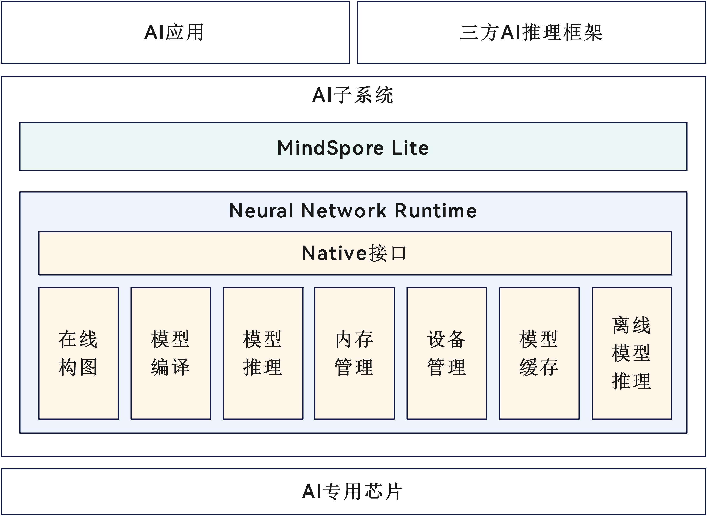

# Neural Network Runtime Kit简介

<!--Kit: Neural Network Runtime Kit-->
<!--Subsystem: AI-->
<!--Owner: @GbuzhidaoR-->
<!--SE: @GbuzhidaoR-->
<!--TSE @GbuzhidaoR-->

## 使用场景
Neural Network Runtime（NNRt, 神经网络运行时）是面向AI领域的跨芯片推理计算运行时，作为中间桥梁连通上层AI推理框架和底层加速芯片，实现AI模型的跨芯片推理计算。

Neural Network Runtime的Native接口主要面向AI推理框架的开发者，或者希望直接使用AI加速硬件实现模型推理加速的应用开发者。

AI推理框架可以调用NNRt的构图接口将推理框架的模型图转换为NNRt内部使用的模型图，然后调用NNRt的编译和执行接口在NNRt底层对接的AI加速硬件上进行模型推理。该方式可以实现无感知的跨AI硬件推理，但是首次加载模型速度较慢。

AI推理框架和应用开发者也可以无需调用NNRt构图接口，直接使用某款具体硬件对应的离线模型在NNRt上执行模型推理。该方式仅能实现在特定AI硬件上执行推理，但是首次加载模型速度较快。

## NNRt架构

如图1所示，除了Native开放接口，NNRt软件架构包含如下几个功能模块：
1. <b>在线构图</b>：AI推理框架需要调用NNRt的构图接口将推理框架的模型图转换为NNRt内部模型图。而系统内置的MindSpore Lite推理框架（具体可参考[MindSpore Lite Kit](../mindspore/mindspore-lite-guidelines.md)）通过MindIR模型图对接NNRt。由于MindIR模型图和NNRt内部模型图格式兼容，因此MindSpore Lite无需调用NNRt的构图接口即可对接NNRt。
2. <b>模型编译</b>：NNRt内部模型图或离线模型文件需要通过NNRt的编译接口在底层AI硬件驱动上编译为硬件相关的模型对象，后续就可以在该硬件上执行模型推理。
3. <b>模型推理</b>：基于已编译的模型对象创建执行器，设置推理的输入和输出张量，然后在AI硬件上执行模型推理。
4. <b>内存管理</b>：推理的输入和输出张量需要包含对应的数据内存，该模块负责在AI硬件驱动上申请共享内存并赋给张量，并在张量销毁时释放对应共享内存。通过AI硬件驱动上的共享内存可以实现输入和输出数据的“零拷贝”，提升推理性能。
5. <b>设备管理</b>：负责展示NNRt对接的AI硬件信息，并提供了选择AI硬件的功能。
6. <b>模型缓存</b>：已编译的模型对象写成模型缓存格式，保存在文件或一段内存中。在下一次编译模型时，可以直接从文件或内存形式的模型缓存中加载，大幅提升编译速度。
7. <b>离线模型推理</b>：除了支持通过构图接口构造模型图，NNRt也支持直接使用AI硬件相关的模型文件（简称为离线模型）进行推理。应用开发者使用AI硬件厂商提供的模型转换器将原始训练模型转换为AI硬件对应的离线模型文件，并将它部署在应用程序中，在应用运行期间通过NNRt的离线模型编译接口传入。离线模型仅能在对应AI硬件上编译和推理，无法支持跨AI硬件兼容。但由于离线模型和硬件直接相关，因此编译速度通常很快。

**图1** Neural Network Runtime架构图

## 亮点特征

- NNRt面向AI推理框架和AI应用开放了统一的AI加速硬件推理接口，可支持无感知的跨AI硬件推理。
- NNRt提供了构图接口，可以让AI推理框架将内部模型图对接到NNRt。
- NNRt提供了模型编译缓存功能，可将模型编译结果保存为缓存文件，大幅加快模型加载速度。
- NNRt提供了硬件相关的离线模型加载功能，可缩短模型编译时间，但是仅可在对应AI硬件上执行。
- NNRt提供了配置推理优先级、性能模式、FP16模式等常见硬件属性，也支持配置特定硬件的自定义扩展属性。
- NNRt通过申请AI硬件驱动上的共享内存来实现数据的“零拷贝”，提升推理性能。

## 能力范围

- NNRt仅可提供已在底层接入的AI加速硬件的AI推理能力，不提供CPU等通用硬件上的AI推理能力。
- NNRt仅能提供大多数AI硬件共有的基础AI推理能力和硬件属性配置，例如编译、执行、内存管理、优先级、性能模式等。如果希望配置某款AI硬件特有的硬件属性，可以通过NNRt提供的自定义扩展属性接口配置，具体属性名称和值需要查阅硬件厂商的文档。
- NNRt目前支持常用算子56个，后续版本会逐步增加。注意NNRt的算子并没有具体实现，仅作为内部模型图的元素对接底层AI硬件，具体算子实现其实是在AI硬件驱动中。
- NNRt目前仅支持同步推理，计划在后续版本支持异步推理。
- NNRt不支持多线程并发构图，是否支持并发编译和执行取决于底层硬件驱动是否支持。

## 与相关Kit的关系

<!--RP1-->
Neural Network Runtime Kit可支持系统内置的MindSpore Lite推理框架（MindSpore Lite Kit），MindSpore Lite已开放了配置NNRt的Native接口。

MindSpore Lite对接NNRt可无需构图，两者共享同一份模型图格式（MindIR），因此使用MindSpore Lite在NNRt上加载模型将快于其他AI推理框架。

此外，MindSpore Lite也支持通用硬件CPU/GPU与NNRt AI加速硬件之间的模型异构推理功能。
<!--RP1End-->